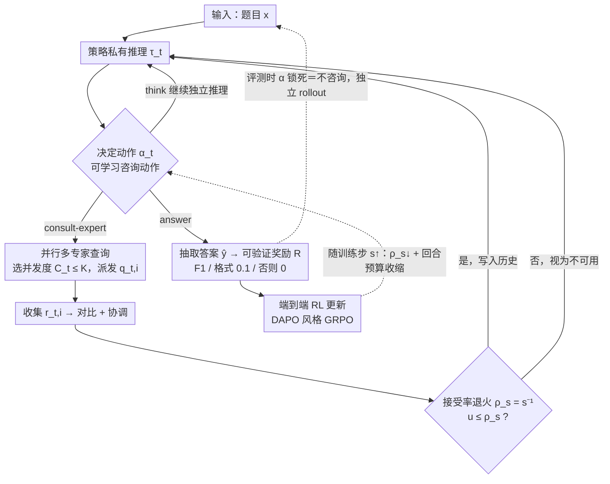

# EAPO: Enhancing Policy Optimization with On-Demand Expert Assistance

**会议**: ICML 2026  
**arXiv**: [2509.23730](https://arxiv.org/abs/2509.23730)  
**代码**: 无  
**领域**: 强化学习 / LLM推理  
**关键词**: 专家辅助RL、按需咨询、稀疏奖励、知识内化、可验证奖励

## 一句话总结
EAPO 把"咨询外部专家"作为一个可学习的离散动作嵌入策略空间，让 LLM 在 RL 训练阶段按需调用更强模型获取中间提示，并通过逐步衰减的接受率把专家知识内化到自身策略中，在评测时完全独立推理仍能在 AIME / AIMO 等数学推理基准上稳定超越纯自探索 RL。

## 研究背景与动机

**领域现状**：当前用 RL 提升 LLM 推理能力的主流范式是 RLVR（带可验证奖励的强化学习），代表方法是 GRPO / DAPO 等基于结果监督的算法，模型完全靠自己 rollout 探索长链推理路径，最后用 verifier 给出 0/1 奖励。

**现有痛点**：对长程数学题这种搜索空间巨大的任务，纯自探索意味着大多数 rollout 都拿不到正奖励，正样本极其稀疏，梯度估计方差高、训练慢且不稳定；推理阶段虽然有 Tree-of-Thoughts、Mixture-of-Agents、LeaP 这些 test-time scaling 方案能用更多算力补偿，但它们既不改善策略本身能力，也带来巨大通信和实现开销。

**核心矛盾**：要让模型自己学到强推理能力，就得让它独立 rollout；可独立 rollout 又太难拿到正奖励信号。换句话说，"训练时需要外部引导"和"评测时必须独立"之间存在结构性张力——以往要么完全独立（自探索 RL），要么完全依赖（专家工作流、蒸馏），缺少一个让训练阶段动态借助专家、评测阶段又能撤掉外援的机制。

**本文目标**：设计一种 RL 框架，使策略在训练时能按需向外部专家求助以稠密化奖励信号，但训练结束后能脱离专家独立推理。

**切入角度**：把"向专家求助"建模为策略动作空间里的一个可学习离散动作 $\alpha_t$，由策略自己决定是否、何时、如何咨询；用接受率退火 $\rho_s = s^{-1}$ 逐步关闭这条通道，迫使模型把专家提示带来的策略内化进自身参数。

**核心 idea**：让"咨询专家"成为可学习动作，配合按训练步衰减的接受率，把训练期的外部信息逐步蒸馏进策略本身。

## 方法详解

### 整体框架

EAPO 把一次解题展开为一条多回合轨迹 $H_T = \{(\tau_t, \alpha_t, o_t)\}_{t=1}^T$：每一步策略先生成私有推理 $\tau_t$，再决定动作 $\alpha_t$（继续独立推理、咨询专家或输出答案），若选择咨询则环境返回专家响应 $o_t$ 拼回上下文，否则 $o_t = \varnothing$。轨迹概率因式分解为 $\pi_\theta(\tau_t, \alpha_t \mid H_{t-1}) = \pi_\theta^\tau(\tau_t \mid H_{t-1}) \cdot \pi_\theta^\alpha(\alpha_t \mid H_{t-1}, \tau_t)$，最终用 F1 与格式奖励组合的 $R$ 做端到端可验证奖励优化，目标是 $\max_\theta \mathcal{J}_{\text{EAPO}} = \mathbb{E}[R(\mathcal{E}(H_T), g)]$。评测时 $\alpha$ 被强制锁死为"不咨询"，策略只能独立 rollout。

实现上策略骨干用 DeepSeek-R1-Distill-Qwen-7B，专家池用 QwQ-32B（异构、更强），训练数据为 DAPO-MATH。

### 关键设计

**1. 可学习的"咨询专家"动作：把外部求助升级成策略动作空间里的一等公民**

以往 expert-assisted workflow 把"咨询专家"硬编码在外部 pipeline，模型本身没学会"什么情况下该问"。EAPO 把动作空间扩展成 $\{\text{think},\ \text{consult-expert},\ \text{answer}\}$ 之类的离散选择：咨询动作触发时策略要自己生成结构化 query $q_{t,i}$ 发给专家，专家返回 $r_{t,i}$ 拼进历史，整条轨迹在同一个 RL 目标下回传梯度，所以"什么时候问"和"问什么"都由奖励信号塑造。这样设计让策略学会判别题目难度并合理分配外援，既避免无差别依赖也避免完全闭门造车——训练中甚至自发涌现出三种 rollout 模式：简单题 self-resolution、难题 direct consultation（一次问 3 个专家做对照）、复杂题 decomposition（拆子问题分别问再聚合）。

**2. 并行多专家查询：把"信息覆盖"和"交互回合数"解耦**

长程推理的 turn budget 有限，如果每回合只能问一个专家，很容易预算耗尽还没解决。EAPO 让策略在第 $t$ 回合先选并发度 $C_t\in[0,K]$，再构造 $\mathcal{Q}_t=\{q_{t,i}\}_{i=1}^{C_t}$ 同步派发，收集 $o_t=\{r_{t,i}\}_{i=1}^{C_t}$ 后做"对比 + 协调"形成下一步上下文（实验里 $K=3$）。这么做把"一回合拿到多视角对照证据"和"消耗一个交互回合"分开，在固定总交互预算下能 surface 更多证据，救回纯顺序模式因预算耗尽未能解决的实例——表 2 显示并行 EAPO 比顺序 EAPO 在 AIMO 2025 上多出 4 个点。

**3. 接受率退火 + 回合预算收缩：把专家知识内化进策略、评测时撤掉外援也不崩**

单纯加专家会让模型对外援产生路径依赖，部署撤掉就崩，这正是"训练需引导、评测须独立"那个结构性张力。EAPO 的解法是让咨询通道前期高频开放、后期逐渐关闭：每次专家返回响应时按全局训练步 $s$ 的概率 $\rho_s=s^{-1}$ 决定是否真写入历史——采样 $u\sim U(0,1)$，$u\le\rho_s$ 才接受、否则视为不可用让策略继续独立推理；同步把每 episode 的回合上限从训练初值向评测预算下调。这形成一条隐式课程：早期靠稠密专家提示快速跨过"全 0 奖励"区，中期在偶尔得不到响应时被迫独立尝试，后期专家通道几乎全关、策略只能依赖学到的推理模式。它本质上是用 RL 实现的在线知识蒸馏，但蒸馏目标不是教师的 token 分布，而是教师在轨迹关键步给出的"建议"——这也是 EAPO 能在评测阶段独立 rollout 仍超过纯 RL 的关键。

### 损失函数 / 训练策略

奖励函数为分段形式：$R = \text{F1}(\hat{y}, g)$ 当 F1 非 0；$R = 0.1$ 当 F1 = 0 但格式正确；否则 $R = 0$。轨迹生成中 $p(o_{t+1} \mid \alpha_{t+1})$ 由专家服务和接受率退火联合决定。优化算法基于在线 RL（DAPO 风格 GRPO 变体），并对咨询动作隐式施加惩罚（接受率衰减实质降低了咨询的期望收益）。

## 实验关键数据

### 主实验

策略 7B + 专家 32B，训练于 DAPO-MATH，评测 AIME 2024/2025 + AIMO 2025 的 Pass@32 与方差 Var：

| 方法类别 | 方法 | Avg Pass@32 ↑ | Avg Var ↓ | 备注 |
|---|---|---|---|---|
| Base | DeepSeek-R1-Distill-7B | 42.53 | 0.0947 | 起点 |
| Offline Workflow | Expert-Assisted Workflow | 49.39 | 0.2039 | 7B 策略 + 3×32B 专家硬编码 |
| Offline Workflow | LeaP | 47.08 | 0.1652 | 平行路径互相摘要 |
| Distillation | LoRA Distill | 43.24 | 0.0969 | 从 32B 蒸馏 |
| Online RL | Self-Exploratory RL | 59.16 | 0.0727 | 纯结果驱动 RL |
| Online RL | **EAPO (Ours)** | **64.07** | **0.0643** | +4.91 vs 自探索 RL |

EAPO 在 AIMO 2025 上 Pass@32 达 64.17，相比自探索 RL 提升约 9 个点，且 Var 全面更低，说明不只是均值上去，稳定性也改善。

### 消融实验

| 配置 | Avg Pass@32 | Avg Var | 说明 |
|---|---|---|---|
| 顺序 EAPO + 32B 专家 | 61.79 | 0.0721 | 单回合只问一次 |
| 并行 EAPO + 14B 专家 | 61.55 | 0.0692 | 弱专家 |
| **并行 EAPO + 32B 专家** | **64.07** | **0.0643** | 完整 |
| 同构 EAPO（7B 专家 = 策略） | 58.85 | 0.0756 | 退化到自探索水平 |
| 异构 EAPO（Llama-8B 专家） | 60.66 | 0.0727 | 互补能力即可 |

### 关键发现

- **专家能力下限**：当专家与策略同构（同一 7B 模型）时 EAPO 几乎丧失增益（58.85 vs 自探索 59.16），说明本质上靠的是"专家有策略不会的东西"的信息注入，互补性是必要条件。
- **并行 + 大专家叠加效应**：并行查询主要改善探索效率与鲁棒性，专家容量决定注入信息的质量，两者正交且都不可缺。
- **跨域泛化**：仅在 DAPO-MATH 训练的 EAPO 在 HumanEval、HLE、GPQA、MMLU、EvalPlus、HotpotQA、SimpleQA 等代码与科学推理基准上同样优于 base 与自探索 RL，提示该框架学到的是通用"咨询-内化"机制而非数学专属。
- **模型规模递减**：7B→14B 策略整体涨点但边际收益缩小，因为难题在数据集中是长尾，更大模型能独立啃下更多 case。

## 亮点与洞察

- 把"调用外部模型"从 pipeline 工程升级为策略动作并联合优化，是一条少有人走却很自然的路：它让 RL 算法第一次以原生方式表达"我现在不会，请教一下"的元认知行为，结果三种 rollout 模式（自解 / 直接咨询 / 拆题咨询）是自发涌现的。
- 接受率 $\rho_s = s^{-1}$ 这种**显式时间衰减**的设计极简但效果好，等价于在线知识蒸馏的退火课程，避免了离线蒸馏会丢失教师中间推理结构、又规避了硬性 KL 约束的脆弱性。
- "外援降低奖励稀疏度 → 策略学到更强模式 → 内化后独立运行"这条因果链可以迁移到任何长程稀疏奖励的 agent 任务，例如代码生成中可学的"调用更强模型 review 一次"动作、机器人任务里"询问示范库"的动作。

## 局限与展望

- 论文未给出训练阶段的算力账：每条 rollout 都可能并发触发最多 3 次 32B 推理，再算上接受率退火早期高频咨询，实际 H100 小时数大概率远超自探索 RL 基线，这部分对公平比较影响很大。
- "专家是固定的"是隐含假设，若把专家也设为可更新的 LLM（自我教师 / 同步训练），是否会出现策略-专家协同漂移甚至崩溃，作者未讨论。
- 接受率退火曲线 $\rho_s = s^{-1}$ 是手设的，对不同任务难度分布是否最优未知；理论上更合理的做法应该是基于策略自身置信度自适应调整。
- 异构性要求 explicit：同构 EAPO 与自探索几乎打平，说明该框架本质上无法靠"自我对话"无中生有，外部信息源是必需条件，这限制了在没有更强可用专家场景下的适用性。

## 相关工作与启发

- **vs Self-Exploratory RL（DAPO / GRPO）**：纯自探索零外援，奖励稀疏；EAPO 在训练时引入专家通道稠密化奖励，在测试时退化为自探索，相当于"训练-评测不对称"的特例。
- **vs 蒸馏（Full / LoRA）**：蒸馏离线匹配教师 token 分布，丢掉了"何时该问"的元决策；EAPO 蒸馏的是教师在关键步的中间建议，且通过 RL 让策略自己决定蒸馏粒度。
- **vs Test-Time Scaling（LeaP / ToT / MoA）**：这些方法部署时仍需要多模型协作，开销在每次 query 上重复；EAPO 把成本前置到训练阶段一次性付清，部署时是单模型推理。
- **vs Expert-Assisted Workflow**：硬编码的 multi-agent pipeline 把"咨询"放在策略之外，模型本身没有学到合适的求助行为；EAPO 让模型学会自适应分配外援。

## 评分

- 新颖性: ⭐⭐⭐⭐ 把"咨询专家"动作化 + 退火内化的组合在 RL 文献里少见且自洽，但单看任一组件都不算颠覆性。
- 实验充分度: ⭐⭐⭐⭐ 数学 + 7 个跨域基准 + 并行度 / 专家规模 / 同异构消融都做了，但缺训练算力对比。
- 写作质量: ⭐⭐⭐⭐ 公式干净、动机层次清晰，三种涌现 rollout 模式的归纳很有助理解。
- 价值: ⭐⭐⭐⭐ 给"如何在 RL 训练中借助更强模型而部署独立"提供了一个通用模板，对工业界资源不对称场景特别实用。

<!-- RELATED:START -->

## 相关论文

- [\[ICML 2026\] Learning to Route Languages for Multilingual Policy Optimization](learning_to_route_languages_for_multilingual_policy_optimization.md)
- [\[ICML 2026\] Making Expert Reasoning Learnable with Self-Distillation](making_expert_reasoning_learnable_with_self-distillation.md)
- [\[ICML 2026\] Metis: Learning to Jailbreak LLMs via Self-Evolving Metacognitive Policy Optimization](metis_learning_to_jailbreak_llms_via_self-evolving_metacognitive_policy_optimiza.md)
- [\[ICML 2026\] Revisiting Regularized Policy Optimization for Stable and Efficient Reinforcement Learning in Two-Player Games](revisiting_regularized_policy_optimization_for_stable_and_efficient_reinforcemen.md)
- [\[ICML 2025\] Wasserstein Policy Optimization](../../ICML2025/reinforcement_learning/wasserstein_policy_optimization.md)

<!-- RELATED:END -->
