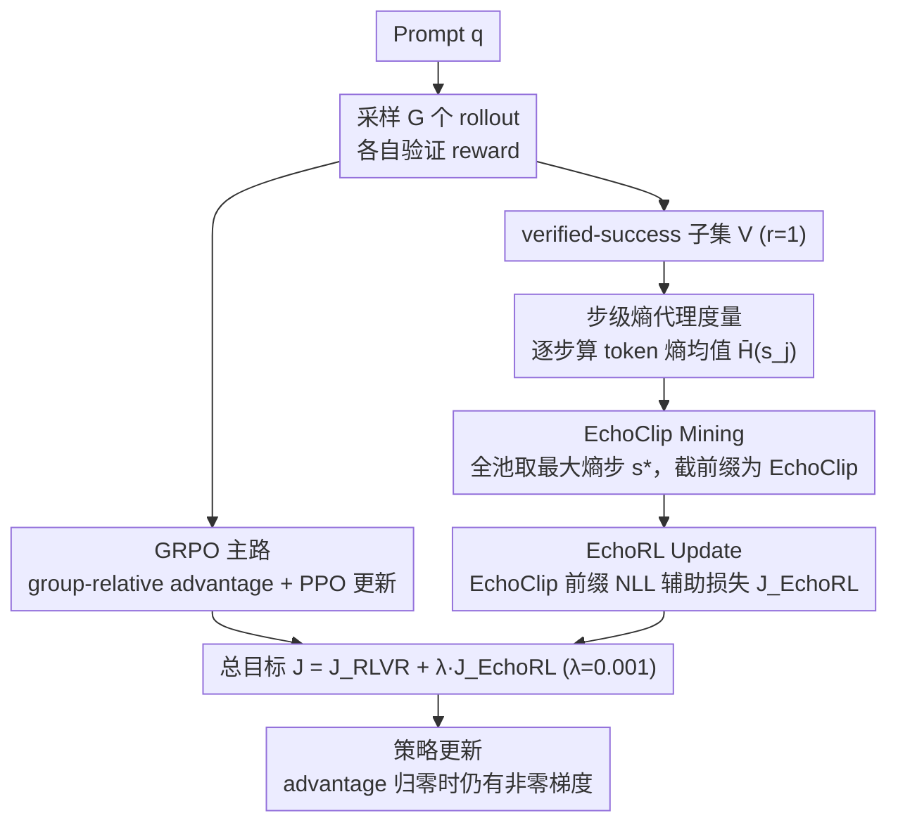

# EchoRL: Reinforcement Learning via Rollout Echoing

**会议**: ICML 2026  
**arXiv**: [2605.31228](https://arxiv.org/abs/2605.31228)  
**代码**: 论文中提及但仓库链接未明示  
**领域**: 强化学习 / LLM 推理 / RLVR / GRPO  
**关键词**: RLVR, Advantage Degeneration, EchoClip, Step-Level Entropy, GRPO  

## 一句话总结
本文指出 RLVR 训练后期 GRPO 类方法因为一组 rollout 全部成功导致优势归零、梯度消失（advantage degeneration），提出 EchoRL：从 verified-success rollout 里基于**步级熵峰值**挑出"最艰难却走通了的"前缀 EchoClip，作为辅助 SFT 项加到 loss 上，在 4 个 RLVR 框架、5 个 backbone、10 个 benchmark 上稳定带来最高 5.6%/5.0% 的 ID/OOD 提升。

## 研究背景与动机

**领域现状**：RLVR（Reinforcement Learning with Verifiable Rewards）是当下 LLM 推理后训练的事实主流，GRPO 因为去掉了 critic、用 group-relative advantage 替代价值函数估计而成为最常用框架，DeepSeek-R1、Qwen-Math 等一票推理模型都建立在它之上。

**现有痛点**：随着模型变强，越来越多 prompt 的 $G$ 个 rollout 全部 verified-success——这时 group 内 reward 完全相同，标准差 $\sigma_r=0$，归一化优势 $\hat{A}_i=(r_i-\mu_r)/\sigma_r=0$ 对所有 $i$ 都成立。GRPO 的 policy gradient $\nabla_\theta J \propto \mathbb{E}[\sum\nabla\log\pi_\theta\cdot w_{i,t}\cdot \hat{A}_i]$ 因此被乘 0 抹平，**消耗了大量算力却没有任何学习信号**。这种现象被作者命名为 advantage degeneration。

**核心矛盾**：reward 只看最终答案对错，对"如何到达答案"完全失明——同一道题里一条用蛮力代数硬算的 rollout 和一条用"对数求导技巧"巧解的 rollout 拿到完全相同的 reward 1，但后者明显蕴含了**更有价值的推理路径**，被现有归一化方式当噪声扔掉。已有解决思路要么是 DAPO / Reinforce-Rej / Reinforce-Ada 这条"拒绝采样 / 动态预算"路线——简单丢掉 degenerate 组，代价是数据效率下降；要么是 LUFFY / UFT / SRFT 这条"外部 golden trajectory 监督"路线——引入对昂贵专家模型的依赖。

**本文目标**：在不依赖外部专家、不丢弃 rollout 的前提下，从模型自己生成的 verified-success rollout 里把"埋着的可用信号"挖出来，让训练即使在 advantage degeneration 阶段也能维持非零梯度。

**切入角度**：作者做了一个关键的诊断分析——对比专家 golden trajectory 和当前策略 verified rollout 的 token 熵分布，发现**专家轨迹整体熵更高**，且具体到每条轨迹，**信息量大的步骤往往伴随陡峭的熵峰值**。这把"哪一步重要"翻译成了"哪一步的步级熵最大"。

**核心 idea**：用步级熵当代理找出 verified rollout 里"最艰难但走通了的"前缀作为 EchoClip，把它作为辅助 NLL 损失加到 RL objective 上——SFT 形式的密集监督不依赖 advantage，自然绕过梯度消失。

## 方法详解

### 整体框架

EchoRL 是一个 plug-and-play 模块，挂在任意 RLVR 算法（GRPO、DAPO、LUFFY、UFT）之外。对每个 prompt $q$，标准流程仍然采 $G$ 个 rollout、算 group-relative advantage、做 PPO-style 更新；EchoRL 在此基础上插入两步：(1) **EchoClip Mining**——从 verified-success 子集 $V=\{o\mid r(o)=1\}$ 里按步级熵筛出一个最关键的前缀片段 $o_{echo}$；(2) **EchoRL Update**——把这个片段的负对数似然作为辅助监督 $\mathcal{J}_{EchoRL}$ 加到主 loss 上，整体目标变成 $\mathcal{J}(\theta)=\mathcal{J}_{RLVR}(\theta)+\lambda\mathcal{J}_{EchoRL}(\theta)$，$\lambda=0.001$ 调节量级。整个机制最妙的地方是：当 group 内全成功导致 $\hat{A}_i=0$、$\nabla\mathcal{J}_{RLVR}\to 0$ 时，$\nabla\mathcal{J}_{EchoRL}$ 仍然非零，训练不至于卡死。

### 关键设计

**1. 步级熵作为"可用学习信号"的代理度量：把"哪一步重要"量化成一个标量**

reward 只看最终答案对错，分不清哪一步推理有价值。EchoRL 用模型自己的预测熵来定位关键步：按自然分隔符（如 `\n`）把 rollout 切成 reasoning step 序列 $(s_1,\dots,s_M)$，步级熵定义为 $\bar{H}(s_j)=\frac{1}{|s_j|}\sum_{x\in s_j}H_\theta(x\mid q,o_{<x})$，即该步内所有 token 预测熵的均值——用步级而非单 token 熵，是因为标点等短期波动会让单 token 熵非常 noisy。"高熵 = 关键步"这条链路有两个证据支撑：一是外部 golden trajectory 的整体熵显著高于自生成 rollout，说明专家的"难步骤"恰好对应模型的"不确定区"；二是在 OpenR1-Math 45k 上做消融式删除——按从高熵到低熵删步骤时准确率迅速崩，按从低熵到高熵或随机删则要删多得多才掉同样多，直接证明高熵步承载了大部分推理价值。

**2. EchoClip Mining：从一组 verified rollout 里挑出唯一的关键前缀**

有了步级熵就能定位监督源。给定 prompt $q$ 的 verified-success 集合 $V=\{o\mid r(o)=1\}$，先把里面所有 step 汇成池 $\text{Steps}(V)$，跨整个池找最大熵步 $s^*=\arg\max_{s\in\text{Steps}(V)}\bar{H}(s)$，设 $o^*\in V$ 是包含 $s^*$ 的母 rollout，EchoClip 就取截到 $s^*$ 结束位置的前缀 $o_{echo}=\text{Prefix}(o^*, s^*)$。选最大熵步而不是 top-k 是为了精确——只挑全组里最棘手却走通了的那一处，比模糊的多步平均更能定位"突破性时刻"；截成前缀而不取整条 rollout，一是避免把后续可能 redundant 的链一起塞进监督，二是保留模型在前缀之后自由生成的空间，只固化"上半场关键步"。而且"前缀"天然是个标准 prefix LM 训练问题，实现成本极低。

**3. EchoRL Update：把 EchoClip 包成 prefix-NLL 辅助损失，绕开 advantage 消失**

挖出的 EchoClip 要转成稳定梯度才能用。辅助目标写成 prefix 上的负对数似然 $\mathcal{J}_{EchoRL}(\theta)=-\frac{1}{L}\sum_{t=1}^{L}\log\pi_\theta((o_{echo})_t\mid q,(o_{echo})_{<t})$（$L=|o_{echo}|$），与主目标加权求和 $\mathcal{J}(\theta)=\mathcal{J}_{RLVR}+\lambda\mathcal{J}_{EchoRL}$，$\lambda=0.001$。刻意做成 SFT-style 的逐 token NLL 正是为了绕开 advantage 这套机制——SFT loss 的梯度不依赖 group variance，所以即使 $\sigma_r=0$、$\nabla\mathcal{J}_{RLVR}\to 0$ 也仍有有效梯度；$\lambda$ 取得很小是让 RL 保持主驱动、EchoRL 只在 degenerate 时刻"补血"，避免训练退化成纯 SFT。相比 LUFFY/UFT 引入完整外部 golden trajectory，EchoRL 只用模型自己的一段前缀，零额外推理成本、零专家依赖。

### 损失函数 / 训练策略

总目标 $\mathcal{J}(\theta)=\mathcal{J}_{RLVR}(\theta)+\lambda\mathcal{J}_{EchoRL}(\theta)$，$\lambda=0.001$。Rollout batch 128、update batch 64、每问 8 rollout、temperature 0.6。在 verl（文本）和 EasyR1（多模态）上实现，base 模型 Qwen2.5-1.5B/7B/Math-7B/LLaMA-3.1-8B/Qwen2.5-VL 等共 5 个，训练集 OpenR1-Math 45k（文本）和 Geometry3K（多模态）。

## 实验关键数据

### 主实验：Qwen2.5-Math-7B 上叠加 EchoRL（节选）

| 方法 | AIME24 | AIME25 | AMC | MATH-500 | Minerva | Olympiad | ID Avg | ARC-c | GPQA | MMLU-Pro | OOD Avg |
|------|--------|--------|-----|----------|---------|----------|--------|-------|------|----------|---------|
| Qwen2.5-Math-7B | 11.4 | 4.9 | 31.3 | 43.6 | 7.4 | 15.6 | 19.0 | 18.2 | 11.1 | 16.9 | 15.4 |
| Qwen2.5-Math-7B-Instruct | 12.9 | 10.2 | 48.5 | 80.4 | 32.7 | 41.0 | 37.6 | 70.3 | 24.7 | 34.1 | 43.0 |
| SFT | 22.2 | 22.3 | 52.8 | 82.6 | 40.8 | 43.7 | 44.1 | 75.2 | 24.7 | 42.7 | 47.5 |
| GRPO | 25.8 | 16.4 | 61.2 | 80.4 | 39.7 | 43.7 | 44.5 | — | — | — | — |
| LUFFY | 29.4 | 23.1 | 65.6 | 87.6 | 37.5 | 57.2 | 50.1 | 80.5 | 39.9 | 53.0 | 57.8 |
| **LUFFY + EchoRL** | **33.4** | **25.7** | **67.5** | **88.9** | 39.0 | 55.1 | **51.9** | **83.6** | **45.3** | **54.1** | **61.0** |
| UFT | 24.8 | 18.1 | 60.5 | 82.6 | 40.1 | 47.8 | 45.7 | 82.2 | 38.9 | 49.6 | 56.9 |
| **UFT + EchoRL** | 27.0 | 21.3 | 62.0 | 84.4 | 40.8 | 49.6 | 47.6 | 82.7 | 43.4 | 53.5 | 59.9 |

LUFFY + EchoRL 在 ID 上 +1.8%、OOD 上 +3.2%；其中 GPQA 一项从 39.9 → 45.3（+5.4），证明对真正 OOD 推理任务收益最大。

### 步级熵消融（验证"高熵=关键"假设）

| 删除策略 | 准确率（删 10% steps） | 准确率（删 30% steps） | 说明 |
|----------|------------------------|------------------------|------|
| 删高熵步 | 大幅下降 | 接近随机 | 高熵步是推理关键 |
| 删低熵步 | 几乎不变 | 仍可接受 | 低熵步是模板化套话 |
| 随机删 | 介于两者之间 | 介于两者之间 | 反向印证 |

### 关键发现
- EchoRL 在 4 个基座 RLVR 方法（GRPO/DAPO/LUFFY/UFT）上**全部**带来正收益，且对原本就引入了外部 expert 的 LUFFY/UFT 仍能再叠加 1–3% 提升，说明"挖自己的高熵步"和"借外部 golden trajectory"是互补信号而非冗余。
- OOD 收益（最高 +5.04%）比 ID 收益（最高 +5.61%）的相对幅度更突出——在 ARC-c/GPQA/MMLU-Pro 上动辄 +3–5 点，证明 EchoRL 强化的不是题型记忆而是**通用推理 step 的稳定性**。
- 计算开销几乎为零：EchoClip 的熵计算复用 rollout 阶段已有的 logits，loss 多一项前向，整体训练时间与原算法持平甚至略低（因为不需要像 DAPO 那样做拒绝采样的额外 rollout）。

## 亮点与洞察
- **"熵峰即关键步"是个普适且优雅的代理信号**：很多人用 verifier、PRM 或外部专家来定位关键步，本文用模型自身的预测熵——零外部依赖、计算几乎免费、可解释性高（高熵 = 模型在分叉口犹豫）。这套思路可以迁移到 Process Reward Model 训练、推理时 best-of-N 选择、甚至搜索式 decoding 的剪枝信号。
- **"用 SFT 旁路 advantage 消失"在工程上是个很经济的 trick**：advantage degeneration 的本质是分母为零，过去大家都在想办法把分母调回来（拒绝采样、动态预算），EchoRL 反其道而行，**绕开分母**——直接用一个 NLL 项注入梯度。这种"用次要 loss 在主 loss 失效时维持训练动能"的设计模式可以推广到任何 group-relative 算法。
- **挑前缀而非整条 golden trajectory 是个被低估的细节**：相比 LUFFY 把整条专家轨迹塞进 loss，EchoRL 只把 prefix 固化为监督，让模型在前缀之后**仍然自由生成**——这既保留了 RL 探索性，又提供了关键转折处的引导。

## 局限与展望
- 步级熵的可靠性建立在"模型已经 reasonably calibrated"上：训练早期模型预测分布很平时高熵步可能只是噪声而非真正的难点，作者没有讨论 warmup 阶段是否需要延迟启用 EchoRL。
- "全组挑一个最大熵 step" 的最大化操作在 verified-success 数量为 1 时退化为"取唯一那条"，此时 EchoRL 等价于一个固定的 SFT 项，可能丢失多样性；可以考虑改成 top-k EchoClips 或带温度的软选择。
- $\lambda=0.001$ 在所有实验里固定不调，跨任务跨规模的最优 $\lambda$ 没系统扫；尤其是对 1.5B 这样的小模型，prefix-NLL 的相对权重可能需要更大才能撬动学习。
- 自然分隔符切 step 在 Chain-of-Thought 良好分段时有效，但碰到密集公式或代码 block 可能切得不准，作者把这部分细节藏在 Appendix D，工业落地时可能需要 task-specific tokenizer。

## 相关工作与启发
- **vs DAPO / Reinforce-Rej / Reinforce-Ada**：它们的解法是"丢掉 degenerate prompt 或加大 rollout 预算"，本质牺牲数据效率换稳定；EchoRL 把同一批 rollout 二次利用，data efficiency 反而提升，是更"环保"的方案。
- **vs LUFFY / UFT / SRFT / SEELE / RelIFT**：它们都引入外部 golden trajectory 或 expert demo 做辅助监督，依赖昂贵的强模型；EchoRL 完全自给自足，且实验显示 LUFFY + EchoRL 仍能再涨——说明"模型自己 verified-success 里的关键 step"和"外部 expert step"是不同质的两类信号，可以叠加。
- **vs Process Reward Model（PRM, Lightman 2023 等）**：PRM 需要专门训一个 step 级 reward model，标注成本高；EchoRL 用熵代替 PRM 评分，零额外训练。

## 评分
- 新颖性: ⭐⭐⭐⭐ "熵峰挖关键步 + 前缀 NLL 旁路 advantage" 这套组合在 RLVR 这条线上比较新，工程上的简洁是其美感。
- 实验充分度: ⭐⭐⭐⭐ 5 个 backbone、4 个 RLVR baseline、10 个 benchmark、ID+OOD 双评、熵消融 + 资源开销分析齐全，研究问题逐个回答。
- 写作质量: ⭐⭐⭐⭐ 问题动机用一个具体例子（quartic polynomial + 对数求导）讲透 advantage degeneration，方法图直观，公式与文字相互印证。
- 价值: ⭐⭐⭐⭐ 即插即用、零额外算力、对所有主流 RLVR 框架都有效，工程落地价值很高，社区可以直接加进 verl/OpenRLHF。

<!-- RELATED:START -->

## 相关论文

- [\[ICML 2026\] DARTS: Distribution-Aware Active Rollout Trajectory Shaping for Accelerating LLM Reinforcement Learning](darts_distribution-aware_active_rollout_trajectory_shaping_for_accelerating_llm_.md)
- [\[ICLR 2026\] QuRL: Efficient Reinforcement Learning with Quantized Rollout](../../ICLR2026/reinforcement_learning/qurl_efficient_reinforcement_learning_with_quantized_rollout.md)
- [\[ICML 2026\] Single-Rollout Hidden-State Dynamics for Training-Free RLVR Data Selection](single-rollout_hidden-state_dynamics_for_training-free_rlvr_data_selection.md)
- [\[ICML 2026\] InftyThink+: Effective and Efficient Infinite-Horizon Reasoning via Reinforcement Learning](inftythink_effective_and_efficient_infinite-horizon_reasoning_via_reinforcement_.md)
- [\[ICML 2026\] Coupled Variational Reinforcement Learning for Language Model General Reasoning](coupled_variational_reinforcement_learning_for_language_model_general_reasoning.md)

<!-- RELATED:END -->
