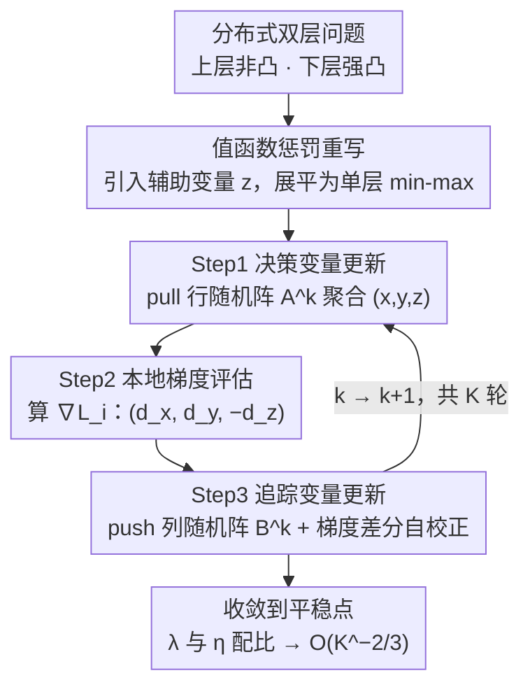

# FAB: A First-Order AB-based Gradient Algorithm for Distributed Bilevel Optimization over Time-Varying Directed Graphs

**会议**: ICML 2026  
**arXiv**: [2605.06328](https://arxiv.org/abs/2605.06328)  
**代码**: https://anonymous.4open.science/r/FAB-HE66 (匿名)  
**领域**: 分布式优化 / 双层优化 / 强化学习  
**关键词**: Push-Pull/AB, 时变有向图, 双层优化, 一阶算法, 共识误差

## 一句话总结
本文提出 FAB——首个面向时变有向图分布式双层优化的纯一阶算法，将 AB/Push-Pull 通信与值函数惩罚法相结合，给出非渐近 $\mathcal{O}(K^{-2/3})$ 收敛率，并顺带解决了 AB/Push-Pull 在时变有向图非凸场景下收敛率长期悬而未决的开放问题。

## 研究背景与动机
**领域现状**：去中心化优化已成为分布式机器学习的主流范式之一，从早期的无向图算法（EXTRA、Exact-Diffusion、梯度追踪），扩展到有向图上的 Push-Sum、Push-DIGing，再到融合行随机矩阵 $A$ 与列随机矩阵 $B$ 的 AB/Push-Pull 协议；针对通信延迟、掉队节点和卫星网络等真实约束，最近又拓展到了**时变有向图**。

**现有痛点**：把这些去中心化算法落到机器学习任务上时，超参数（如正则系数 $\lambda$）调优非常痛苦，作者实验观察到，与其暴力 grid search，不如把超参看作双层优化的上层变量；但分布式双层优化在静态网络上才被研究过，时变有向图设定下至今没有可证明的方法。同时，即便是单层场景，AB/Push-Pull 在时变有向图、非凸目标下的收敛率也一直没有严格刻画。

**核心矛盾**：(1) 动态非平衡通信会引入持续漂移的共识偏差，时变设定下根本特征向量 $\pi$ 不再固定，传统静态分析中 $\pi$ 的时不变性这个关键武器失效；(2) 双层优化的惩罚参数 $\lambda$ 想要逼近原始问题就必须取大，但 $\lambda$ 越大共识误差被放大得越厉害，可能直接发散——存在「逼近精度 vs 共识稳定性」的硬性 trade-off。

**本文目标**：设计一个纯一阶、可证明收敛的分布式双层算法，能在时变有向图、上层非凸 + 下层强凸的最一般设定下工作，并顺手把 AB/Push-Pull 在非凸时变设定下的收敛率补齐。

**切入角度**：值函数惩罚法 $\min_{x,y} F(x,y)+\lambda(G(x,y)-\min_z G(x,z))$ 把双层问题化成单层，避免了二阶 Hessian-vector product；引入辅助变量 $z$ 追踪 $y^*(x)$ 后，问题进一步分解成可分布的 min-max 形式，与 AB/Push-Pull 的 push/pull 双矩阵通信天然契合。

**核心 idea**：用一行随机矩阵 $A^k$ pull 决策变量 $(x,y,z)$，用一列随机矩阵 $B^k$ push 梯度追踪变量 $(t_x,t_y,t_z)$，把值函数惩罚目标的梯度下降-上升更新直接嵌入 AB/Push-Pull 框架，把双层结构、时变有向通信、纯一阶梯度三件事一次性打包解决。

## 方法详解

### 整体框架
FAB 把上层非凸、下层 $\mu$-强凸的分布式双层问题
$\min_x \mathcal{F}^*(x)=F(x,y^*(x))$，$y^*(x)=\arg\min_y G(x,y)$
重写为带辅助变量的等价 min-max 形式 $\min_{x,y}\max_z \frac{1}{n}\sum_i \mathcal{L}_i(x,y,z)$，其中 $\mathcal{L}_i = f_i(x,y)+\lambda(g_i(x,y)-g_i(x,z))$。每个 agent $i$ 在每轮维持两组变量：决策变量 $(x_i^k,y_i^k,z_i^k)$ 与梯度追踪变量 $(t_{x,i}^k,t_{y,i}^k,t_{z,i}^k)$。每轮通过 pull（行随机矩阵 $A^k$）从入邻居聚合决策，本地评估 $\nabla \mathcal{L}_i$，再通过 push（列随机矩阵 $B^k$）传递梯度追踪量，三步循环到底。

### 关键设计

**1. AB/Push-Pull + 值函数惩罚的耦合：把单层通信原语无缝扩展到双层，全程不碰二阶导**

分布式双层先前要么依赖二阶导（Hessian-vector 在去中心化下很难精确算），要么只能跑在静态无向图上。FAB 先用值函数惩罚把双层 $\min_{x,y}\max_z F+\lambda(G(x,y)-G(x,z))$ 等价重写成单层 min-max，避开 Hessian；然后让 $y$ 用梯度下降逼近上层最优、$z$ 用梯度上升追踪 $y^*(x)$，三者全部走 AB/Push-Pull 的"pull-评估-push"三步，共享同一套行随机矩阵 $A^k$ 与列随机矩阵 $B^k$，不需要任何二阶信息。这样所有要交换的信号都变成了梯度量，又复用了双随机矩阵的 push-pull 结构，恰好契合时变有向通信。

**2. 梯度追踪三元组：在动态非平衡的通信图上恢复全局平均梯度的无偏估计**

时变有向图缺乏时不变的根特征向量 $\pi$，单纯做共识平均会留下持续漂移的偏差，这正是把分析从强凸推到非凸最难啃的地方。FAB 给 $(x,y,z)$ 各维护一个追踪变量 $t$，更新规则 $t^{k+1}_i = \sum_j b_{ij}^k t_j^k + d_i^{k+1} - d_i^k$（$d_i^k = \nabla_{\cdot}\mathcal{L}_i$），靠列随机性保证 $\sum_i t_{\cdot,i}^k = \sum_i d_{\cdot,i}^k$，使每个 agent 的步进方向逐渐对齐全局平均梯度。差分项 $d^{k+1}-d^k$ 起的就是"自校正"作用——把因 agent 异质性导致的共识漂移在每一步抵消掉，是非凸时变设定下收敛的关键工具。

**3. 惩罚参数 $\lambda$ 与步长 $\eta$ 的精细配比：在"逼近精度"与"共识稳定"之间找出可证明的最优 trade-off**

双层惩罚里 $\lambda$ 越大越逼近原问题，但 $\lambda$ 越大共识误差被放大得越厉害、甚至直接发散——这对矛盾是分布式特有的硬骨头。FAB 的 Lyapunov 分析把它量化：descent 不等式形如 $\|\nabla \mathcal{F}^*\|^2 + \frac{8\underline{c}n}{5a^n}\mathcal{C}_{b,3}\lambda \mathbf{V}_D^k \leq \frac{4\mathcal{C}_{gap}}{\lambda^2}+\dots$，逼近误差按 $\lambda^{-2}$ 衰减、共识误差被 $\lambda$ 线性放大，于是取 $\lambda = \mathcal{O}(K^{1/3})$、$\eta = \mathcal{O}(K^{-1/3})$ 让两个量在 $K^{-2/3}$ 处汇合。这是全文理论的精髓：把双层常用的"$\lambda$ 越大越好"放回分布式共识误差的框架里重新权衡，并给出可执行的渐近调参公式。

### 损失函数 / 训练策略
Local penalty $\mathcal{L}_i(x,y,z)=f_i(x,y)+\lambda(g_i(x,y)-g_i(x,z))$，$\lambda=\mathcal{O}(K^{1/3})$；步长 $\eta_x^k,\eta_y^k,\eta_z^k=\mathcal{O}(K^{-1/3})$。下层 $g_i$ 假设 $\mu$-强凸、$L_{g,1}$-光滑、Hessian Lipschitz；上层 $f_i$ 仅需 $L_{f,1}$-光滑 + 有下界即可非凸；通信图每步强连通（或 $C$-连通），$A^k,B^k$ 非零元一致下界 $a,b>0$。

## 实验关键数据

### 主实验

| 任务 | 网络/设定 | 对比基线 | FAB 表现 |
|------|-----------|---------|----------|
| 分布式 RL 策略评估（线性 Bellman） | $\nu\in\{0.1,0.3,0.5\}$, 噪声 $\omega\in\{1,2,3\}$ | SGP-DL / Push-SAGA-DL / Push-ASGD-DL / AB-DL | 全部连通度+噪声组合下 loss 最低、收敛最快 |
| Fashion-MNIST 数据超清洗（MLP, 203k 参数） | $cr\in\{0.4,0.5,0.6\}$, $\rho\in\{0.1,0.5,1\}$ | 同上 | 测试准确率在所有破坏率/异质度下领先 |
| IMDB 数据超清洗（BERT-110M 微调） | 时变有向图 | 同上 | 在大模型 NLP 设定下仍保持优势 |
| MNIST 超参调优（验证集对抗 corruption） | 100 agents, $cr=0.2,0.4$ | SGP+grid / Push-DIGing+grid / AB+grid | 测试精度显著高于固定 $\lambda=0.2$ 的单层基线，$\lambda$ 自适应轨迹随训练演化 |

### 消融实验

| 维度 | 观察 | 结论 |
|------|------|------|
| 网络规模 $n$ 增大 | 收敛性能下降但非指数级 | 与理论 $(ab)^{-n}$ 的最坏界一致，实际衰减更温和 |
| 连通参数 $\nu$ 变小（更稀疏） | FAB 与基线均变慢，但 FAB 退化更轻 | 双层 + 梯度追踪对稀疏拓扑更鲁棒 |
| 噪声 $\omega$ 增大 | 单层 baseline 显著震荡 | 双层结构相当于内置自适应正则，吸收梯度噪声 |
| 峰值内存 | FAB 与单层 baseline 同量级 | 一阶设计避免了二阶方法常见的内存爆炸 |

### 关键发现
- **理论开放问题被顺手解决**：把 FAB 退化到单层（无 $\lambda$）即得到 AB/Push-Pull 在时变有向图、非凸目标下的 $\mathcal{O}((ab)^{-n}K^{-1})$ 收敛率，与中心化梯度下降 $K^{-1}$ 速率完全匹配。
- **双层 vs grid search**：在 motivating experiment 中，FAB 在 $cr=0.4$ 的强标签噪声下显著高于任何固定 $\lambda$ 的单层方法，且 $\lambda$ 训练轨迹清晰显示出从大到小的自适应衰减，证明双层调超参的实际价值。
- **网络规模因子 $(ab)^{-n}$**：理论上看似指数差，但作者通过实验 Figure 6(a) 说明实际只缓慢退化，与文献中 subgradient-push、Push-Pull 在最坏分析下出现的同类常数一致。

## 亮点与洞察
- 把「分布式优化」+「双层优化」+「时变有向图」三个本来各自难啃的方向拼在一起，并给出第一份非渐近收敛保证，工作量与新颖性都非常硬。
- 用辅助变量 $z$ 把 $\min\max\min$ 结构展平到一层 min-max，再配上 AB/Push-Pull 的天然 row/column 双矩阵设计，结构对应得非常优雅——可以迁移到其他 nested 结构问题（meta-learning、对抗鲁棒、actor-critic）。
- 分析框架可剥离：只取「单层 + 时变有向 + 非凸」子集就能立刻拿到 AB/Push-Pull 收敛率，这种「证大送小」的副产品在算法论文里很少见。
- 工程上 100% 一阶 + 梯度追踪的设计意味着可以直接嵌入 PyTorch 的 DDP/RPC，不需要二阶导支持，对实际部署友好。

## 局限与展望
- 收敛常数中的 $(ab)^{-n}$ 因子虽然是最坏情形，但仍然提示算法在 agent 数量极大、通信极稀疏时可能性能崩塌；未来需要 task-specific tighter 分析或引入压缩通信。
- $\lambda=\mathcal{O}(K^{1/3})$ 需要事先知道 $K$，作者也提出可借鉴中心化的递增 $\lambda$ 方案（Kwon 2023）改进，但分布式情形下还未给出严格保证。
- 下层强凸假设在很多 RL/meta-learning 任务里并不成立（如非凸 value function），如何放宽到下层 PL 或非凸是自然方向。
- 实验最大模型是 BERT-base（110M），尚未验证大模型 + 跨地域时变通信（如真实的卫星网或联邦学习边缘节点）的端到端可行性。

## 相关工作与启发
- **vs AB/Push-Pull 系列 (Xin & Khan 2018; Pu 2021; Saadatniaki 2020; Nedić 2025)**：他们做单层、主要靠强凸，本文做双层、非凸 + 时变；分析框架的一个 simplified variant 也补齐了他们留下的开放问题。
- **vs 分布式双层 (Yang 2022, Zhu 2024, Chen 2025)**：先前工作多依赖二阶导（Hessian-vector）且只能跑静态图；本文是首个静态/时变有向图都能跑的一阶方案。
- **vs 中心化双层 (Kwon 2023, Chen 2025a)**：他们的值函数惩罚法启发了本文 reformulation，但本文额外处理共识误差与 $\lambda$ 的相互放大效应，是分布式特有的硬骨头。
- **vs Push-DIGing / SGP**：同样面向时变有向图，但单层；本文表明在引入双层结构后，同样的通信原语可以用来做超参自适应，意义远超传统 ERM。

## 评分
- 新颖性: ⭐⭐⭐⭐⭐ 首个时变有向图分布式双层算法 + 顺手解决 AB/Push-Pull 非凸时变开放问题
- 实验充分度: ⭐⭐⭐⭐ 涵盖超参调优、数据超清洗、RL 策略评估三类任务 + CV/NLP 两域，但缺超大规模联邦实测
- 写作质量: ⭐⭐⭐⭐ 理论推导脉络清晰，挑战分析与设计动机交代到位，Algorithm 1 结构紧凑易读
- 价值: ⭐⭐⭐⭐ 在去中心化 ML 系统、卫星网、联邦学习超参自动化等场景有直接应用前景

<!-- RELATED:START -->

## 相关论文

- [\[ICML 2026\] Bilevel Optimization over Saddle Points of Zero-Sum Markov Games](bilevel_optimization_over_saddle_points_of_zero-sum_markov_games.md)
- [\[AAAI 2026\] First-Order Representation Languages for Goal-Conditioned RL](../../AAAI2026/reinforcement_learning/first-order_representation_languages_for_goal-conditioned_rl.md)
- [\[ICML 2026\] Parameter-free Dynamic Regret: Time-varying Movement Costs, Delayed Feedback, and Memory](parameter-free_dynamic_regret_time-varying_movement_costs_delayed_feedback_and_m.md)
- [\[AAAI 2026\] Do It for HER: First-Order Temporal Logic Reward Specification in Reinforcement Learning](../../AAAI2026/reinforcement_learning/do_it_for_her_first-order_temporal_logic_reward_specification_in_reinforcement_l.md)
- [\[ICML 2026\] Laplacian Representations for Decision-Time Planning](laplacian_representations_for_decision-time_planning.md)

<!-- RELATED:END -->
