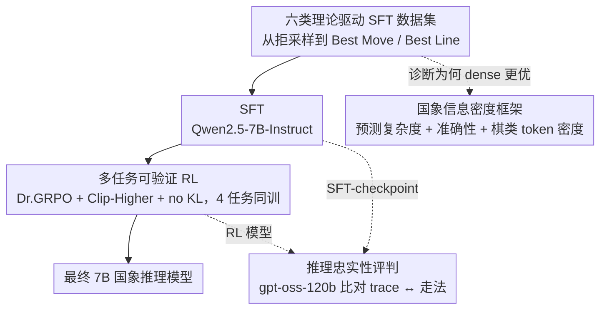

# How Reasoning Evolves from Post-Training Data: An Empirical Study Using Chess

**会议**: ICML 2026  
**arXiv**: [2604.05134](https://arxiv.org/abs/2604.05134)  
**代码**: https://github.com/(lang-chess) (有)  
**领域**: 强化学习 / LLM 推理 / 可验证 RL  
**关键词**: SFT-to-RL, 推理忠实性, 国象推理, 信息密度, GRPO

## 一句话总结
作者把"训 LLM 学下国际象棋"当成可验证 RL 的干净实验台，系统比对 6 类自制 SFT 数据集对 RL 的影响，发现"直接预测最佳一步 (Best Move)"得最高分但 RL 后产生不忠实推理，"预测多步最佳走法 (Best Line)"性能相当但 RL 更稳、推理更忠实；并提炼出三条可用 SFT-checkpoint 预测 RL 终局性能的指标，最终用 7B 模型在多个国象 benchmark 上超过 gpt-oss-120b。

## 研究背景与动机

**领域现状**：当前训练 LLM "学会推理"几乎只在数学和代码上做，因为这两个域有海量高质量数据 + 可自动验证；R1 / DeepSeek-R1、Kimi k1.5 等都靠 RL + verifiable reward 大跃迁。

**现有痛点**：可控实验难做。数学和代码训练数据已经太成熟，base model 自带强能力，导致很难隔离出"是哪类训练数据让 RL 涨点"。同时，研究界对"推理质量"基本只看终局准确率，几乎没有人系统问"RL 是不是真在学推理 vs. 只是在调答案分布"。

**核心矛盾**：要做精细的"SFT 数据→ RL 行为"因果分析，就必须找一个 LLM 天生很弱（避免 base 干扰）但又有充足可验证 reward 的领域；同时这个领域要能定义"推理是否忠实于答案"。

**本文目标**：(a) 不同 SFT 数据（程序化 / 拒采样 / 合成 / Best Move / Best Line）如何影响 SFT 和 RL 终局性能？(b) RL 如何改变模型的 move 质量分布、幻觉率、推理策略？(c) 哪些 SFT-checkpoint 指标能预测 RL 之后的表现？

**切入角度**：作者把国象选成"理想 testbed"——LLM 历来下不好（避免 base 强偏置），有 episodic MDP 结构，有 Stockfish 这种 superhuman oracle 提供 verifiable reward 与合成数据；同时国象很容易定义"推理是否与最终走法一致"（让 gpt-oss-120b 当 judge）。

**核心 idea**：用 Qwen2.5-7B 跑系统化 SFT→RL ablation，引入"chess information density"框架（predictive complexity + accuracy + chess token density）解释为什么有些数据集训出来的 RL 又稳又强，提炼"忠实推理"的关键设计。

## 方法详解

### 整体框架
统一 base：Qwen2.5-7B-Instruct。Board state 用 visual ASCII 格式（试过 FEN 与 spaced FEN 后嫌 tokenization 不均匀），move 用 UCI 格式。任务套件四件：Predict Move（给棋盘选最优走法）、Best Move / Worst Move（5 选 1）、Legal Moves（IoU 评估）。流程：先固定 15M token SFT、8k samples RL（Dr. GRPO + Clip-Higher + no KL）做 ablation 选最强 recipe，再 scale 到 60M+60M token SFT + 更多 RL。整条研究就是一条「数据 → SFT → RL → 分析」的流水线：六类理论驱动的 SFT 数据集喂进 Qwen2.5-7B 做 SFT，得到 SFT-checkpoint 后跑多任务可验证 RL 得到最终模型；两把分析尺子贯穿全程——用 gpt-oss-120b 当 judge 测「推理忠实性」、用一个轻量 0.5B 模型测「国象信息密度」，前者解释为什么 Best Line 比 Best Move 更可信、后者解释为什么 dense 数据在等量 token 下训得更好。

### 关键设计

**1. 6 类理论驱动的 SFT 数据集：从不同角度灌入棋盘理解、决策与推理格式，让 ablation 能逐一隔离贡献**

整个研究是冲着"哪种 SFT 数据让 RL 更稳更强"去的，所以六个数据集不是随便凑的，每个都对应 MDP 里一种不同结构。① General Instruction Following（Magpie Llama 3.3 70B）做 regularization；② Rejection Sampling 用 Llama 4 Maverick 在四个评估任务上生成、保留正确样本，注入"教师风格"推理；③ Guided Synthetic 给教师一个 5-ply 局面线 + 起止盘面，让它写含转移函数 $\mathcal{T}(s_t,a_t)$ 和价值 $V(s_t)$ 的口头 $n$-step bootstrapping；④ Verbalized Alpha-Beta Pruning 完全程序化——基于 Stockfish 做 softmax 采样、递归构 minimax 树并把搜索过程口头化；⑤ Best Move：给盘面直接输出最佳 UCI 走法，近似 behavior cloning $\pi_\theta(a_t|s_t)$；⑥ Best Line：输出 4-6 ply 最优走法序列并附最终 centipawn delta，近似含 $V$ 与 $\mathcal{T}$ 的 $n$-step bootstrapping。这样 ablation 比的不只是"哪个数据集分高"，而是"哪种归纳偏置最有效"。

**2. 可验证 RL 环境与 Dr. GRPO 设置：在四种任务上同时跑 multitask RL，避免单任务的 reward hacking**

reward 全部可程序化算出——Predict Move 是 normalized rank（$r\in[0,1]$，最佳为 1）、Best/Worst Move 看是否选对、Legal Moves 用 IoU。算法用 Dr. GRPO（移除 GRPO 的长度归一化）+ Clip-Higher（扩大 PPO clip 上界鼓励探索）+ 去掉 KL penalty，8k samples 平均分给四个任务，scale 阶段再放大。关键发现是作者本来在单任务 Predict Move 上跑 RL，结果容易 reward hack，而 multitask 同时强迫"知道哪些 move 合法/哪些好/哪些差"，move quality 反而更高、模型更鲁棒——任务多样性比单点强训更值，这是个反直觉但实用的结论。

**3. "忠实推理"的判定与 Best Line 的优势：把"推理 trace 和最终 move 是否一致"做成可比较的标量**

只看终局分数会得出"Best Move 和 Best Line 效果相近"的错误结论，引入忠实性维度后才能区分两条训练路径。作者用 gpt-oss-120b 当 judge 逐条评分 reasoning trace 与最终答案的对齐度，结果 Best Move 数据 SFT 后的 checkpoint 经 RL 后 reasoning 与 move 严重不一致（典型的"先决定再编理由"），Best Line 训出来的经 RL 后却保持忠实。归因是：Best Line 强迫模型在 token 序列里学到 $V$ 和 $\mathcal{T}$，相当于内化一个 mini world model；Best Move 只学到 policy $\pi_\theta$，于是 RL 提升的是潜在能力但表面推理与答案脱节（呼应 Turpin et al. 2023 的 unfaithful CoT）。有了忠实性这把尺子，研究者才能选"性能差不多但推理可信"的路径，这对安全和可解释性意义重大。

**4. 国象信息密度（chess information density）框架：解释"为什么 dense 数据集在等量 token 下训得更好"**

ablation 把训练 token 数固定住后，"哪个数据集更优"就归结成"等量 token 里塞了多少有用信息"——但信息论没有现成定义能直接套，作者于是从三个可度量维度自定义这把尺子：① 预测复杂度（predictive complexity）——数据在训练全程是否仍然难预测；② 准确性（accuracy）——token 是否正确 grounded 到棋盘与任务；③ 棋类 token 密度（chess token density）——预测某个 token 是否真需要棋盘理解与策略（直接输出最佳走法的 Best Move，其每个 token 的"含金量"远高于 Rejection Sampling 里大段自然语言冗余）。为把"预测复杂度"落成数字，作者拿 Qwen2.5-0.5B 在 4M unique token 上 SFT 2 epoch，统计验证集里被分配概率 $>0.995$（即模型已"背下来"）的 token 比例：比例越高越平凡、信息越稀。结果 Best Line / Best Move 的 trivial token 比例最低（0% / 28.6%）是真·dense，而 Verbalized Alpha-Beta Pruning 训完飙到 71%——程序化生成的搜索话术被迅速记死、只剩零星 move 决策与估值还带不确定性，这正解释了它单独训为何反而拖累性能。这把尺子可迁移到 SAT、定理证明等其他可验证 RL 域，是个诊断"数据值不值得训"的通用工具。

### 损失函数 / 训练策略
- SFT 用 LlamaFactory，RL 用 veRL；Dr. GRPO + Clip-Higher + no KL；scale 阶段先 60M token Best Move-All 再 60M token Best Line-All 的两段式 curriculum。

## 实验关键数据

### 主实验

| Benchmark | Qwen2.5-7B base | gpt-oss-120b | 本文 7B (Best Move + Best Line) |
|---|---|---|---|
| Best Move (5 选 1) | 接近随机 0.2 | 强 | **超过 gpt-oss-120b** |
| Worst Move | 接近随机 0.2 | 强 | **超过 gpt-oss-120b** |
| Predict Move (move quality) | 低 | 中 | **大幅领先** |
| Legal Moves (IoU) | 低 | 中 | **领先** |

| 数据集 | Pre-SFT trivial token% | Post-SFT trivial token% | 性质 |
|---|---|---|---|
| Best Line | 0.00% | 24.0% | dense 高密度 |
| Best Move | 0.04% | 28.6% | dense 高密度 |
| Factual Board Answering | 0.04% | 62.5% | 部分子任务已被压扁 |
| Verbalized Alpha-Beta Pruning | 4.31% | 71.0% | 大部分搜索短语已被记忆 |
| Guided Synthetic | 2.90% | 9.77% | 中等 |
| Rejection Sampling | 12.69% | 20.8% | 自然语言冗余 |

### 消融实验

| 训练 recipe | 终局 | RL 稳定性 | 推理忠实性 |
|---|---|---|---|
| Single-task RL (Predict Move) | 差，易 reward hack | 不稳 | 一般 |
| Multitask Rejection Sampling | 中 | 一般 | 一般 |
| Best Move（focused） | 高 | 不稳 | **不忠实** |
| Best Move-All（含全数据） | 最高 | 不稳 | **不忠实** |
| Best Line（focused） | 高 | **稳定** | **忠实** |
| Best Line-All | 高 | **稳定** | **忠实** |
| 含 Verbalized Alpha-Beta | 反而拖累性能 | — | — |

### 关键发现
- "数据集多样性 > 单一最强"——Best Move-All 和 Best Line-All 都比各自 focused 版强，即便里面包含了被单独验证为有害的 Verbalized Alpha-Beta Pruning；说明 RL 阶段的多样性是一种隐式正则。
- RL 一致性地把 move quality 分布右移、把幻觉率压低，即便没人显式 reward 这些副效应；尤其在 RL 后引用的 move accuracy（"reasoning trace 里提到的 move 是否合法"）成为最强的 SFT→RL 性能预测变量之一。
- Best Line 训出的 RL 模型在"训练时未见过的 OOD eval"上也更强，说明它学到了更接近 policy + value 的"world model"，而 Best Move 学到的是更脆弱的纯 policy。
- SFT-checkpoint 的三件预测指标（平均评估分 / 引用 move 合法率 / 推理质量 LLM 评分）线性回归显著（图 9），意味着"先用便宜的 SFT 评估筛 checkpoint，再花贵 RL 训"是可行省钱策略。

## 亮点与洞察
- 把推理研究从"哪种 RL 算法好"挪到"哪种 SFT 数据好"，这是一个对实践者帮助大得多的视角——RL 算法差异有限，数据配方差异极大。
- "Chess Information Density"概念把"为什么 dense 数据集训得好"用 predictive complexity + accuracy + chess token density 三个维度拆开，是一个可迁移到其他可验证 RL 域（如 SAT、电路、定理证明）的诊断框架。
- 提出"reasoning faithfulness"作为一阶指标，并用具体实验展示"高分但不忠实"现象，给 alignment 研究敲响警钟：仅追求 task accuracy 会让模型学到隐式 "rationalize"。
- Multitask SFT + multitask RL 能压住 reward hacking 这一点对工业界非常实用，是一种成本几乎为零的稳定化手段。

## 局限与展望
- 仅在 Qwen2.5-7B 一个 base 上做，跨家族（Llama / Mistral）泛化未验证。
- "推理忠实性"由 gpt-oss-120b judge，可能存在 self-preference bias（Panickssery 2024）；未做交叉 judge 对照。
- Full-game play 时仍输给 OpenAI o3，作者归因为训练偏中后期局面、开局分布失配；说明本工作不是"通用国象智能体"，仅是"国象 puzzle 与中局推理"的强模型。
- 没有多轮 RL、没有树搜索集成，留下一大块明显改进空间。

## 相关工作与启发
- **vs DeepSeek-R1 / Kimi k1.5**：他们在数学/代码上展示 RL+verifiable reward 能涌现推理；本文在更可控的国象上把"哪种 SFT 数据让 RL 更稳/更忠实"做成定量结论。
- **vs Quiet-STaR / STaR**：那些工作都假设有现成"成功推理"做 bootstrap；本文显示 dense 程序化数据（Best Move/Best Line）比合成推理样本更有效，提示未来 reasoning 数据建设可以"少自然语言、多任务密度"。
- **vs DeepMind 270M Chess Transformer**：那是纯 next-move prediction、不写推理；本文用 7B + 推理 trace，证明"语言推理 + RL"路径可以兼得 chess 能力和可解释 trace（虽然仍弱于 search-based engine）。
- 启发：把 Best Line 的"输出多步走法 + 价值"看作一种"显式 world-model SFT"，可以套到对话（多轮规划 + 终局价值）、agentic task（多步行动 + reward 评估）、code（多步执行 + 输出预测）等任意 sequential domain，相当于把 RL 的"bootstrap"提前到 SFT 阶段。

## 评分
- 新颖性: ⭐⭐⭐⭐ 用国象做 RL 推理研究的角度新颖；引入"chess information density"和忠实性度量是实在的方法学贡献。
- 实验充分度: ⭐⭐⭐⭐⭐ 6 类数据 × multitask vs single-task × focused vs all data × 多种 metric，全套 ablation 极完整。
- 写作质量: ⭐⭐⭐⭐ 三个研究问题 → 三组实验 → 三条结论，结构清晰；附录极厚但主文紧凑。
- 价值: ⭐⭐⭐⭐ 给"SFT 数据→ RL 行为"映射一个可复现的实证基线；推理忠实性的提法对安全研究有直接价值。

<!-- RELATED:START -->

## 相关论文

- [\[ACL 2026\] Scaling Behaviors of LLM Reinforcement Learning Post-Training: An Empirical Study](../../ACL2026/reinforcement_learning/scaling_behaviors_of_llm_reinforcement_learning_post-training_an_empirical_study.md)
- [\[ICML 2026\] Provable Benefit of Curriculum in Transformer Tree-Reasoning Post-Training](provable_benefit_of_curriculum_in_transformer_tree-reasoning_post-training.md)
- [\[ICML 2026\] CPMöbius: Iterative Coach–Player Reasoning for Data-Free Reinforcement Learning](cpmobius_iterative_coach-player_reasoning_for_data-free_reinforcement_learning.md)
- [\[ICML 2026\] Single-Rollout Hidden-State Dynamics for Training-Free RLVR Data Selection](single-rollout_hidden-state_dynamics_for_training-free_rlvr_data_selection.md)
- [\[ICML 2026\] D$^2$Evo: Dual Difficulty-Aware Self-Evolution for Data-Efficient Reinforcement Learning](d2evo_dual_difficulty-aware_self-evolution_for_data-efficient_reinforcement_lear.md)

<!-- RELATED:END -->
