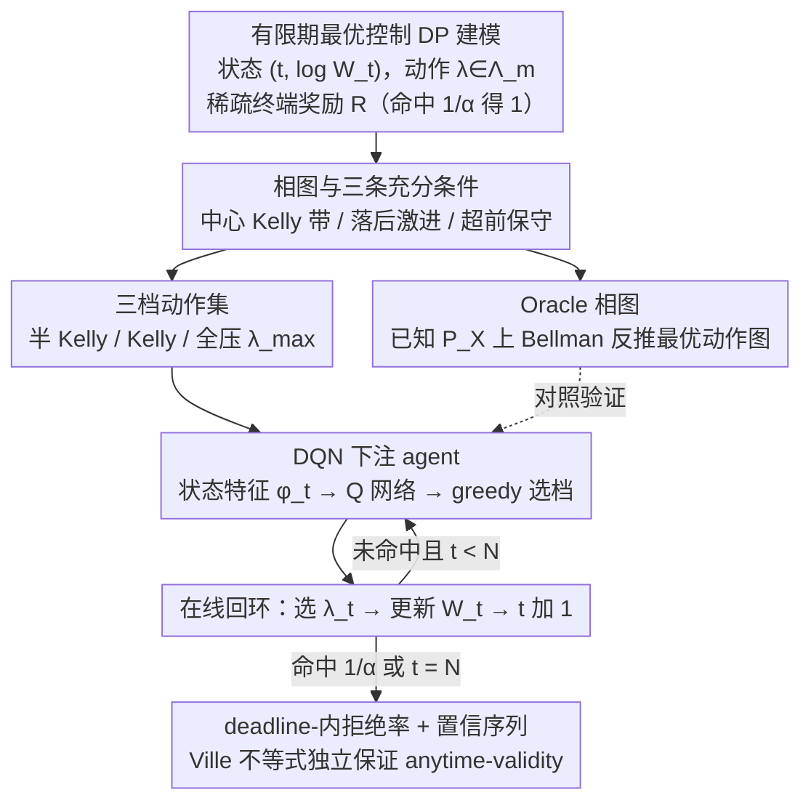

# Learning to Bet for Horizon-Aware Anytime-Valid Testing

**会议**: ICML 2026  
**arXiv**: [2603.19551](https://arxiv.org/abs/2603.19551)  
**代码**: https://github.com/egetaga/learning-to-bet (有)  
**领域**: 序贯假设检验 / Anytime-Valid Inference / 有限期最优控制  
**关键词**: 测试鞅, Kelly 下注, 置信序列, 相图, DQN, 有限期决策  

## 一句话总结
本文把"在严格观测上限 $N$ 下设计 anytime-valid 序贯检验"重新表述为一个状态空间为 $(t,\log W_t)$ 的有限期最优控制问题，从理论上证明 Kelly 下注在"按时进度"的中间带最优、落后时该激进、超前时该保守，得到一张三区"相图"，并用一个在大量合成 Beta 分布上训练的统一 DQN agent 自动学到与相图一致的状态依赖策略，在合成与真实数据上同时拿到更高的 deadline-内拒绝率与更窄的置信序列，同时通过 Ville 不等式保持 anytime-validity。

## 研究背景与动机
**领域现状**：基于"测试即下注"（testing by betting，shafer2019game/2021；waudby2024estimating）的 e-process / 测试鞅框架已经成为构造 power-one 检验与置信序列的主流，给定假设 $H_0:\mu_X=m$，定义可预测下注 $\lambda_n(m)\in[-1/(1-m),1/m]$，让财富过程 $W_n(m)=W_{n-1}(m)(1+\lambda_n(m)(X_n-m))$ 在 $H_0$ 下为非负鞅，凭 Ville 不等式 $\mathbb P(\exists n: W_n\ge 1/\alpha)\le \alpha$ 立刻得到 $\tau_m=\inf\{n: W_n\ge 1/\alpha\}$ 是 level-$\alpha$ 停时。waudby2024estimating 提出 PrPlEB、orabona2023tight 用 universal portfolio、voravcek2025star 提出 STaR-Bets 都在这个框架内打磨下注策略。

**现有痛点**：所有 mainstream 工作都假设观测流 $\{X_n\}$ 无穷长，但实际场景（在线 A/B、自适应实验、资源/时间受限科研）几乎都有硬上限 $N$。Doob/Robbins 风格的纯 anytime 策略对大 $N$ 仍然太保守；针对固定 $N$ 调出来的检验在连续监测下又会爆 type-I——这两类方法都没法直面"有 deadline 的连续监测"。

**核心矛盾**：在 deadline $N$ 之内最大化拒绝概率，需要的"每步漂移"$(b-\log W_t)/(N-t)$ 是非平稳的，会随当前进度和剩余时间动态变化；但是要保持 anytime-validity，下注必须始终是 $\mathcal F_{t-1}$-可测且取值在 $\Lambda_m$ 内的鞅约束。先前唯一直面这个 setting 的 voravcek2025star 用 STaR（Sequential Target-Recalculating）启发式调下注，没有最优性刻画也无法适应分布形状。

**本文目标**：(1) 给"horizon-aware 下注"做一个最优控制（DP）形式化；(2) 给出"何时该偏离 Kelly、偏向哪边"的可证明充分条件；(3) 把这套理论翻译成一个能在线学、跨分布通用的下注策略。

**切入角度**：注意到 Bellman 状态完全由 $(t,\log W_t)$ 决定、动作就是 $\lambda$；这是一个典型的 finite-horizon 离散 DP——只是动作空间连续、过渡分布 $P_X$ 未知。对 DP 做局部分析，能在状态平面切出"Kelly 区 / 激进区 / 保守区"的相图，再用 DQN 把分布信息从经验特征中吸收进去。

**核心 idea**：把 anytime-valid 检验当成最优控制问题做相图刻画，再用一个跨分布通用的 DQN 把相图实现为可执行策略，理论保证 + 学到的策略同时拿走。

## 方法详解
作者先用 Bellman 递归把问题写干净，证明三条互补的"相图定理"，再据此把动作空间收紧到 $\{\widehat\lambda_t/2,\widehat\lambda_t,\lambda_{\max}\}$ 训练一个通用 DQN。最关键的是策略学习对 anytime-validity 是透明的：validity 只需 $\lambda_t\in\Lambda_m$ 且可预测，与策略怎么得到无关。

### 整体框架
- **DP 状态**：$(t,\log W_t)$，终止条件 $W_t\ge 1/\alpha$ 或 $t=N$。
- **动作**：$\lambda_t(m)\in\Lambda_m=[-1/(1-m),1/m]$；实际离散化为 $\{\widehat\lambda_t/2,\widehat\lambda_t,\lambda_{\max}\}$ 三档（"半 Kelly / Kelly / 全压"）。
- **奖励**：$R=\mathbb I\{\max_{1\le t\le N}\log W_t\ge \log(1/\alpha)\}$（稀疏终端奖励），$\mathbb E[R]=\mathbb P(\tau_m\le N)$ 直接等于 deadline-内拒绝率。
- **Bellman 递归**：$V_t(y)=\max_{\lambda\in\Lambda_m}\mathbb E_{X\sim P_X}\big[\mathbb I\{y+h_m(\lambda,X)\ge b\}+\mathbb I\{y+h_m(\lambda,X)<b\}V_{t+1}(y+h_m(\lambda,X))\big]$，其中 $h_m(\lambda,x)=\log(1+\lambda(x-m))$、$b=\log(1/\alpha)$。
- **置信序列**：$C_n=\{m\in[0,1]:W_n(m)<1/\alpha\}$，由每个 $m$ 的 $\tau_m$ 自动给出 horizon-aware 覆盖保证。

整条线索是：先把问题写成 DP，再用三条相图定理刻画最优策略的形状、据此把动作收成三档，用已知分布上的 oracle 相图把"理论最优动作"算成 ground truth 当参照，最后让一个跨分布通用的 DQN 从状态特征里学出何时切档——而 anytime-validity 始终由 Ville 不等式独立兜底，与策略怎么得到无关。

### 关键设计

**1. $(t,\log W_t)$ 平面相图与三条充分条件：把"按进度调节下注"的模糊直觉变成可证伪的命题**

Bellman 递归整体没有解析解，但作者证明在状态平面上它呈现出可刻画的区域结构。定义 $T=N-t$、$\Delta=TL_{\max}-(b-y)$（其中 $L_{\max}=L(\lambda_m^{\text{Kelly}})=\mathbb E[h_m(\lambda_m^{\text{Kelly}},X)]$）表示"照 Kelly 走还能富余多少漂移"，三条定理切出三块区域。**定理 3.1（中心带）**说：若 $\Delta\ge B\sqrt{8T\log T}$，纯 Kelly 以 $\ge 1-1/T$ 概率撞线；反过来若有 $\rho$ 比例时间偏离 Kelly $\ge\delta$ 且 $\Delta\le\rho\epsilon T-B\sqrt{8T\log 2}$，拒绝概率 $\le 1/2$——也就是按时进度时偏离 Kelly 只会变差。**命题 3.4（落后激进）**说：当 $r=(b-y)/T>\max\{L_{\max},B_K/2\}$（Kelly 漂移不够、且 Kelly 撞不进 $T/2$ 步）时，若存在 $\lambda^{\text{agg}}>\lambda^{\text{Kelly}}$ 使 $I^+(\lambda^{\text{agg}},r)<\frac12 I^+(\lambda^{\text{Kelly}},r)-c_T^+$（KL rate 比 Kelly 小一半），激进下注严格优于 Kelly。**命题 3.6（超前保守）**说：当 $B_K/2<r<L_{\max}$ 时，存在 $\lambda^{\text{def}}<\lambda^{\text{Kelly}}$ 使失败概率指数小于 Kelly。这三块"中心 Kelly 带 + 落后激进区 + 超前保守区"不仅给出最优策略的形状，更直接给后面 DQN 的三档动作集（半 Kelly / Kelly / 全压）提供了合法性——相图说最优动作就落在这三档附近。

**2. Oracle 相图（DP backward induction）：在已知分布上把理论最优动作算成 ground truth**

理论相图只给区域之间的相对关系，不给具体边界，所以作者在已知 $P_X$ 的合成分布上做一个 oracle 版求解当参照。把 $(t,\log W_t)$ 平面离散化，从 $t=N-1$ 起做 Bellman 反推 $V_t(y)$ 和 $\arg\max_\lambda$，动作集固定为 $\{\lambda_{\max},\lambda^{\text{Kelly}},\lambda^{\text{Kelly}}/2\}$。结果在 Beta-mixture 上 oracle 确实长成"中心 Kelly 带 + 上方半 Kelly 带 + 下方 All-in 带"的三段结构；当问题变难（$m$ 离 $\mu_X$ 更近）时，保守带消失、Kelly 带收窄、激进带扩张，和命题 3.4"r 更大就更该激进"完全对得上。这张数值化的最优动作图后面可以直接和 DQN 学出来的"modal action map"做视觉对比，用来确认学到的策略真的复现了相图，而不是退化成一个常数 Kelly。

**3. 跨分布通用的 DQN 下注 agent：把"何时切档"交给网络从特征里读，validity 由 Ville 不等式独立保证**

相图的边界位置依赖未知 $P_X$，写不出解析公式；加上经验 Kelly 估计 $\widehat\lambda_t(m)$ 在 $t$ 小时方差极大，硬调一个 $\epsilon$-greedy 调度只能在单一分布上调好。作者干脆把每次检验当成一个长度 $\le N$ 的 episode，用稀疏终端奖励 $R=\mathbb I\{\max_t \log W_t\ge b\}$，于是 $\mathbb E[R]$ 直接等于 deadline-内拒绝率（power）。状态是 $\mathcal F_{t-1}$-可测的紧凑特征（经验矩、剩余时间 $N-t$、距阈值 $b-\log W_t$、$m$、经验 Kelly $\widehat\lambda_t(m)$ 等），动作只 3 档 $\{\widehat\lambda_t/2,\widehat\lambda_t,\lambda_{\max}\}$ 对应理论的三个区域，用 Q-learning 学 $Q(s,a)$ 后 greedy 选拒绝概率最高的档。整个策略只训一次、跑 500,000 个合成 episode（Beta 与 Beta-mixture，随机化 $\mu_X,m,N$），不用对每个新问题重训。最关键的是这套学习对统计保证是透明的：anytime-validity 只要求 $\lambda_t\in\Lambda_m$ 且可预测，和策略怎么得到无关，所以 DQN 再黑盒，Ville 不等式 $\mathbb P(\exists n: W_n\ge 1/\alpha)\le \alpha$ 仍然成立——这正是"把 DRL 用在统计检验上"能站住脚的核心理由。

### 损失函数 / 训练策略
DQN 用标准 Q-learning（mnih2015human），sparse 终端奖励 $R\in\{0,1\}$，500k 个 episode 覆盖随机化 $(N,m,P_X)$；$N$ 从有限集采样、$P_X$ 从 Beta / Beta-mixture 家族采参；DQN-EB（reward $=1+(1-t/N)$）与 DQN-U（$=1-t/N$）作为两个 reward shaping 变体探索"早期拒绝"目标。

## 实验关键数据

### 主实验
对比对象：voravcek2025star 的 STaR-Bets / STaR-Hoeffding（唯一现存 horizon-aware 基线），以及 PrPlEB（horizon-agnostic Kelly 类）。

| 设置 | 指标 | DQN | STaR-Bets | PrPlEB |
|------|------|------|------|------|
| Beta-mix conc=6, $N=100$, $m=0.45$ | $\mathbb P(\tau\le N)$ | 最高 | 次之 | 落后 |
| Beta-mix conc=1, $N=100$, $m=0.45$ | $\mathbb P(\tau\le N)$ | 最高 | 次之 | 落后 |
| 三种 Beta-mix, $N=100$ | $C_N$ 宽度 | 最窄 | 中 | 较宽 |
| 真实数据（DNA 甲基化 + 湿度，6 个源） | $\mathbb P(\text{reject})$ | 5/6 最高 | — | — |

DQN 是单一策略（只在合成 Beta 上训练），跨 OOD 的 logit-normal、Bernoulli 家族、6 个真实数据源都能保持领先且 type-I 校准合法；STaR-Bets 与 PrPlEB 是 setting-specific。

### 消融实验

| 配置 | 关键观察 | 说明 |
|------|------|------|
| 3 动作 vs 9 动作 | 性能相近 | 动作集与理论相图三档对齐已足够，扩到 9 档无显著增益 |
| DQN（原 reward） | terminal power 最强 | 直接优化 $\mathbb P(\tau\le N)$ |
| DQN-EB（$1+(1-t/N)$） | terminal-power 中间，早期更早拒绝 | 早期 bonus 把拒绝时间前移 |
| DQN-U（$1-t/N$） | 早期拒绝最早，$N$ 处 power 略降 | urgency reward 极端化时间偏置 |
| $N\in\{250,300,350\}$（原 DQN，未重训） | 仍优于 baseline | 表明策略对更长 horizon 有泛化 |
| $\alpha=0.01$（重训一次） | 同样改进 power | 单 $\alpha$ 训出来的策略不能跨 $\alpha$，需重训 |

### 关键发现
- DQN 学到的"modal action map"在视觉上严格复现了 oracle 相图：中心 Kelly 带 + 上方半 Kelly 带 + 下方 All-in 带，且边界随分布形状自动平移——说明 DQN 真的把分布信息内化进了状态依赖策略，而不是退化为常数 Kelly。
- 早期 conservative 是反 Kelly 直觉但正确：$\widehat\lambda_t(m)$ 在 $t$ 小时方差大，过早激进会被估计噪声推到不可恢复的低 $W_t$；DQN 的早期偏保守对应这一估计不确定性。
- 跨分布迁移成立：合成 Beta 上训练 → logit-normal / Bernoulli / 真实 DNA/湿度数据上都 work，且 anytime-validity（Ville 不等式）不依赖训练分布，全程合法。

## 亮点与洞察
- "把 anytime-valid 检验变成有限期最优控制 + 用 DQN 当 betting 策略"是一个非常干净的桥梁：所有 validity 都来自 $\lambda_t\in\Lambda_m$ + 可预测性，因此策略可以任意复杂、任意黑盒，统计保证仍然成立——这把"统计严谨"与"学习黑盒"解耦得非常彻底。
- 三条相图定理（中心 Kelly、落后激进、超前保守）用 Hoeffding + Sanov + KL rate 的初等工具就能证明，但给出的指导（"动作集只需三档"）直接简化了 DQN 设计；这种"理论指导动作空间设计"的范式对其他统计-RL 交叉问题（自适应实验、最优停止）很有借鉴价值。
- 单一 DQN 跨 $(N,m,P_X)$ 通用 + 在真实 OOD 数据上仍领先，说明把分布不变的"几何位置信息"（$t/N$、$(b-y)/T$、empirical Kelly）作为状态特征就足以让策略具备分布鲁棒性，而不必为每个新场景重训。

## 局限与展望
- 训练分布限定在 Beta / Beta-mixture，对真正重尾或离散点质量大的分布迁移性仍是 open；论文将"mixed distributions"留作 future work。
- 动作集只有 3 档，连续动作空间或非对称的负向下注（$\lambda<0$）没系统探索——对双侧检验和置信序列下界的紧致性可能有进一步空间。
- DQN 学到的是黑盒策略，比 hand-crafted 规则少了可审计性；在监管严格的场景（临床试验、监管 A/B）部署需要额外的解释 / 验证层。
- 不同 $\alpha$ 需要重训（论文展示 $\alpha=0.01$ 重训一次），未来工作可考虑把 $\alpha$ 作为状态输入做"通用 $\alpha$ 策略"。
- 实验只覆盖有界 $[0,1]$ 均值的检验，对方差/分位数/CATE 这类更一般的统计泛函是否能复用同套相图 + DQN，还需要重新做控制论分析。

## 相关工作与启发
- **vs voravcek2025star (STaR-Bets)**：唯一现存的 horizon-aware betting 工作，用 Sequential Target-Recalculating 启发式实时调下注；本文给出最优控制公式 + 相图理论 + DQN 实现，跨分布通用且实测领先。
- **vs waudby2024estimating (PrPlEB)**：经典的 anytime 下注策略，假设无限 horizon，对有 deadline 场景天然偏保守；本文复用其 e-process / Ville 框架，但在策略上做 horizon-aware 改造。
- **vs koning2026anytime**：通过 Doob 鞅把固定样本 test 变成 anytime-valid，路线和本文正交——他们改"如何把固定 test anytime 化"，本文改"如何针对 deadline 调整下注"，二者理论上可以叠加。
- **vs orabona2023tight (universal portfolio betting)**：用 universal portfolio 在 horizon-agnostic 上拿到强 regret 保证；本文在 horizon-aware 上引入 DRL 是一条互补路线——universal portfolio 适合 anytime 紧致 CS，DQN 适合 deadline 内最大化 power。

<!-- RELATED:START -->

## 相关论文

- [\[ICML 2026\] Offline Reinforcement Learning with Universal Horizon Models](offline_reinforcement_learning_with_universal_horizon_models.md)
- [\[ICML 2026\] InftyThink+: Effective and Efficient Infinite-Horizon Reasoning via Reinforcement Learning](inftythink_effective_and_efficient_infinite-horizon_reasoning_via_reinforcement_.md)
- [\[ICML 2026\] Long-Horizon Model-Based Offline Reinforcement Learning Without Explicit Conservatism](long-horizon_model-based_offline_reinforcement_learning_without_explicit_conserv.md)
- [\[ICML 2026\] Multi-Agent Decision-Focused Learning via Value-Aware Sequential Communication](multi-agent_decision-focused_learning_via_value-aware_sequential_communication.md)
- [\[ICML 2026\] Learning Query-Aware Budget-Tier Routing for Runtime Agent Memory](learning_query-aware_budget-tier_routing_for_runtime_agent_memory.md)

<!-- RELATED:END -->
