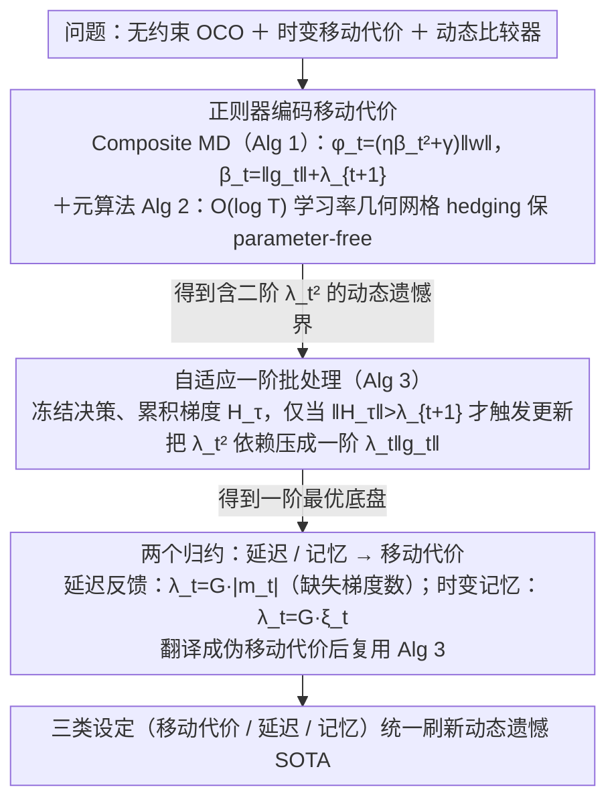

# Parameter-free Dynamic Regret: Time-varying Movement Costs, Delayed Feedback, and Memory

**会议**: ICML2026  
**arXiv**: [2602.06902](https://arxiv.org/abs/2602.06902)  
**代码**: 无（理论论文）  
**领域**: 在线凸优化 / 动态遗憾 / Parameter-free 算法  
**关键词**: 动态遗憾, 移动代价, 延迟反馈, 在线学习记忆, 无约束 OCO  

## 一句话总结
本文给出第一个针对**无约束**在线凸优化、**时变移动代价**与**动态比较序列**三重设定的 parameter-free 算法，把延迟反馈与时变记忆都规约为带时变移动代价的 OCO，从而统一刷新这三个场景的动态遗憾上界。

## 研究背景与动机

**领域现状**：在线凸优化（OCO）的标准设定假设决策域有界、比较器是单一最优固定点，并用 $R_T = \sum_t f_t(w_t) - \min_u \sum_t f_t(u)$ 的静态遗憾衡量。但实际应用——投资组合、视频流、负载均衡、最优控制——都同时违反这一标准设定：决策无界（杠杆/做空）、目标漂移（市场结构变化）、并且调整决策本身要付出与 $\|w_t - w_{t-1}\|$ 成正比的移动代价（手续费、切换成本），而这个代价系数 $\lambda_t$ 还会随时间剧烈波动（流动性、波动率）。

**现有痛点**：三个方向至今只在各自孤岛里被研究——Zhang et al. (2022) 处理无约束 + 移动代价但只看静态遗憾；Zhang et al. (2021) 给出有界域 + 固定移动代价的动态遗憾；Wan et al. (2024) 处理延迟反馈的动态遗憾但只在有界域，并且只有在"按序到达"这一强假设下才能把 $d_{\max}T$ 收紧到 $d_{\mathrm{tot}}$。三者交集——**无约束 + 动态 + 时变移动代价**——一直是开放问题。

**核心矛盾**：parameter-free（不预先知道比较器范数 $M$ 和路径长度 $P_T$）与无约束域之间存在张力：无界域里 $M$ 没有先验上界，但算法又要让 regret 对 $M$、$P_T$ 自适应。移动代价让矛盾更尖锐——它鼓励算法少动，但 parameter-free 通常需要"激进试探未知半径"的非强凸正则器，二者天然冲突。

**本文目标**：(1) 设计第一个针对无约束 OCO with 时变移动代价的 parameter-free 算法；(2) 证明所得 regret 同时对 $M$、$P_T$、$\{\lambda_t\}$、$\{\|g_t\|\}$ 四种问题相关量自适应；(3) 把延迟反馈与时变记忆都归约到该框架。

**切入角度**：作者注意到 Jacobsen & Cutkosky (2022) 的 composite mirror descent 框架里有一个"控制 iterate 漂移"的修正项 $\varphi_t(w)$，本来用来稳定无约束 mirror descent；如果把这个修正项的系数从 $\eta\|g_t\|^2$ 扩展为 $\eta(\|g_t\|+\lambda_{t+1})^2$，就能把移动代价编码成"动态摩擦系数"——下一步要付高昂代价时算法自动减小步长。

**核心 idea**：用 $\beta_t = \|g_t\| + \lambda_{t+1}$ 重整正则器，把无约束 parameter-free 工具箱整体抬到 time-varying movement cost 设定；再用自适应分段（adaptive batching）把二阶 $\lambda_t^2$ 依赖压成一阶 $\lambda_t\|g_t\|$ 依赖，使得在小梯度温和环境下移动代价不再"白白罚分"。

## 方法详解

### 整体框架
全文围绕一个三层堆叠的算法体系：

1. **基础层（Algorithm 1）**：Composite Mirror Descent，针对单个学习率 $\eta$ 工作，用 log-linear 正则 $\psi(w) = \tfrac{2}{\eta}\int_0^{\|w\|}\log(x/\alpha+1)\,dx$ 加上一个时变修正项 $\varphi_t(w) = (\eta\beta_t^2 + \gamma)\|w\|$。
2. **元算法层（Algorithm 2）**：维护对数级别 ($\mathcal{O}(\log T)$ 个) 的并行 Algorithm 1 实例，学习率取几何网格 $\eta_i = 2^i / (L\sqrt{T})$，把所有实例的输出**直接相加**作为最终决策。这一步用 parameter-free 文献里的标准 hedging trick：任何一个实例的 regret 都可以被切到"最接近最优学习率的那个实例"加上其它实例对零比较器的 regret，后者只贡献 $\mathcal{O}(\log T)$ 加性项。
3. **批处理层（Algorithm 3）**：在 Algorithm 2 之上套一个自适应 epoch 划分——只有当累积梯度 $\|H_\tau\| = \|\sum_{t\in I_\tau} g_t\|$ 超过当前移动代价 $\lambda_{t+1}$ 时才真正触发 mirror descent 更新，否则把决策冻结并继续聚合梯度。这一层是把二阶 $\lambda_t^2$ 依赖压成一阶 $\lambda_t\|g_t\|$ 依赖的关键。

之后第 5 节用两个独立的归约（Algorithm 4 和 Algorithm 5）把延迟反馈和时变记忆都翻译成 Algorithm 3 的输入。

下图按论文的"先建底盘、再精炼、再归约"思路串起三个核心设计（元算法层 Algorithm 2 是借用的标准 parameter-free hedging，作为脚手架并入第一步）：

### 关键设计

**1. 把时变移动代价编码进正则器：让 mirror descent 在未来要付高代价时自动谨慎**

无约束域里 log-linear 正则 $\psi$ 不强凸，Jacobsen & Cutkosky (2022) 早就指出必须靠一个 linear-norm 修正项 $\varphi_t$ 才能稳住 iterate。本文的关键观察是这个修正项的系数本来就可以任意放大，于是把它改写成 $\varphi_t(w) = (\eta\beta_t^2 + \gamma)\|w\|$，其中 $\beta_t \triangleq \|g_t\| + \lambda_{t+1}$，更新规则

$$w_{t+1} = \arg\min_w\ \langle g_t, w\rangle + D_\psi(w \mid w_t) + \varphi_t(w).$$

$\varphi_t$ 就像一根"弹回原点的皮筋"，劲度随当前梯度与下一步移动代价共同放大：$\lambda_{t+1}$ 大时算法被强制保守、不敢乱动，$\lambda_{t+1}\to 0$ 时它平滑退回标准 parameter-free OCO。这一步之所以几乎"白嫖"成功，是因为只往修正项系数里塞了个 $\lambda_{t+1}^2$，原 Jacobsen–Cutkosky 的分析骨架原样继承，全部 parameter-free 性质（对 $M$、$P_T$、$\|g_t\|$ 自适应）自动保留。

**2. 自适应一阶批处理（Algorithm 3）：把二阶 $\lambda_t^2$ 依赖压成一阶 $\lambda_t\|g_t\|$**

直接用上面的正则器会得到 leading term 含 $\lambda_t^2$ 的界，在小梯度温和环境里这等于"白白罚分"。批处理层的做法是维护一个累积梯度缓冲 $H_\tau$ 与 epoch 索引 $\tau$：每一轮决策直接复用 $w_t=\tilde w_\tau$ 不动、把 $g_t$ 累加进 $H_\tau$，**只有当** $\|H_\tau\| > \lambda_{t+1}$ 时才把 $(\tilde g_\tau=H_\tau,\ \tilde\lambda_{\tau+1}=\lambda_{t+1})$ 喂给底层 Algorithm 2、触发一次真正更新并开启新 epoch。直觉很直白——只有当前累积的证据足以盖过下一步移动成本时，移动才划算，否则就忍住别动、继续观察。它把 leading term 从 $\sqrt{\sum_t(\|g_t\|^2+\lambda_t^2)\|u_t\|}$ 改进成 $\sqrt{\sum_t(\|g_t\|^2+\lambda_t\|g_t\|)\|u_t\|}$；Remark 4.3 证明这个一阶界永远不差于二阶界（差一个 AM-GM 常数），并在 $\|g_t\|\ll\lambda_t$ 时严格收紧。相比固定移动代价的 Zhang et al. (2022b)，难点在于触发阈值要随时变 $\lambda_{t+1}$ 一起动，分析里还得仔细处理 epoch 边界对 path-length 的影响。

**3. 两个归约：把延迟反馈与时变记忆翻译成移动代价**

这一步是全文最漂亮的地方——论证"无约束 + 时变移动代价"不是孤立设定而是一个**原语**，别的问题只要能归约进来就自动继承整套工具。延迟反馈方向，Lemma 5.1 给出

$$R_T^{\mathrm{del}}(u_{1:T}) \le \sum_t \Big\langle \textstyle\sum_{\tau\in o_{t+1}\setminus o_t} g_\tau,\ w_t - u_t\Big\rangle + G\sum_t |m_t|\,\|w_t - w_{t-1}\| + GP_T\,\sigma_{\max},$$

其中 $m_t$ 是 round $t$ 还没到的梯度集合；把已到达的累积梯度当伪梯度 $h_t$、把 $\lambda_t=G|m_t|$ 当伪移动代价喂给 Algorithm 3，就直接拿到 $\widetilde{\mathcal{O}}(\sqrt{(M^2+MP_T)(T+d_{\mathrm{tot}})})$。这个归约的精髓在于揭示移动代价的物理含义其实是"信息缺失的惩罚"——缺的梯度越多越不该动；正因如此它绕开了 Wan et al. (2024) 必须的"按序到达"假设，第一次在无界域 + 任意到达顺序下拿到 $d_{\mathrm{tot}}$ 依赖。时变记忆方向同理，Lemma 5.6 用 unary 损失 $\hat f_t(w)=f_t(w,\dots,w)$ 加 Lipschitz 假设导出 $R_T^{\mathrm{mem}} \le \sum_t\langle h_t, w_t-u_t\rangle + G\sum_t\xi_t\|w_t-w_{t-1}\| + GP_T B^2$，把与未来记忆长度相关的可计算量 $\xi_t$ 当成移动代价，同样套进 Algorithm 3。

### 损失函数 / 训练策略
本文不涉及神经网络训练，所有结果都是 worst-case regret 上界。算法的实现复杂度是 $\mathcal{O}(d\log T)$ per round（$d$ 为决策维度），与标准 parameter-free OCO 持平。需要事先知道 $L \ge G + 2\lambda_{\max}$（或在延迟反馈下 $L \ge G(1 + 3\sigma_{\max})$），$G$ 是损失 Lipschitz 常数；Remark 4.2 给出标准 doubling trick 把 $\lambda_{\max}$ 与 $\sigma_{\max}$ 的先验依赖也去掉。

## 实验关键数据

> 本文为纯理论论文，没有数值实验。下面用**理论遗憾上界表**代替主结果表，用**与既有最强结果的对比表**代替消融。

### 主实验：三类设定的动态遗憾上界

| 设定 | 本文遗憾上界 | 适用域 | 关键自适应量 |
|------|--------------|--------|--------------|
| 无约束 OCO + 时变移动代价（Th 4.1） | $\widetilde{\mathcal{O}}\bigl(\sqrt{(M+P_T)\sum_t(\|g_t\|^2 + \lambda_t\|g_t\|)\|u_t\|}\bigr)$ | $\mathbb{R}^n$ | $M, P_T, \|g_t\|, \lambda_t, \|u_t\|$ 全部 |
| 无约束 OCO + 延迟反馈（Th 5.2） | $\widetilde{\mathcal{O}}\bigl(\sqrt{(M^2 + MP_T)(T + d_{\mathrm{tot}})}\bigr)$ | $\mathbb{R}^n$ | $M, P_T, d_{\mathrm{tot}}$ |
| 无约束 OCO + 时变记忆 $b_t$（Th 5.7） | $\widetilde{\mathcal{O}}\bigl(\sqrt{(M^2 + MP_T)(H^2 T + GH\sum_t b_t^2)}\bigr)$ | $\mathbb{R}^n$ | $M, P_T, \{b_t\}, G, H$ |

三个结果在 $\lambda_t = 0$（无移动代价）/ $d_t = 0$（无延迟）/ $b_t = 0$（无记忆）的退化情形下都恢复无约束 OCO 已知的最优动态遗憾 $\widetilde{\mathcal{O}}(\sqrt{(M+P_T)\sum_t\|g_t\|^2\|u_t\|})$。

### 对比：与既有最强结果

| 设定 | 既有最强结果 | 本文结果 | 改进点 |
|------|--------------|----------|--------|
| 静态 unconstrained + 移动代价 (Zhang 2022b) | $\sqrt{G^2 T + \lambda GT}$ | $\sqrt{\sum_t\|g_t\|^2 + \lambda \sum_t \|g_t\|}$ | 抹掉 worst-case $G^2T$，改为问题自适应 |
| 动态有界 + 固定记忆 (Zhao 2023) | $\sqrt{(1+P_T)(\sqrt{G}H^2 B + GHB^2)T}$ | $\sqrt{(M^2+MP_T)(H^2 T + GH\sum_t b_t^2)}$ | 去掉域有界假设，记忆改时变 |
| 动态有界 + 延迟 (Wan 2024) | $\sqrt{(1+P_T)(T + d_{\max}T)}$（一般）或 $\sqrt{(1+P_T)(T+d_{\mathrm{tot}})}$（按序） | $\sqrt{(M^2+MP_T)(T + d_{\mathrm{tot}})}$ | 去掉按序假设 + 无界域 |
| 静态无约束 + 延迟 (van der Hoeven 2022) | 二阶 "lag" 依赖，静态 | 动态版本（含 $P_T$） | 支持比较器漂移 |

### 关键发现
- 一阶移动代价依赖 $\lambda_t\|g_t\|$（Th 4.1）相比二阶 $\lambda_t^2$（Th 3.1）总是 no worse、并在 $\|g_t\|\to 0$ 时严格收紧——这一点是后续两个归约能拿到最优率的关键。
- 延迟反馈归约的精髓在于：移动代价的真正物理含义是"信息缺失的惩罚"——$\lambda_t = G|m_t|$ 把缺失的梯度数翻译成"动得越多越亏"。这是文献里第一次明确指出 delay 与 movement cost 之间的等价关系。
- 时变记忆的最坏情形下，本文的 $H^2 T + GH\sum_t b_t^2$ 依赖在 $b_t \equiv B$ 时恢复已知的 $B\sqrt{T}$ minimax 下界（Kumar et al. 2023, Thm 3.4），并扩展到动态遗憾的 $\Omega(B\sqrt{(1+P_T)T})$ 下界——所以记忆长度依赖在常数因子意义下是 minimax 最优的。

## 亮点与洞察
- **"移动代价是 OCO 的隐藏原语"**：本文最有启发的洞察是，时变移动代价不仅是个独立问题，而是一个可以承载其它复杂结构（延迟、记忆，甚至未来可能的更多设定）的原语；只要别的问题能机械地归约到它，整套 parameter-free 工具立刻可用。这种"先建一个通用底盘、再做归约"的写作思路在做证明 heavy 的领域里很值得借鉴。
- **修正项 $\varphi_t(w)$ 的可扩展性**：把 $\beta_t = \|g_t\| + \lambda_{t+1}$ 直接塞进修正项的系数，几乎不改变原 Jacobsen-Cutkosky 分析骨架就能继承全部 parameter-free 性质——这种"只改一个系数就解锁新设定"的扩展模式提示了：可能还有其它能编码进 $\beta_t$ 的物理量（如噪声方差、bandit 反馈尺度），将带来另一系列推论。
- **批处理 + parameter-free 共存**：通常人们觉得自适应 batching（不更新）和 parameter-free（要试探未知半径）相互打架，本文证明只要在合适的 trigger 条件（$\|H_\tau\| > \lambda_{t+1}$）下做 batching，两者可以共存并互相增益——这对 bandit / partial feedback 等其它"想 batch 但不敢"的设定是一个范式。

## 局限与展望
- **作者承认的局限**：所有结果对 $\lambda_t^2$ 的依赖虽然被 first-order 化，但与 $\|g_t\|$ 完全无关的纯移动代价惩罚仍然不可避免；如果环境完全静止（$g_t = 0$）但 $\lambda_t$ 大，algorithm 退化为不动是最优的，本文的 batching 也确实实现了这一点。
- **隐含假设**：$\lambda_{t+1}$ 在时刻 $t$ 就要被告知，这在金融场景（手续费提前公示）合理，但在自适应对手或部分可观测代价场景下需要进一步处理。
- **可改进方向**：(1) 把延迟与记忆双重叠加（"延迟 + 记忆"组合）尚未刻画；(2) 当前 mirror descent 是显式形式，能否设计 implicit 版本以处理 $\beta_t$ 突变更平滑？(3) high-probability / 高阶矩遗憾（不仅是期望）在此框架下的扩展。

## 相关工作与启发
- **vs Jacobsen & Cutkosky (2022)**：他们建立了无约束动态遗憾 parameter-free 的基础框架但没有移动代价；本文把 $\beta_t$ 重整即得到推广，是该工作的直接后续。
- **vs Zhang et al. (2022b)**：他们处理无约束 + 固定移动代价的静态遗憾，本文同时把 fixed 改成 time-varying 并加入动态比较器；当 $\lambda_t \equiv \lambda$ 时本文严格优于他们。
- **vs Wan et al. (2024)**：他们用直接分析处理有界域 + 延迟，要靠 in-order 假设才能取 $d_{\mathrm{tot}}$；本文用 "delay → movement cost" 归约绕开此假设并扩展到无界域，是分析视角的范式跃迁。
- **vs Zhao et al. (2023)**：他们的 OCO with memory 是有界域 + 固定记忆 + 动态遗憾，本文把记忆改为时变并去掉域有界假设，记忆长度依赖与 Lipschitz 常数都更紧。

## 评分
- 新颖性: ⭐⭐⭐⭐⭐ 第一次在无约束 + 动态 + 时变移动代价的交集给出 parameter-free 算法，并发现 delay/memory 都可以归约成它，是真正"开新设定 + 给原语"的工作。
- 实验充分度: ⭐⭐⭐ 纯理论论文无数值实验，所有结论以最优性 / 退化恢复 / 与既有最强 bound 的代数对比方式呈现；对 OCO 理论圈足够，对应用方读者略显抽象。
- 写作质量: ⭐⭐⭐⭐ 三层算法堆叠 + 两条独立归约的结构清晰，Remark 4.2/4.3/5.3 把"先验依赖去除"、"first-order 总比 second-order 不差"、"延迟+移动代价的耦合 corollary"都点透；缺点是符号 $\widetilde{M}_T(\epsilon), \widetilde{P}_T(\epsilon)$ 等堆叠较多，需要反复回查定义。
- 价值: ⭐⭐⭐⭐⭐ 同时刷新三个 sub-area 的 SOTA、提出可复用的 "movement cost as primitive" 设计哲学，并为延迟+记忆联合设定铺平道路；属于必读型 OCO theory paper。

<!-- RELATED:START -->

## 相关论文

- [\[NeurIPS 2025\] Bandit and Delayed Feedback in Online Structured Prediction](../../NeurIPS2025/reinforcement_learning/bandit_and_delayed_feedback_in_online_structured_prediction.md)
- [\[AAAI 2026\] Bi-Level Contextual Bandits for Individualized Resource Allocation under Delayed Feedback](../../AAAI2026/reinforcement_learning/bi-level_contextual_bandits_for_individualized_resource_allocation_under_delayed.md)
- [\[ICML 2026\] Flow-Equivariant World Models: Memory for Partially Observed Dynamic Environments](flow_equivariant_world_models_memory_for_partially_observed_dynamic_environments.md)
- [\[ICML 2026\] FAB: A First-Order AB-based Gradient Algorithm for Distributed Bilevel Optimization over Time-Varying Directed Graphs](fab_a_first-order_ab-based_gradient_algorithm_for_distributed_bilevel_optimizati.md)
- [\[NeurIPS 2025\] Dynamic Regret Reduces to Kernelized Static Regret](../../NeurIPS2025/reinforcement_learning/dynamic_regret_reduces_to_kernelized_static_regret.md)

<!-- RELATED:END -->
