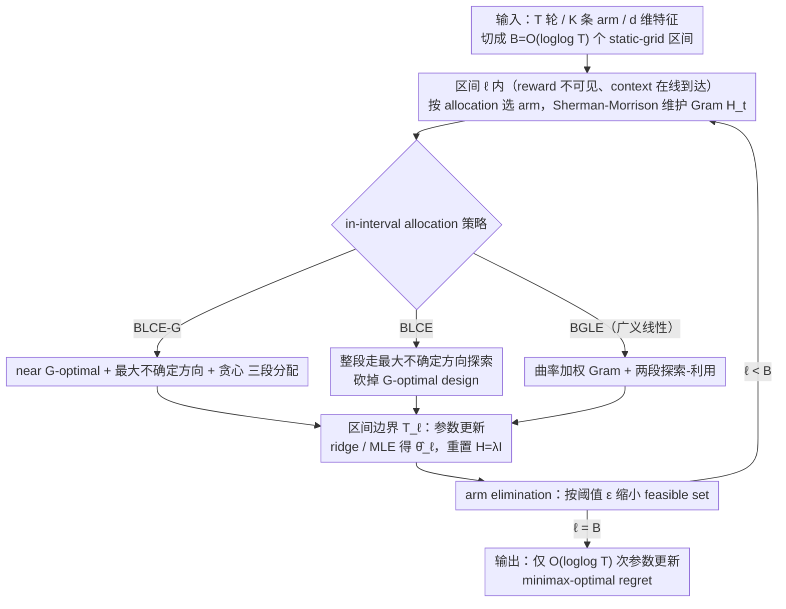

# Practical and Optimal Algorithm for Linear Contextual Bandits with Rare Parameter Updates

**会议**: ICML2026  
**arXiv**: [2606.00984](https://arxiv.org/abs/2606.00984)  
**代码**: 待确认  
**领域**: 强化学习 / Bandit 理论  
**关键词**: 线性 contextual bandit, batched bandit, rare parameter updates, minimax regret, G-optimal design

## 一句话总结
在线性 contextual bandit 上，作者把过去"batched"一词隐式混淆的"何时拿到 reward"和"区间内能否依赖到达的 context"两个轴显式拆开，定义出"rare parameter updates"（只限制 reward-driven 参数更新次数、允许 reward-free 的 context 自适应）这个更贴近实际部署的设定；并据此提出两个仅需 $\mathcal O(\log\log T)$ 次参数更新的算法 BLCE-G 和 BLCE，前者首次在小-$K$ 与大-$K$ 两个 regime 同时达到 minimax-optimal regret $\widetilde{\mathcal O}(\sqrt{dT\log K}\wedge d\sqrt T)$，后者更进一步彻底去掉 G-optimal design 这个主算力瓶颈、把 runtime 砍到所有 optimal 算法中最低；并把同一思想扩到广义线性 bandit，得到不依赖最坏曲率参数 $\kappa$ 的 BGLE。

## 研究背景与动机

**领域现状**：随机线性 contextual bandit 是序贯决策的经典模型：每轮 $t$ 观察到 $K$ 条 arm 的特征向量 $\mathcal A_t=\{x_{t,1},\ldots,x_{t,K}\}\subseteq\mathbb R^d$，agent 选一条 arm 拉取，收到 $r_t=\langle x_{t,a_t},\theta^*\rangle+\eta_t$，目标是最小化 $T$ 轮内累计期望 regret $\mathcal R(T)=\mathbb E[\sum_t(\langle x_t^*,\theta^*\rangle-\langle x_{t,a_t},\theta^*\rangle)]$。算法的部署瓶颈通常不是"给定 context 选 arm"，而是"把新的 reward 反馈灌进参数估计"：模型重训、置信集重算、posterior 更新都可能涉及昂贵的 pipeline、日志合表、隐私审核或人工校验。这促成了"limited adaptivity / batched bandit"这一支研究。

**现有痛点**：作者发现文献里"batched"一词被混用在两个独立的轴上——(i) reward 何时可见（feedback delay），(ii) 区间内策略能否依赖到达的 context（context adaptivity）。比如 Karbasi 2021 把 batch policy 形式化为 $\pi_t:H_{t_{\ell-1}}\times C_t\to\mathcal A$ 是允许 within-interval context 依赖的；而 Ruan 2021、Hanna 2023、Zhang 2025 等 static-grid 算法虽然只用 $\mathcal O(\log\log T)$ 次参数更新就达到了近 minimax-optimal regret，但隐式地要求"区间开始时就 commit 一个不依赖 within-interval context 的动作规则"，这种 strict batching 强制它们调用 G-optimal design / $(1/T)$-net 离散化 / repeated optimization oracle 等昂贵原语，整体 runtime 反而高得离谱（Zhang 2025 的 BatchLinUCB-DG 在 $(K=1000,d=5,T=10^4)$ 上跑 290 秒，Hanna 2023 contexts 因 $\Omega(T^d)$ 离散化在数值实验里直接被标注为 "Exponential"）。

**核心矛盾**：strict batching 不是 batched feedback 的内在需求——context 本来就是先观察后选 arm，"已经看到的 context"延迟到下次参数更新才用既无必要也不自然。一旦把"少做 reward-based 参数更新"与"在区间内对已观察 context 仍然自适应"解耦，就有机会甩掉 G-optimal design 这个 strict batching 强加的算力包袱。

**本文目标**：(1) 在 $\mathcal O(\log\log T)$ 参数更新下，给出同时在 small-$K$（$K\le\mathcal O(e^d)$）和 large-$K$（$K\ge\Omega(e^d)$）两个 regime 都 minimax-optimal 的算法——已有 static-grid 算法只能 cover 单一 regime；(2) 在保留 minimax-optimality 的同时去掉 G-optimal design 这个公认必需的子过程，把 runtime 压下来；(3) 把同一套思想扩到 generalized linear bandit，并去掉 regret bound 中对 worst-case 曲率 $\kappa$（当 link function 进入饱和区 $\dot\mu\to 0$ 时可发散）的依赖。

**切入角度**：在每个区间 $\ell$ 内维护一个 reward-free 的状态变量——Gram 矩阵 $H_t$ 及其逆（Sherman-Morrison 维护，每次 $\mathcal O(d^2)$）——选 arm 时按 $\arg\max_x\|x\|_{H_{t-1}^{-1}}$ 走"uncertainty-driven"探索；这天然依赖了区间内已到达的 context，但不依赖 reward，因此完全符合"rare parameter updates"的设定。

**核心 idea**：用"reward-free in-interval 最大方差方向探索 + arm elimination + 在区间边界做参数更新"取代"static G-optimal design rollout"，理论分析层面利用 $\|x\|_{H^{-1}}$ 的累积界拿到与 G-optimal design 同阶的 information gain，但 runtime 上甩掉 $\mathcal O(Kd^3)$ 的 design 调用。

## 方法详解

### 整体框架
把 $[T]$ 切成 $B=\mathcal O(\log\log T)$ 个 static-grid 区间：$\mathcal T_1=\lceil\sqrt T/\log_2\log_2 T\rceil+1$，$\mathcal T_\ell=(\mathcal T_{\ell-1}+\lceil T^{1-2^{-\ell}}/\log_2\log_2 T\rceil+2)\wedge T$。在每个区间内 reward 不可见但 context 在线到达，agent 按某种 allocation 策略选 arm、用 Sherman-Morrison 每步 $\mathcal O(d^2)$ 维护 reward-free 的 Gram 矩阵 $H_t$；在区间边界 $\mathcal T_\ell$ 做一次 ridge regression $\hat\theta_\ell=V_\ell^{-1}\sum_{t}r_tx_{t,a_t}$（其中 $V_\ell=H_{\mathcal T_\ell}$）并把 $H$ 重置为 $\lambda I$，下一区间用 $\hat\theta_1,\ldots,\hat\theta_{\ell-1}$ 做嵌套的 arm elimination 缩小 feasible set $\mathcal A_t^{(k)}$，如此循环到第 $B$ 个区间。三个算法共用这套"区间内 reward-free 探索 + 区间边界参数更新 + arm elimination"的回环骨架，**只在区间内的探索-利用 allocation 上不同**：BLCE-G 与 BLCE 针对线性 bandit、分别保留与去掉 G-optimal design，BGLE 则把同一骨架（ridge regression 换成 MLE、Gram 按局部曲率加权）扩到广义线性 bandit。

### 关键设计

**1. BLCE-G：near G-optimal design + uncertainty + greedy 三段分配，首次双 regime 同时 optimal**

已有 static-grid 算法只能在 small-$K$ 或 large-$K$ 单一 regime 里 optimal，BLCE-G 要在 $\mathcal O(\log\log T)$ 参数更新下两边同时打满。它把第一个区间按比例 $c:(1-c)$ 切两段：前段按 near G-optimal design 分布 $\pi_{G'}(\mathcal A_t)$ 采 arm（精确 G-optimal 是 NP-hard，near 版把 bound 放宽至多 2 倍换来 $\mathcal O(Kd^3)$ 可计算），后段按 $\arg\max_x\|x\|_{H_{t-1}^{-1}}$ 走最大不确定方向；$\ell\ge 2$ 的区间则按 $c^2:c(1-c):(1-c)$ 三段，分别是 near G-optimal design over $\mathcal A_t^{(\ell-1)}$、最大不确定方向、按 $\hat\theta_{\ell-1}$ 贪心利用。双 regime optimality 的关键藏在 elimination 阈值里——它取两个 confidence bound 的较小值

$$\varepsilon_{t,k}=\max_{y\in\mathcal A_t^{(k-1)}}\|y\|_{V_k^{-1}}\Big(\sqrt{2\log(|\mathcal A_t^{(k-1)}|(B-1)T^2)}+\sqrt\lambda \;\wedge\; 2\sqrt{\log(2^{6d-5}\pi d(B-1)^2T^2/15^{d-1})}+2\sqrt\lambda\Big),$$

取 $\min$ 让 small-$K$ 时 $\sqrt{\log K}$ 主导、large-$K$ 时 $\sqrt d$ 主导，自然 cover 两个 regime；三段里的 greedy 段则负责对 elimination 收紧后的 feasible set 做 exploitation，把 regret 常数进一步压低。

**2. BLCE：彻底去掉 G-optimal design，仍 minimax-optimal，runtime 全场最低**

之前所有 $\mathcal O(\log\log T)$ optimal 算法都把 G-optimal design 当必需品，BLCE 的核心论点是它只是 strict batching 强加的、并非 optimality 的内在需求。strict batching 之所以"必须"用 design，是因为区间内不能依赖 within-interval context；可一旦允许 reward-free 的 Gram 矩阵随到达 context 演化，那个完全 reward-free 的规则 $\arg\max_x\|x\|_{H_{t-1}^{-1}}$ 就能拿到和 G-optimal design 同阶的 information gain（论文用 elimination + Gram 累积分析证明）。于是 BLCE 第一个区间整段都走最大不确定方向探索，用 Sherman-Morrison 每步 $\mathcal O(d^2)$ 维护 $H_t^{-1}$；$\ell\ge 2$ 的区间按 $c:(1-c)$ 两段，前段是更长的 uncertainty 探索段（等于把 BLCE-G 的"design 段 + uncertainty 段"合并），后段按 $\hat\theta_{\ell-1}$ 贪心。Theorem 2 证明它仍达 $\mathcal R(T)=\widetilde{\mathcal O}(\sqrt{dT\log K}\wedge d\sqrt T)$，只在 polylog 因子里多一个 $\sqrt{\log T}$；省掉 design 不仅把 runtime 砍到 $\mathcal O(Kd^2T\log\log T)$（所有 optimal 算法最低），还顺带消除了 1-approx 不可达带来的近似误差。

**3. BGLE：把同一原则扩到 generalized linear bandit，并去掉对最坏曲率 $\kappa$ 的依赖**

广义线性 bandit 里 reward 经 link function $\mu$ 生成（$\mathbb E[r_t]=\mu(\langle x_{t,a_t},\theta^*\rangle)$），经典结果的 regret 都含 $1/\kappa$ 因子（$\kappa=\max\dot\mu^{-1}$，在 logistic 等饱和区可任意大），让 bound 变得 vacuous。BGLE 沿用 BLCE 的两段探索-利用 + uncertainty-driven Gram 骨架，关键改动是给 Gram 按局部曲率加权——$\ell\ge 2$ 区间用 $\alpha_{t,\ell-1}(\lambda)\dot\mu(\langle x_{t,a_t},\hat\theta_{\ell-1}\rangle)$ 加权（$\alpha_{t,k}(\lambda)$ 首区间是 $\exp(-2RS)$、后续随 $\|x_{t,a_t}\|_{V_k^{-1}}\beta(\lambda)$ 自适应），区间边界用 MLE $\hat\theta_\ell=\arg\min_\theta\sum_t[m(\langle x_{t,a_t},\theta\rangle)-r_t\langle x_{t,a_t},\theta\rangle]$ 替代 ridge regression，elimination 从 $\ell\ge 3$ 才启动（首次 MLE 估计质量不够），阈值在 $\lambda=R^2(d+\log T)$ 时简化为 $\max_y\|y\|_{V_k^{-1}}(50RS\sqrt{d+\log T})$。用 $\dot\mu$ 给 Gram 加权后，分析只依赖平均曲率 $\hat\kappa=1/\mathbb E_{\mathcal A\sim\mathcal D}[\dot\mu(\langle x^*,\theta^*\rangle)]$ 而非最坏曲率——前者有限、后者可发散，这对饱和型 link 是质的改进。

### 损失函数 / 训练策略
两条算法都不学神经网络参数，只有最小二乘/最大似然估计：BLCE-G 和 BLCE 在区间边界跑 ridge regression $\hat\theta_\ell=V_\ell^{-1}\sum_t r_t x_{t,a_t}$，$\lambda$ 在 BLCE-G 中取 $\log(dT)$、BLCE 中取 1；BGLE 在区间边界跑 MLE，$\lambda=R^2(d+\log T)$。区间长度严格按 $\mathcal T_\ell=\mathcal T_{\ell-1}+\lceil T^{1-2^{-\ell}}/\log_2\log_2 T\rceil$ 这种 doubling-trick 风格的 static grid 设定。

## 实验关键数据

### 主实验
$T=10{,}000$，10 次独立运行，arm 从 $d$ 维 uniform 采样，$\theta^*$ 从 $d$ 维 normal 采样。Baseline：RS-OFUL（Abbasi 2011，$\mathcal O(d\log T)$ 参数更新），BatchLinUCB-DG（Ruan 2021），SoftBatch（Hanna 2023 contexts），BatchLearning（Zhang 2025）。

| 配置 (K,d) | RS-OFUL | SoftBatch | BatchLinUCB-DG | hanna2023contexts | BatchLearning | BLCE-G | BLCE |
|------------|---------|-----------|----------------|--------------------|----------------|--------|------|
| (1000,5)   | 0.85s   | 4.18s     | 290.87s        | Exponential        | 166.17s        | 23.40s | **5.91s** |
| (5000,10)  | 4.15s   | 15.17s    | 1300.01s       | Exponential        | 621.09s        | 40.27s | **12.83s** |
| (50,20)    | 0.42s   | 3.74s     | 1031.66s       | Exponential        | 45.85s         | 2.26s  | **1.06s** |
| (100,30)   | 0.61s   | 5.50s     | 2987.07s       | Exponential        | 77.01s         | 3.70s  | **1.62s** |

BLCE 在所有 optimal 算法（BatchLinUCB-DG、BatchLearning、BLCE-G）中 runtime 最低，且与 suboptimal 的 RS-OFUL/SoftBatch 同量级。regret 上 BLCE-G 与 BLCE 在 large-$K$ 与 small-$K$ 四组实验里都跑赢所有 baseline，方差更小（论文 Figure 1）。

### 理论 regret 对比
| 算法 | Regret | 参数更新 | Context-adaptive | Runtime |
|------|--------|----------|-------------------|---------|
| RS-OFUL | $\mathcal O(d\sqrt T\log T)$ | $\mathcal O(d\log T)$ | Yes | $\mathcal O((Kd+d^2)T+Kd^3\log T)$ |
| Ruan 2021 | $\mathcal O(\sqrt{dT\log(dKT)\log d}\log\log T)$ | $\mathcal O(\log\log T)$ | No | $\mathcal O(Kd^4T(\log T+\log d))$ |
| Hanna 2023 contexts | $\mathcal O(d\sqrt{T\log T}\log\log T)$ | $\mathcal O(\log\log T)$ | No | $\Omega(T^d)$ |
| Zhang 2025 | $\mathcal O(\sqrt{dT\log(dKT)\log T}\log(dT)\log\log T)$ | $\mathcal O(\log\log T)$ | No | $\mathcal O(Kd^2T\log\log T)+\mathcal O(Kd^{7/2}\sqrt{T\log(dKT)\log T})$ |
| **BLCE-G** | $\widetilde{\mathcal O}(\sqrt{dT\log K}\wedge d\sqrt T)$ | $\mathcal O(\log\log T)$ | Yes | $\mathcal O(Kd^2T(d+\log\log T))$ |
| **BLCE** | $\widetilde{\mathcal O}(\sqrt{dT\log K}\wedge d\sqrt T)$ | $\mathcal O(\log\log T)$ | Yes | $\mathcal O(Kd^2T\log\log T)$ |

### 关键发现
- BLCE 的 runtime 与 Zhang 2025 的 leading-order $\mathcal O(Kd^2T\log\log T)$ 项相同，但 Zhang 2025 还多一个 $\mathcal O(Kd^{7/2}\sqrt{T\log(dKT)\log T})$ 的 first-batch G-optimal design 主导项，BLCE 直接砍掉这一块。
- "rare parameter updates ≠ strict batching"这一概念区分本身就是论文的实证贡献：在同样 $\mathcal O(\log\log T)$ 参数更新下，allowing context adaptivity 让 runtime 从 290s 降到 5.9s（约 50×），且 regret 反而更紧。
- BGLE 的 regret leading term $\widetilde{\mathcal O}(RSd\sqrt T/\sqrt{\hat\kappa})$ 中 $\hat\kappa$ 是 *平均* 而非最坏曲率，对 logistic 等饱和型 link function 是质的改进——$\kappa$ 可无界发散，$\hat\kappa$ 有限。
- Remark 1 还把 BLCE 的 i.i.d. context 假设放宽到 batch-wise 三条件（相邻区间条件分布相等 + 区间间条件独立 + 区间内条件独立），使其适用于带 batch-level drift 的实际场景。

## 亮点与洞察
- 论文最 valuable 的并不是新算法本身，而是把"batched"这个被滥用的术语劈成 3 个 operationally distinct 的层级（fully sequential / strictly batched / rare parameter updates），让后续工作可以做公平比较——这是教科书级别的概念清理工作。
- 把 G-optimal design 从 strictly batched 算法里拿掉是一次"打破共识"的成功：之前所有 $\mathcal O(\log\log T)$ optimal 算法都把 G-optimal design 当作必需品，这篇文章用一个反例证明它只是 strict batching 强加的，不是 optimality 的内在需求。
- BLCE 的"uncertainty-driven Gram"机制本质上是把 LinUCB 那种 fully-adaptive 思路 *约束在 reward-free 的 within-interval 部分*，是一种在算力受限场景下复用经典思想的优雅设计，值得借鉴到带 batched feedback 的推荐/广告排序系统。
- BGLE 把 leading term 与 transient term 都做到 $\kappa$-free，且 transient 在 $T^{1/3}$ 阶——对生产环境短期 cold-start 阶段尤其重要（饱和型 link 在冷启动时 $\kappa$ 巨大）。

## 局限与展望
- static-grid schedule 对 $T$ 已知的依赖较强，doubling-trick 可拓但论文未给出统一证明；adaptive grid 下能否保留双 regime optimality 是开放问题。
- $K$ 在主体分析里要求有限（实验也是 $K\le 5000$）；无限/大规模 arm set（如推荐系统候选池数百万）下需要 BLCE-G 这种依赖 $\arg\max_x\|x\|_{H^{-1}}$ 的算法配合 ANN/IVF 等数据结构，文中未讨论。
- BGLE 的 transient 项含 $e^{8RS}$，当 $RS$ 较大（动态范围大的 logistic）时仍可能 dominate；leading term 已 $\kappa$-free，但 transient 的指数依赖是下一步需要打掉的。
- 实验只在合成 uniform/Gaussian 设定下做，没有跑真实推荐/广告数据集，工业可用性仍待验证。

## 相关工作与启发
- **vs Abbasi 2011 RS-OFUL**: RS-OFUL 是 rare-switching 思路，参数更新 $\mathcal O(d\log T)$、regret $\mathcal O(d\sqrt T\log T)$；BLCE 把参数更新砍到 $\mathcal O(\log\log T)$、regret 同时优化到 minimax-optimal，runtime 还低于它（$d\ge 10$ 后）。
- **vs Ruan 2021 / Hanna 2023 / Zhang 2025**: 这些 static-grid 算法都用 G-optimal design 维持 strict batching，runtime $\mathcal O(Kd^4T)$ 或 $\Omega(T^d)$ 不实用；BLCE 用 reward-free Gram 演化替代，runtime $\mathcal O(Kd^2T\log\log T)$。
- **vs Karbasi 2021**: Karbasi 2021 是少数允许 within-interval context adaptivity 的工作（regret $\mathcal O(d^{3/2}\sqrt T\log T)$，参数更新 $\mathcal O(K\log T)$）；本文 BLCE 在保留 context adaptivity 的同时把参数更新降到 $\mathcal O(\log\log T)$ 且 regret 达到 minimax-optimal。
- **vs Sawarni 2024 (GLB)**: Sawarni 2024 在 generalized linear bandit 上的 transient term 仍含 $\kappa$；BGLE 的 transient 与 leading 都 $\kappa$-free，是这一支的最强结果。

<!-- RELATED:START -->

## 相关论文

- [\[ICML 2025\] Optimal and Practical Batched Linear Bandit Algorithm](../../ICML2025/reinforcement_learning/optimal_and_practical_batched_linear_bandit_algorithm.md)
- [\[ICLR 2026\] Single Index Bandits: Generalized Linear Contextual Bandits with Unknown Reward Functions](../../ICLR2026/reinforcement_learning/single_index_bandits_generalized_linear_contextual_bandits_with_unknown_reward_f.md)
- [\[ICML 2026\] Parameter-free Dynamic Regret: Time-varying Movement Costs, Delayed Feedback, and Memory](parameter-free_dynamic_regret_time-varying_movement_costs_delayed_feedback_and_m.md)
- [\[NeurIPS 2025\] Tractable Multinomial Logit Contextual Bandits with Non-Linear Utilities](../../NeurIPS2025/reinforcement_learning/tractable_multinomial_logit_contextual_bandits_with_non-linear_utilities.md)
- [\[NeurIPS 2025\] Generalized Linear Bandits: Almost Optimal Regret with One-Pass Update](../../NeurIPS2025/reinforcement_learning/generalized_linear_bandits_almost_optimal_regret_with_one-pass_update.md)

<!-- RELATED:END -->
