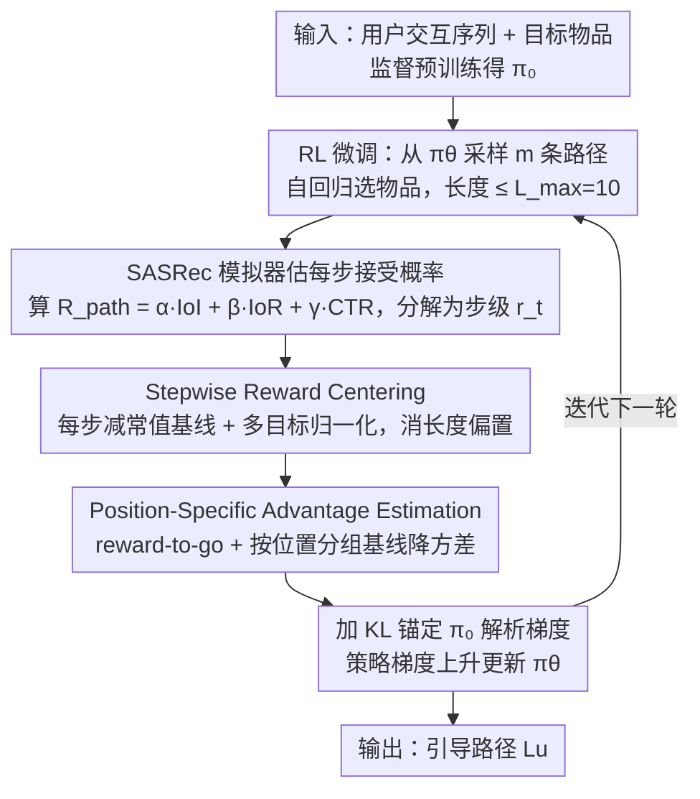

# ProRL: Effective Reinforcement Learning for Proactive Recommendation via Rectified Policy Gradient Estimation

**会议**: ICML2026  
**arXiv**: [2605.28293](https://arxiv.org/abs/2605.28293)  
**代码**: https://github.com/hongruhou89/ProRL  
**领域**: 强化学习 / 推荐系统  
**关键词**: 主动推荐, 策略梯度, 长度捷径, 位置自适应优势, 多目标奖励

## 一句话总结
针对"主动推荐"任务中朴素策略梯度坍缩到"等长重复路径"的问题，作者从理论上把失败归因为路径级奖励分解后的正均值步级奖励所诱导的"长度捷径"和过高方差，并提出 ProRL：用 Stepwise Reward Centering 把每步期望奖励减去常值基线、消除长度偏置，再用 Position-Specific Advantage Estimation 按步位置做 GRPO 式分组基线降低方差，三个真实数据集上 IoI、IoR、CTR、Coherence 四指标全面超过启发式、监督式与 LLM 式 SOTA。

## 研究背景与动机

**领域现状**：常规推荐系统主要反映用户历史偏好，但平台往往希望主动把用户引向某个目标物品（新品、独家内容、长尾品类）。这催生了 Proactive Recommender Systems (PRS)：给定用户交互序列 $S_u$ 和平台指定的目标物品 $i_T$，生成一条由 $L$ 个中间物品组成的引导路径 $L_u=(i_1,\ldots,i_L)$，每一步既要被用户接受（Path Feasibility，用 CTR 度量），又要让用户对目标物品的兴趣实质上升（Guidance Effectiveness，用 IoI、IoR 度量）。已有方案分三类：启发式（IPG、ITMPRec）靠规则贪心选物品，容易陷入局部最优；LLM 规划路径（LLM-IPP、T-PRA）昂贵，难以工业部署；监督式（IRN）模仿历史路径，被训练分布卡死，无法发现更好的路径。

**现有痛点**：把 PRS 自然套到强化学习里看起来很合理——把路径奖励 $R_\text{path}=\alpha\cdot\mathrm{IoI}+\beta\cdot\mathrm{IoR}+\gamma\cdot\mathrm{CTR}$ 当作可观测信号，用标准策略梯度估计 $\hat g_\text{std}=\frac{1}{nm}\sum_{i,j}\sum_{t=1}^{L^{(i,j)}}\nabla_\theta\log\pi_\theta^{(i,j,t)}\cdot R^{(i,j)}$ 优化即可。但实证上几百步内策略就坍缩成"对所有用户生成几乎一模一样、长度顶到 $L_\max$ 的路径"，丧失多样性。

**核心矛盾**：作者把失败拆成两条结构性缺陷。第一，路径级奖励天然分解成步级增量 $r_t:=R(i_1,\ldots,i_t)-R(i_1,\ldots,i_{t-1})$，且实验上 CTR、IoI、IoR 三个分量的 $\mathbb E_\pi[r_t]$ 都恒正，从而 $\mathbb E[R_\text{path}]$ 直接随路径长度线性增长——这意味着早期训练里"延长路径"比"挑更好的物品"更快带来收益，导致 length shortcut。理论上作者证明一个简化模型下 stop 概率 $p(s)$ 以 $O(1/s)$ 速率单调坠向 0。第二，标准估计用整条路径奖励 $R^{(i,j)}$ 给每一步的 log-prob 加权，第 $t$ 步的动作其实只影响 $r_t,\ldots,r_L$，把 $r_1,\ldots,r_{t-1}$ 也塞进去等于注入无关噪声，导致梯度方差过高。

**本文目标**：在保留 PRS 用 supervised 预训练 + RL 微调的轻量 transformer 框架下，重新设计策略梯度估计器，使得 (1) 延长路径的期望增益为零，迫使模型把梯度花在"挑好物品"上；(2) 每步的 advantage 估计是低方差且无偏的。

**切入角度**：既然失败源自"步级奖励均值非零"这个结构属性，那么消除它的最直接方式就是 *reward centering*——但要按步做、并配合多目标归一化；既然标准估计的方差源自"用全局奖励给每步加权"，那么 GRPO 把 critic 拆成 group baseline 的思路可以更进一步，按 *position-specific* 做基线。

**核心 idea**：在 PRS 上把 reward centering 和 GRPO 风格的 group baseline 分别从"步级正均值"和"reward-to-go 按位置变化"两个 PRS 独特结构上做特化，得到一个无 critic、低方差、长度无偏的策略梯度估计器。

## 方法详解

### 整体框架
ProRL 把 PRS 形式化为一个 episode 由若干离散选择步组成的 RL 问题：policy $\pi_\theta(\cdot\mid S_u,i_T)$ 从词表中自回归地生成下一个物品 id，直到输出 EOS 或长度达到 $L_\max=10$。整条 pipeline 是「监督预训练 $\pi_0$ → 用 ProRL 估计器做策略梯度微调」：每个 batch 从 $\pi_\theta$ 采样 $m$ 条路径，由 SASRec user simulator 估出每步接受概率，组合成路径奖励 $R_\text{path}=\alpha\cdot\mathrm{IoI}+\beta\cdot\mathrm{IoR}+\gamma\cdot\mathrm{CTR}$（三个分量数量级相差几个量级，需归一化后量级才可比），再把路径奖励分解到步级后交给两个机制依次修正梯度。RL 目标函数为 $J(\theta)=\mathbb E_{L_u\sim\pi_\theta}[R_\text{path}]-\lambda\cdot D_\mathrm{KL}(\pi_\theta\|\pi_0)$，其中 KL 项把 $\pi_\theta$ 锚定到预训练 $\pi_0$、保留序列先验并防止搜索飘到分布外（这也解释了不在奖励里的 Coherence 为何被一并提升），且有解析梯度，因此关键完全在 reward 项 $\nabla_\theta\mathbb E_{\pi_\theta}[R]$ 的估计。ProRL 用两个独立但互补的机制依次解决「长度捷径」和「梯度方差」两个问题：Stepwise Reward Centering 让“延长一步”的期望梯度归零，Position-Specific Advantage Estimation 按步位置做分组基线压低方差。

### 关键设计

**1. Stepwise Reward Centering（SRC）：让"延长一步"的期望梯度归零，打断长度捷径**

前面诊断出 length shortcut 的根源是步级奖励均值恒正——实验上 CTR、IoI、IoR 三个分量的 $\mathbb E_\pi[r_t]$ 都是正的，于是 $\mathbb E[R_\text{path}]$ 随路径长度线性增长，早期训练里"延长路径"比"挑更好的物品"更快赚到收益。SRC 的修法直击这个结构属性：把路径奖励按 $R=\sum_t r_t$ 分解后，对每步减去一个全局常值基线 $\tilde r_t=r_t-\bar r$，其中 $\bar r=\mathbb E_\pi[r_*]$，按构造 $\mathbb E_\pi[\tilde r_t]=0$，于是 $\mathbb E[\sum_t\tilde r_t]$ 不再随 $L$ 增长。多目标时扩展成按分量归一化

$$\tilde r_t=\sum_{i=1}^K w_i\cdot\frac{r_t^{(i)}-\mu^{(i)}}{\sigma^{(i)}},$$

$\mu^{(i)},\sigma^{(i)}$ 在第一个 warm-up epoch 用 rollout 累积估计后**冻结**。为什么单一全局基线就够？因为三个分量的步级期望都正且相对稳定（IoR 略缓降但始终正），一条标量基线足以打破"长度-奖励耦合"；冻结统计量则是为了不让基线随策略一起漂、避免奖励估计被自身改进反复扭曲；归一化让多目标梯度量级可比，防止数值大的 IoR 压住数值小的 IoI。

**2. Position-Specific Advantage Estimation（PSAE）：按步位置做分组基线，无需 critic 就把方差压下来**

标准估计的第二个毛病是用整条路径奖励 $R^{(i,j)}$ 给每一步 log-prob 加权，可第 $t$ 步的动作其实只影响 $r_t,\ldots,r_L$，把 $r_1,\ldots,r_{t-1}$ 也塞进去等于注入无关噪声。PSAE 分两步收拾：先用 reward-to-go $G_t^{(i,j)}=\sum_{\ell=t}^{L^{(i,j)}}r_\ell^{(i,j)}$ 把过去无关的奖励从加权信号里剔掉；再按位置做分组基线

$$\bar G_{i,t}=\frac{\sum_{j:L^{(i,j)}\ge t}G_t^{(i,j)}}{\sum_j \mathbb I[L^{(i,j)}\ge t]},\qquad \hat A_t^{(i,j)}=G_t^{(i,j)}-\bar G_{i,t},$$

即对同一输入 $i$ 下所有"能到达第 $t$ 步"的 rollout 取平均，得到 rectified 估计器 $\hat g_\text{rect}=\frac{1}{nm}\sum_{i,j}\sum_{t}\nabla_\theta\log\pi_\theta^{(i,j,t)}\cdot\hat A_t^{(i,j)}$。这比 GRPO 用整条路径平均奖励 $\bar R_i$ 当所有步共享基线更贴 PRS 的结构——reward-to-go 在前期步累积长、末尾步累积短，$\mathbb E[G_t]$ 本来就随 $t$ 变化，一条全局基线对前期步偏低、对末尾步偏高，方差未必降；按位置分组的基线天然适配这种结构，仍是 Williams 1992 意义下的无偏估计，但方差显著更小。

### 损失函数 / 训练策略
训练分两阶段。预训练阶段：把历史交互序列截断成 (history, target, path) 三元组，用 seq2seq 交叉熵学到 $\pi_0$。RL 阶段：每个 batch 从 $\pi_\theta$ 采 $m$ 条路径，第一个 epoch 用 rollout 累积估计 $\mu^{(i)},\sigma^{(i)},\bar r$ 后冻结，后续 epoch 按 $\hat g_\text{rect}-\lambda\nabla_\theta D_\mathrm{KL}(\pi_\theta\|\pi_0)$ 做策略梯度上升。$L_\max=10$，user simulator 用 SASRec 训练在历史交互上，接受概率 $P(i\mid S)$ 通过 SASRec 的 softmax 输出读取。

## 实验关键数据

### 主实验
三个真实数据集（MovieLens-1M、Steam、Amazon-Book），SASRec 作为评估器，与 9 个 baseline 对比。

| 数据集 | 指标 | ProRL | 次优 baseline | 提升 |
|--------|------|-------|---------------|------|
| MovieLens-1M | CTR | 0.8543 | IRN 0.8398 | +1.7% |
| MovieLens-1M | IoI | 2.8504 | T-PRA 2.4867 | +14.6% |
| MovieLens-1M | IoR | 728.18 | LLM-IPP 662.52 | +9.9% |
| Steam | CTR | 0.5625 | Bert4Rec 0.4617 | +21.8% |
| Steam | IoI | 1.1188 | T-PRA 0.3339 | +235% |
| Amazon-Book | IoI | 2.9812 | T-PRA 1.7261 | +72.7% |
| Amazon-Book | IoR | 1383.41 | T-PRA 476.93 | +190% |

Coherence（语义连贯性，不在奖励里）ProRL 也全面碾压（如 MovieLens-1M 0.8422 vs LLM-IPP 0.6288），说明学到的是高质量路径而非奖励 hack。

### 消融实验
在 ML-1M 上拆 SRC 和 PSAE 两个模块：

| 配置 | CTR | IoI | IoR | 说明 |
|------|-----|-----|-----|------|
| Full ProRL | 0.8543 | 2.8504 | 728.18 | 完整模型 |
| w/o SRC | 0.9731 | 1.2373 | 649.96 | CTR 反而最高但 IoI 暴跌 56%，证实 length shortcut 让模型过度刷点击 |
| w/o PSAE | 0.7456 | 2.5556 | 695.86 | 三项全跌，PSAE 在 CTR 上贡献尤大 |

多目标 reward 消融（ML-1M）：去掉 CTR、IoI、IoR 任一项都让对应主指标显著下滑，且部分场景下其余指标也连带降级，证明三项目标互相强化。

### 关键发现
- SRC 的真正价值不在 CTR 而在 guidance：去掉 SRC 后 CTR 因正均值偏置被刷到 0.97 但 IoI 砍半，说明 length shortcut 本质是用"短期点击"挤掉"长期引导"。
- PSAE 相对 GRPO 的 $\bar R_i$ 基线在 PRS 上有结构性优势：reward-to-go 随步数下降，位置基线比全局基线方差更低（论文 Table 5 报告 advantage variance 显著低于 reward-to-go 和 GRPO）。
- 跨评估器迁移（cross-evaluator analysis）：ProRL 在 SASRec 上训练，用 GRU4Rec、LightSANs、Bert4Rec 当未见过的评估器，IoI/IoR 仍稳居第一（如 ML-1M GRU4Rec 评估下 IoI 2.4560 vs T-PRA 2.3167），说明学到的是泛化引导策略而非 reward 模型 overfit。

## 亮点与洞察
- 把"训练失败"上升为"结构性诊断"是论文最漂亮的部分：通过分解 $R=\sum r_t$ 并实证 $\mathbb E[r_t]>0$，把 length shortcut 从经验现象变成 $O(1/s)$ 的可证明结果，使得修复方案（centering）有明确目标——"让 $\mathbb E[\tilde r_t]=0$"。
- 把 GRPO 风格的 group baseline 升级到 position-specific 是一个可以迁移到任意"reward 可分解、每步语义不同"任务的通用 trick，例如 dialog generation、tool-use planning、code agent 多步骤生成。
- 冻结 warm-up epoch 统计量（$\mu,\sigma,\bar r$）是个常被忽视的工程细节：若让基线随策略共同更新，会被"策略改进推高基线→减小 advantage→阻止进一步改进"的反馈回路困住。
- Coherence 不在奖励里却被一并提升，提示"奖励 + KL 锚定"组合自然偏好语义连贯的路径——这是一个"PRS 比纯监督路径更能跳出训练分布同时保留语义先验"的存在证明。

## 局限与展望
- 全局基线 $\bar r$ 用一个标量近似所有步的期望，论文也承认对那些 $\mathbb E[r_t]$ 随 $t$ 显著变化的奖励（IoR 缓降）会有残差偏置，更精细的做法是按位置估 $\bar r_t$ 但样本效率下降。
- User simulator 是 SASRec 训出来的 offline 模型，跨评估器实验做了一些缓解，但本质上仍是"在 simulator 上做 RL"，真实线上 A/B 的提升幅度未在文中验证。
- $L_\max=10$ 的设置下 SRC 修掉了 length shortcut，但更长的 episode（如 100 步路径）下，全局常值 $\bar r$ 的近似误差会累积；可能需要引入低秩 $\bar r_t$ 或 critic-based baseline。
- KL 锚定项 $\lambda$ 的取值未在主表上系统消融，KL 太弱会失去 $\pi_0$ 先验，太强会让 RL 退化成 SFT，对部署调参是个隐性成本。

## 相关工作与启发
- **vs IRN (Zhu et al., 2023)**: IRN 直接对历史路径做 seq2seq 模仿学习，受训练分布锁死；ProRL 在同样的轻量 transformer backbone 上用 RL 探索分布外路径，IoI 上比 IRN 高 65% 以上。
- **vs LLM-IPP / T-PRA**: LLM 规划路径强但成本高，部署不友好；ProRL 用小模型 + RL 在大多数指标上反超，特别是 Steam 上 IoI 从 0.33 提到 1.12。
- **vs GRPO (Shao et al., 2024)**: GRPO 用 $\bar R_i$ 一条全局 baseline，PSAE 把 baseline 按位置 $t$ 细分，正是利用了 PRS 中 reward-to-go 随位置变化这个结构信号，且无需引入 critic。
- **vs 经典 REINFORCE + baseline (Williams, 1992)**: 经典 baseline 是 state-value $V(s)$，需要单独训 critic；PSAE 用同一 input 多 rollout 的位置均值替代，零额外参数。

<!-- RELATED:START -->

## 相关论文

- [\[NeurIPS 2025\] On the Global Optimality of Policy Gradient Methods in General Utility Reinforcement Learning](../../NeurIPS2025/reinforcement_learning/on_the_global_optimality_of_policy_gradient_methods_in_general_utility_reinforce.md)
- [\[ICML 2026\] InftyThink+: Effective and Efficient Infinite-Horizon Reasoning via Reinforcement Learning](inftythink_effective_and_efficient_infinite-horizon_reasoning_via_reinforcement_.md)
- [\[NeurIPS 2025\] Robust and Diverse Multi-Agent Learning via Rational Policy Gradient](../../NeurIPS2025/reinforcement_learning/robust_and_diverse_multi-agent_learning_via_rational_policy_gradient.md)
- [\[ACL 2026\] CE-GPPO: Coordinating Entropy via Gradient-Preserving Clipping Policy Optimization in Reinforcement Learning](../../ACL2026/reinforcement_learning/ce-gppo_coordinating_entropy_via_gradient-preserving_clipping_policy_optimizatio.md)
- [\[ICML 2026\] d2: Improving Reasoning in Diffusion Language Models via Trajectory Likelihood Estimation](d2_improving_reasoning_in_diffusion_language_models_via_trajectory_likelihood_es.md)

<!-- RELATED:END -->
