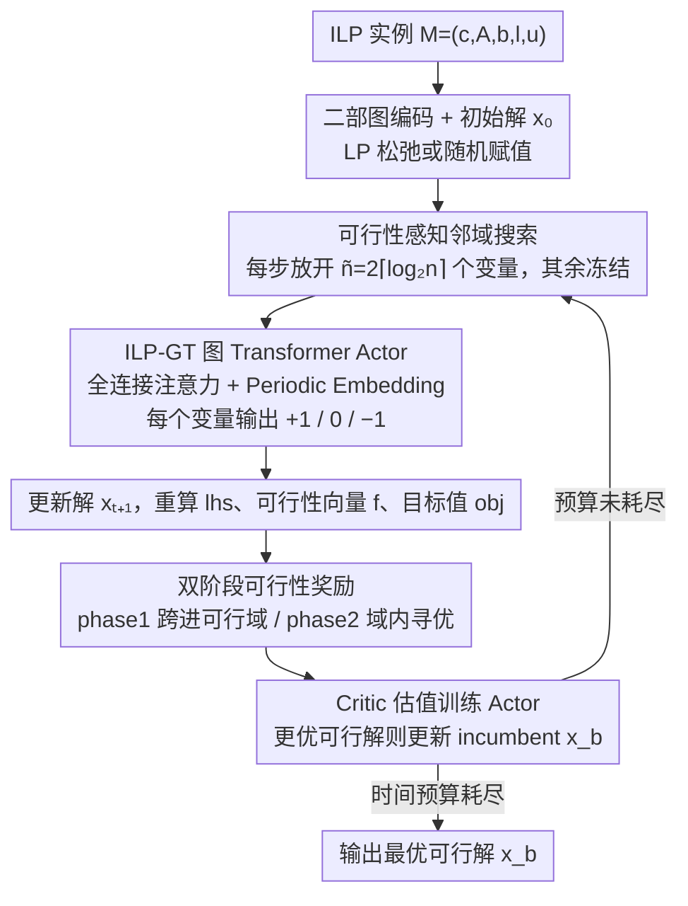

# RL-SPH: Learning to Achieve Feasible Solutions for Integer Linear Programs

**会议**: ICML 2026  
**arXiv**: [2411.19517](https://arxiv.org/abs/2411.19517)  
**代码**: 论文未直接给出仓库地址  
**领域**: 强化学习 / 组合优化  
**关键词**: 整数线性规划, Start Primal Heuristic, 强化学习, Graph Transformer, 可行性奖励

## 一句话总结
本文提出 RL-SPH —— 一种不依赖外部 ILP 求解器、能独立产出 100% 可行解的端到端强化学习启发式算法，用「可行性奖励 + 双阶段策略 + 可行性感知邻域搜索」让 Graph Transformer Agent 在包含非二元整数变量的 ILP 上把 primal gap 平均降低 28.6 倍。

## 研究背景与动机
**领域现状**：求解 NP-hard 的整数线性规划（ILP）时，primal heuristics 用来快速找到可行解；近年的 end-to-end learning-based primal heuristics（E2EPH）用 GNN 在多个 ILP 实例上学共性，直接预测变量取值，再交给 Gurobi/SCIP 等求解器修补成可行解。

**现有痛点**：现有 E2EPH 的可行性几乎都依赖外部 ILP 求解器，因为 ML 预测一旦不精确就会违反约束；少数试图独立产出可行解的工作（DDIM、DiffILO）仍然难以稳定收敛，可行率远低于 100%。此外，绝大多数方法只针对 0/1 二元变量，遇到取值范围更大的非二元整数变量（NBI）时违反约束的概率成倍上升。

**核心矛盾**：ML 端到端预测的「全局一次性输出」与 ILP 约束的「逐元素硬性满足」之间存在根本错位 —— 端到端 supervised learning 用 MSE/CE 训练，缺少显式的 feasibility 信号反馈通道。

**本文目标**：训练一个不依赖求解器、能自洽产出可行解（含非二元整数）的 start primal heuristic；并在二元/非二元、多种 CO benchmark 上验证可行率与解质量。

**切入角度**：作者把寻找可行解视为一个序列决策过程 —— 每个变量「加 1 / 不变 / 减 1」就是动作，约束违反度就是负奖励，可行性达成本身就是大额奖励，从而把不可微的可行性约束直接嵌进 RL 奖励里。

**核心 idea**：用「双阶段奖励 + 可行性感知邻域选取 + ILP-GT 图 Transformer」让 Agent 先快速跨进可行域，再在可行域内逐步寻优，整个过程不需要任何外部求解器。

## 方法详解

### 整体框架
输入是任意一个 ILP 实例 $M=(\mathbf{c},\mathbf{A},\mathbf{b},l,u)$。RL-SPH 先把它编成「变量-约束」二部图，并通过 LP 松弛或随机赋值得到初始解 $\mathbf{x}_0$。在每一步 $t$ 中，先用 feasibility-aware selection 挑出 $\tilde n = 2\lceil\log_2 n\rceil$ 个可变变量（其余冻结），送入 ILP-GT actor 预测动作集 $\mathcal{A}_t$（每个变量在 $\{+1,0,-1\}$ 中三选一），更新解 $\mathbf{x}_{t+1}$，重新计算左端 $\mathbf{lhs}_{t+1}=\mathbf{Ax}_{t+1}$、可行性向量 $\mathbf{f}_{t+1}=\mathbf{b}-\mathbf{lhs}_{t+1}$ 与目标值 $obj_{t+1}$。Critic 估值用于 actor 训练；每发现一个比 incumbent 更好的可行解就更新 $\mathbf{x}_b, obj_b$。直到外部时间预算耗尽或所有 baseline 完成搜索为止。

### 关键设计

**1. 双阶段可行性奖励（Two-Phase Reward）：把"先达到可行"和"在可行域内寻优"解耦**

端到端 supervised 方法用 MSE/CE 训练，缺一条显式的 feasibility 反馈通道，所以 ML 预测一旦不精确就违约。RL-SPH 把不可微的可行性约束直接嵌进奖励，并按两个截然不同的子目标分阶段驱动。phase1 主奖励是 $\mathcal R_{t,\text{F}}=\mathcal R_{t,\text{bound}}+\frac{1}{\sqrt{\tilde n}}\mathcal R_{t,\text{const}}$：其中 $\mathcal R_{t,\text{bound}}=-\sum_i\mathbb I(x_{t+1,i}\notin[l_i,u_i])$ 惩罚越界，$\mathcal R_{t,\text{const}}=\sum_j\min(f_{t+1,j},0)-\min(f_{t,j},0)$ 奖励每条违反约束的"改善量"，只有变量都在边界内且约束改善时才把 $\Delta obj$ 叠进来。进入可行域后切到 phase2 的 $\mathcal R_{t,\text{p2}}$：只对可行解给 $\Delta obj$ 正奖励、对不可行解给 $\mathcal R_{t,\text{F}}$ 负奖励，并用 toward-optimal bias $\alpha=2$ 鼓励朝优于 incumbent 的区域探索，原地不动直接 $-100$ 重罚防止摆烂。这套奖励有理论兜底——Proposition 1 证明只要 $\mathcal R_{t,\text{const}}>0$ 且 $\mathcal R_{t,\text{bound}}=0$ 持续成立，agent 终将进入可行域，把可行性这一硬约束转成了 agent 的 reward-feasibility alignment 保证，正好补上端到端方法的可行性盲区。

**2. ILP 专用 Graph Transformer（ILP-GT）：用全连接注意力刻画跨约束依赖，用 Periodic Embedding 化解整数无界**

传统 GCN 只能聚合一阶邻域，对 ILP 里变量间的长程相关性建模不足。RL-SPH 把每一步选中的 $\tilde n$ 个变量、它们对应的目标系数与约束行 $(\mathbf c^\top|\mathbf A)$，以及 phase/obj/可行性向量这些"奖励上下文 token"一起编进 Transformer encoder——全连接注意力天然刻画跨约束依赖。两个工程要点解决了 ILP 喂进 Transformer 的难处：先用 equilibration scaling 把 $(\mathbf c^\top|\mathbf A)$ 规范到 $[-1,1]$ 稳住训练；变量的连续取值用 Periodic Embedding $\operatorname{PE}(z)=\oplus(\sin(\tilde z),\cos(\tilde z))$（$\tilde z=[2\pi w_1 z,\dots,2\pi w_k z]$）编码，再配一个 `bnd_lim` 二元位指示是否触界——"连续值 + 离散触界标志"的双轨编码刚好化解了整数取值无界、难嵌入的问题。reward context 含 phase 标识、PE 后的 $obj$ 和按 $\sqrt{|\mathbf b|+|\mathbf b-\mathbf{lhs}_t|}$ 归一化的 $\mathbf f_t$，最后用 phase-separated actor/critic head 与共享 backbone 拼成长度 $\tilde n+3$ 的输入序列。

**3. 可行性感知邻域搜索（Feasibility-Aware Search Strategy）：每步只放开 $\Theta(\log n)$ 个最有希望的变量**

单变量 local search 太慢，朴素 LNS 又需要一个可行初始解。RL-SPH 把 RENS 的"子问题修复"和 LNS 的"大邻域"思想合进一个不依赖求解器的 RL 框架，每步只放开 $\tilde n=p+q$ 个最有希望改善可行性的变量、其余冻结。具体地，phase1 先按"在违反约束中出现频次"加权随机抽 $p$ 个种子变量，再选与种子共现于同一违反约束最多的 $q$ 个邻居一起动作；phase2 改为优先抽 slack 较充裕、不易让约束反复抖动的种子。$p=q=\lceil\log_2 n\rceil$ 限制 Transformer 输入规模，使方法可扩展到上万变量的 ILP。回滚规则也按阶段区分——phase1 只在变量越界时回滚，phase2 只要新解未严格改善 incumbent 就回滚，让搜索单调推进。

### 损失函数 / 训练策略
采用 Actor-Critic：actor 鼓励 $\mathcal{R}_{t,\text{total}}>V_\theta$ 的动作、抑制低奖励动作；critic 用回归损失逼近真实回报。每个实例在 phase1 上停留预设步数确保充分训练后才换实例。训练只用 1,000 个 instance 即可，单实例平均训练时间 30 分钟，相比 E2EPH baseline 提速约 14.7×。

## 实验关键数据

### 主实验
在 5 个 NP-hard ILP benchmark（MVC、IS、SC、CA、NBI）上对比 4 类 SPH（FP / RENS / DHF / RHF）与 3 个 E2EPH（PAS / DDIM / DiffILO），统一 1000 秒 wall-clock 预算。

| 指标维度 | RL-SPH | 既有 SPH/E2EPH baseline | 提升 |
|----------|--------|------------------------|------|
| 可行率 (FR) | 100% (5/5 benchmark) | 多数 <100%，部分 timeout 失败 | 唯一全可行 |
| 平均 primal gap | 1× | 28.6× | 28.6× 更优 |
| 平均 primal integral | 1× | 2.6× | 2.6× 更优 |
| 训练时间 | ~30 min | E2EPH 平均 7+ h | ~14.7× 加速 |

### 消融实验

| 配置 | 关键现象 | 说明 |
|------|---------|------|
| 完整 RL-SPH | 100% FR + 最低 gap | baseline |
| 去掉 phase-separated head | gap 显著上升 | 双阶段奖励需配套双阶段网络头 |
| $\alpha=1$（无 toward-optimal bias） | phase2 探索停滞 | 探索偏置不可或缺 |
| 朴素 GNN 替代 ILP-GT | 大规模实例性能掉点 | 长程依赖必须靠 Transformer |
| 单变量动作（弃 feasibility-aware selection） | 收敛速度严重退化 | 大邻域同时改值是加速关键 |

### 关键发现
- 双阶段奖励是 100% 可行率的根本保证：Proposition 1 把「reward > 0」与「最终进入可行域」严格挂钩，实证上 phase1 通常几十步内就跨进可行域。
- 在非二元整数 benchmark (NBI) 上 RL-SPH 优势最显著 —— 既有 E2EPH 在变量值域变宽后约束违反率激增，而 RL 的 $\{+1,0,-1\}$ 增量动作天然适配整数搜索。
- RL-SPH 可作为 LNS、local branching 的 warm-start，显著降低后续求解时间；MIPLIB 真实实例上同样保持可行率优势。

## 亮点与洞察
- 把可行性约束「翻译」成奖励信号，并配上理论 Proposition 证明 reward-feasibility alignment —— 这是同类 ML for CO 工作里少有的形式化可行性保证。
- 双阶段设计巧妙地解决了「先要可行」与「再要最优」这对常被混在一起的目标冲突，避免了 RL 在 sparse reward 下卡死。
- Periodic Embedding + `bnd_lim` 这种「连续值 + 离散触界标志」的双轨编码可直接迁移到任何需要把无界整数喂给 Transformer 的场景（如调度、布局）。
- $\tilde n=2\lceil\log_2 n\rceil$ 的自适应邻域大小让方法可扩展到上万变量的 ILP。

## 局限与展望
- 作者承认 RL-SPH 没有内建终止条件，需借助 baseline 完成时间或外部 budget 来停；自动判断「已达到局部最优」仍是开放问题。
- 整数动作幅度被固定为 $\pm 1$（附录 I.7 讨论），对取值跨度极大的 ILP（如运输量级 $10^4$）可能需要分层动作或自适应步长。
- 初始解依赖 LP 松弛或随机，未来可结合 supervised warm-start 进一步降低 phase1 步数。
- 没有显式建模目标函数最优性证明，仅是「拿到高质量可行解」，与 branch-and-bound 的 exact 保证之间仍有鸿沟。

## 相关工作与启发
- **vs PAS / Predict-and-Search (Han et al. 2023)**: PAS 预测固定+trust region 后仍要交给 SCIP 修复；RL-SPH 完全跳过求解器，且对非二元整数适用。
- **vs DiffILO (Geng et al. 2025)**: DiffILO 用扩散模型直接采样解，但可行率不稳定；RL-SPH 通过奖励对齐拿到 100% FR。
- **vs 经典 RENS / LNS**: RL-SPH 借鉴 RENS「固定一部分变量解子问题」与 LNS「大邻域搜索」的思想，但用 RL 取代了求解器与启发式规则。
- 启发：在其他「输出必须满足硬约束」的学习任务（如电路布线、车辆路径）里，把约束改善作为奖励 + 双阶段策略也许同样适用。

## 评分
- 新颖性: ⭐⭐⭐⭐ 首个有理论可行性对齐保证的 E2EPH，且天然支持非二元整数
- 实验充分度: ⭐⭐⭐⭐⭐ 5 类 benchmark + 7 baseline + MIPLIB + 求解器联调 + 超参分析，覆盖面强
- 写作质量: ⭐⭐⭐⭐ 方法图与 Algorithm 1 清晰，奖励公式 case 较多需细读
- 价值: ⭐⭐⭐⭐ 为「ML 独立解 ILP」提供了一条可工程化路线，可直接给 LNS warm-start 复用

<!-- RELATED:START -->

## 相关论文

- [\[AAAI 2026\] DeepProofLog: Efficient Proving in Deep Stochastic Logic Programs](../../AAAI2026/reinforcement_learning/deepprooflog_efficient_proving_in_deep_stochastic_logic_programs.md)
- [\[ACL 2026\] A Survey of Reinforcement Learning for Large Language Models under Data Scarcity: Challenges and Solutions](../../ACL2026/reinforcement_learning/a_survey_of_reinforcement_learning_for_large_language_models_under_data_scarcity.md)
- [\[ICML 2026\] MoMa QL: 用矩匹配加速扩散/流匹配策略的离线 + 离线-在线 RL](moment_matching_q-learning.md)
- [\[ICML 2025\] Actor-Critics Can Achieve Optimal Sample Efficiency](../../ICML2025/reinforcement_learning/actor-critics_can_achieve_optimal_sample_efficiency.md)
- [\[ICML 2026\] RL4RLA: Teaching ML to Discover Randomized Linear Algebra Algorithms Through Curriculum Design and Graph-Based Search](rl4rla_teaching_ml_to_discover_randomized_linear_algebra_algorithms_through_curr.md)

<!-- RELATED:END -->
