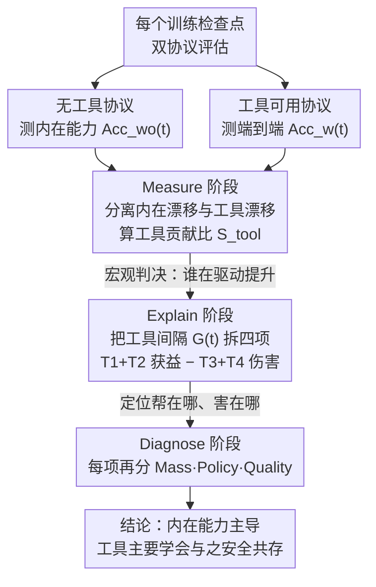

# 视觉工具使用强化学习究竟学到了什么？

**会议**: ICML 2026  
**arXiv**: [2602.01334](https://arxiv.org/abs/2602.01334)  
**代码**: https://github.com/GAIR-NLP/Med  
**领域**: 多模态 VLM / 强化学习 / Agent 工具使用  
**关键词**: 视觉工具使用, 强化学习解释, 裁剪-放大工具, 多模态推理

## 一句话总结
本文提出 MED 框架系统分析视觉工具使用 RL 在裁剪-放大场景中的实际学习效果——发现 RL 训练所带来的性能提升主要源于**内在能力提升**而非工具掌握能力提升，模型主要学会了如何与工具安全共存而非真正掌握工具。

## 研究背景与动机

**领域现状**：当前 VLM 广泛采用工具使用 RL 增强多模态推理能力。研究者给 VLM 配备视觉操作工具（如裁剪-放大），通过 RL 训练模型学会在推理过程中调用工具。

**现有痛点**：虽然视觉工具使用 RL 能带来性能提升，但**本质上取得的是什么样的改进仍然不明确**。观察到的性能收益可能来自三个不同来源——（1）RL 强化内在能力（不使用工具也能改进）；（2）RL 改进工具交互本身；（3）RL 只是减少工具带来的副作用而非真正改进修复失败的能力。既有评估只报告端到端工具可用下的准确率，无法机制级归因。

**核心矛盾**：性能改进的成因属性不清楚导致无法设计有效 RL 目标函数。若主要是内在能力提升则优化工具调用策略效果有限；若主要是工具使用改进则应针对性奖励工具纠正失败能力。

**本文目标**：从训练动态视角系统分解性能改进来源——分离内在能力漂移与工具诱导效应，进一步分解为可解释的收益与伤害项。

**切入角度**：检查点级分析，在两个不同工具先验的 VLM 骨干（Qwen2.5-VL 未训练过裁剪-放大、Qwen3-VL 已训练）和六个基准上对比**无工具推理准确率**与**工具可用推理准确率**的演化曲线。

**核心 idea**：设计 MED（Measure-Explain-Diagnose）三层递进式框架——概率分解恒等式将工具诱导性能差距分解为四项，再对每项进行 Mass-Policy-Quality 因式分解诊断根本原因。

## 方法详解

### 整体框架
对每个训练检查点，模型在两种推理协议下评估——**无工具协议**：不提供工具 schema 测量"内在能力"；**工具可用协议**：提供工具 schema 模型可主动调用。通过追踪两条曲线分离内在漂移 $f_{wo}(t)$ 与工具诱导漂移 $\Delta_{tool}(t)$：$f_w(t) = f_{wo}(t) + \Delta_{tool}(t)$。在此基础上，MED 用一条 coarse-to-fine 的诊断流水线层层逼近成因——Measure 给宏观判决、Explain 把间隔拆成可作用的成分、Diagnose 再定位每项背后的机制。

### 关键设计

**1. Measure 阶段：先回答"内在能力还是工具使用在驱动提升"这个宏观问题**

要分离两种来源，先把两条曲线的累积幅度积出来：内在漂移 $|B_{wo}| = \int_0^T |f_{wo}(t)|\,dt$，工具漂移 $|B_{\Delta tool}| = \int_0^T |\Delta_{tool}(t)|\,dt$，再算工具贡献比

$$S_{tool} = \frac{|B_{\Delta tool}|}{|B_{wo}| + |B_{\Delta tool}|}.$$

$S_{tool}\approx 0$ 说明内在漂移主导，$\approx 1$ 说明工具效应主导。这一步给出的是一个宏观判决——到底是 RL 强化了不用工具也能改进的内在能力，还是真的改进了工具使用，为后面的细粒度拆解定下基调（实验里两个模型的 $S_{tool}$ 都远低于 0.5，直接指向内在能力主导）。

**2. Explain 阶段：把工具性能间隔拆成"调用/Schema × 获益/伤害"四项**

宏观判决之后要进一步问"工具到底帮在哪、害在哪"。作者按样本在无工具协议下是否成功分成 $\mathcal{D}_{fail}$ / $\mathcal{D}_{succ}$，再按是否实际调用工具分成 call / no-call，把工具性能间隔分解为 $G(t) = T1 + T2 - T3 - T4$：$T1$ 是无工具会失败、调用工具后成功（真正的工具救场），$T3$ 是无工具本来成功、调用工具后反而失败（工具的害处），$T2$/$T4$ 则是 Schema 暴露本身（哪怕没真调用）带来的获益与伤害。这一拆把抽象的性能间隔变成可作用的成分——收益是 $T1+T2$、伤害是 $T3+T4$，且能区分是"调用动作"还是"Schema 暴露"引发的效应，为定位问题提供抓手。

**3. Diagnose 阶段：Mass-Policy-Quality 三因子分解，定位每一项变化背后的机制**

知道某一项（比如调用获益 $T1$）停滞了还不够，得知道是哪种机制导致的。作者把每一项进一步因式分解成三个概率因子

$$\text{Term}(\mathcal{D},a,o) = P(\mathcal{D}) \cdot P(a\mid\mathcal{D}) \cdot P(o\mid a,\mathcal{D}),$$

分别对应 **Mass**（这类样本的规模有多大）、**Policy**（调用决策"何时调用"）、**Quality**（执行质量"调用得好不好"）。这样一来，"调用获益停滞"就能被精确归因到三种完全不同的成因：失败集萎缩（Mass↓）、模型干脆不调用了（Policy↓）、还是执行质量下降了（Quality↓）。正是这层分解揭示了本文最反直觉的结论——调用获益停滞不是质量崩坏，而是内在能力提升让困难失败样本集自然萎缩（Mass↓）造成的"容量限制"，即"内在能力-工具 trade-off"。

### 训练策略
使用 GRPO 算法以纯结果奖励训练，在两个 VLM 骨干和六个基准（VStar, HR-Bench 4k/8k, VisualProbe Easy/Medium/Hard）上进行 21 个检查点分析。

## 实验关键数据

### 主实验：内在漂移主导

| 模型 | 工具贡献比 $S_{tool}$ | 内在漂移 $\|B_{wo}\|$ | 工具漂移 $\|B_{\Delta tool}\|$ |
|-----|----------------|-------------------|----------------------|
| Qwen2.5-VL | 0.30 | 大 | 小 |
| Qwen3-VL | 0.22 | 大 | 小 |

两模型工具贡献比都远低于 0.5，表明 70%+ 学习进度来自内在能力提升。

### 收益-伤害分解

| 阶段 | 调用获益 (T1) | Schema 获益 (T2) | 调用伤害 (T3) | Schema 伤害 (T4) | 净效益 |
|-----|----------|-----------|-----------|-----------|--------|
| 早期 | 快速上升 | 小 | 中等 | 中等 | 正增长 |
| 中期 | 平台化/下降 | 小 | 下降 | 下降 | 缓慢增长 |
| 晚期 | 平台化/下降 | 小 | 继续下降 | 继续下降 | 基本不变 |

### 持久失败案例（人工标注 370 样本）

| 失败类型 | 数量 | 比例 |
|--------|------|------|
| 未调用但应该调用 | 82 | 22.2% |
| 调用但裁剪错误 | 52 | 14.1% |
| 裁剪正确但推理仍错 | 37 | 10.0% |
| 裁剪正确但任务仍难 | 10 | 2.7% |

### 关键发现
- 调用获益停滞：T1 在 Qwen2.5-VL 上快速上升后平台化，Qwen3-VL 单调下降。
- 伤害持续下降：T3+T4 在整个训练过程中持续减少。
- 净工具效益趋于平台期反映收益饱和与伤害递减的平衡。
- 深层洞察：调用获益停滞并非质量崩坏，而是**容量限制**——内在能力改进时困难失败样本集自然萎缩，限制了工具帮助上限。

## 亮点与洞察
- **概率分解恒等式的优雅性**：将性能间隔分解为四项的做法既是数学恒等式也是可操作诊断工具。
- **Mass-Policy-Quality 因式分解的诊断力**：擅长捕捉"内在能力-工具 trade-off"现象。
- **对工具实际学到了什么的清醒认识**：模型实际学会的是"与工具安全共存"——减少工具引发伤害而非强化工具修正能力。
- **双 VLM 骨干对比设计**：揭示工具先验对学习动态的影响。

## 局限与展望
- 分析仅限单一工具（裁剪-放大），多工具场景的学习动态可能不同。
- 本文分析训练动态但未提出新 RL 算法。
- 指标仅关注准确率，未考虑效率、可解释性等维度。
- 固定检查点采样可能遗漏某些快速动态。
- 改进：设计 RL 目标函数显式最大化"在失败集上的选择性纠正"同时最小化"在成功集上的伤害"；扩展到多工具场景。

## 相关工作与启发
- **vs Tool-use Faithfulness 工作**：faithfulness 检查表面对齐，MED 诊断实际效能。
- **vs 单一 VLM 分析**：本文对比不同工具先验的两个模型，揭示工具先验对学习曲线的显著影响。
- **vs 结果奖励 vs 工具奖励的辩论**：本文通过 MED 分析表明工具相关奖励主要改变 Policy 而非 Quality，且不能解决 Mass 容量限制根本问题。

## 评分
- 新颖性: ⭐⭐⭐⭐⭐  概率分解恒等式与 Mass-Policy-Quality 因式分解是原创诊断框架。
- 实验充分度: ⭐⭐⭐⭐⭐  两 VLM + 6 基准 + 21 检查点纵向 + 手工 case + 多 sanity check。
- 写作质量: ⭐⭐⭐⭐  逻辑清晰，三层分析递进自然。
- 价值: ⭐⭐⭐⭐⭐  挑战了对"工具使用 RL 就是学会掌握工具"的直观理解。

<!-- RELATED:START -->

## 相关论文

- [\[ICML 2026\] RL-SPH: Learning to Achieve Feasible Solutions for Integer Linear Programs](rl-sph_learning_to_achieve_feasible_solutions_for_integer_linear_programs.md)
- [\[ICML 2026\] 跨域离线强化学习中统一值对齐与值分配](unifying_value_alignment_and_assignment_in_cross-domain_offline_reinforcement_le.md)
- [\[ICML 2026\] FAB: A First-Order AB-based Gradient Algorithm for Distributed Bilevel Optimization over Time-Varying Directed Graphs](fab_a_first-order_ab-based_gradient_algorithm_for_distributed_bilevel_optimizati.md)
- [\[ICML 2026\] Perceptual Flow Network for Visually Grounded Reasoning](perceptual_flow_network_for_visually_grounded_reasoning.md)
- [\[ICML 2026\] One Bias After Another: Mechanistic Reward Shaping and Persistent Biases in Language Reward Models](one_bias_after_another_mechanistic_reward_shaping_and_persistent_biases_in_langu.md)

<!-- RELATED:END -->
