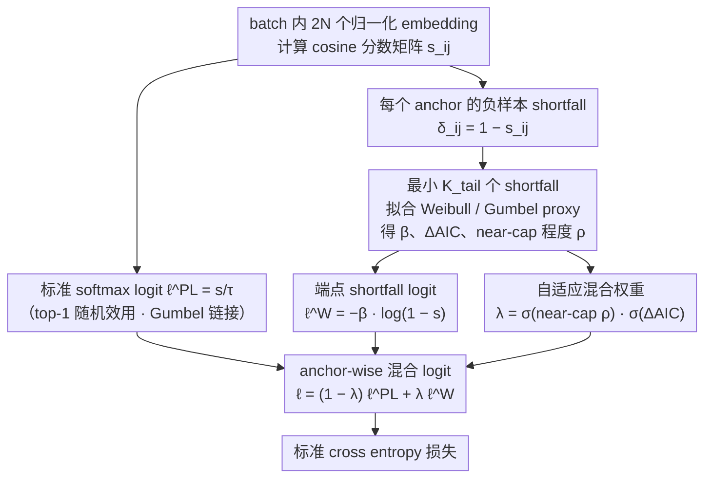

# When Softmax Fails at the Top: Extreme Value Corrections for InfoNCE

**会议**: ICML 2026  
**arXiv**: [2606.00262](https://arxiv.org/abs/2606.00262)  
**代码**: https://github.com/hsme98/weince  
**领域**: 自监督学习 / 对比学习  
**关键词**: InfoNCE, 极值理论, hard negatives, Weibull tail, 对比学习  

## 一句话总结
这篇论文把 InfoNCE 解释为 top-1 选择似然，指出标准 softmax 隐含 Gumbel 尾部分布假设，而归一化 embedding 的高相似度 hard negatives 更常呈现有限端点的 Weibull 行为，因此提出无额外参数的 WEINCE，用 batch 内尾部统计自适应混合 softmax logit 和 endpoint shortfall logit，稳定提升自监督表征质量。

## 研究背景与动机
**领域现状**：InfoNCE 是 SimCLR、MoCo、SimCSE、CLIP 等对比学习方法的核心目标。它通过 softmax 让正样本在一组候选中胜出，鼓励同一数据的两种增强视图相似、不同数据的视图不相似。

**现有痛点**：现代对比学习常用归一化 embedding 和 cosine similarity，分数天然有上界 $s\le1$。但 InfoNCE 的 softmax 可以从随机效用模型推导为“分数加 Gumbel 噪声”的 top-1 选择模型，这相当于假设尾部是平移型、无有限端点的 Gumbel 几何。hard negatives 正好位于相似度上界附近，这里 softmax 的尾部假设可能失配。

**核心矛盾**：对比学习最依赖 hard negatives 的梯度，但 hard negative tail 的统计几何又最可能违背 softmax 假设。如果 loss 在顶部尾部给错概率，就会把梯度分配给不该强调或强调不足的 negatives，影响表征学习。

**本文目标**：作者希望从极值理论出发，刻画 large-$K$ 负样本集合里 top-scoring example 的尾部选择规律，并设计一个不改变模型结构、不增加可学习参数、可直接替换 InfoNCE 的 corrected loss。

**切入角度**：论文把 InfoNCE 视为 Plackett-Luce top-1 likelihood，而不是单纯的互信息下界。这样 softmax 就不只是计算技巧，而是一个可检验的统计假设：winner event 是否由 Gumbel/translation tail 产生。

**核心 idea**：当 batch 内某个 anchor 的 negatives 接近 cosine 上界且尾部更像 Weibull endpoint geometry 时，WEINCE 用 $-\log(1-s)$ 型 shortfall logit 修正 softmax；证据不足时退回原始 InfoNCE。

## 方法详解
论文先重新解释 InfoNCE：对于 anchor $u_j$，正样本 $v_{j0}$ 和 $K$ 个负样本构成候选集合，观察到的事件是正样本成为 top-1 winner。若候选效用为 $U_{ji}=s_{ji}+\epsilon_{ji}$ 且噪声为 i.i.d. Gumbel，则 top-1 概率正好是 softmax，负 log-likelihood 就是 InfoNCE。

接着作者引入 Fisher-Tippett-Gnedenko 极值理论。最大值的尾部极限有三种几何：Fréchet 重尾、Gumbel 快速衰减无界尾、Weibull 有限右端点。cosine similarity 有固定上界，所以 hard-negative tail 中自然会出现 endpoint shortfall 行为。WEINCE 的设计目标就是不全盘替换 softmax，而是在每个 anchor 上检测是否有 endpoint 证据，再局部修正 logits。

### 整体框架
训练时，WEINCE 接收一个 batch 的 $2N$ 个 $\ell_2$ 归一化 embeddings，并计算所有 cosine scores $s_{ij}=z_i^\top z_j$。对每个 anchor $i$，候选集合包含其正样本 $i^+$ 和所有其他视图。标准 InfoNCE 使用 $\ell^{PL}_{ij}=s_{ij}/\tau$。

WEINCE 额外为每个 anchor 估计两个 stop-gradient 统计量：一个是 Weibull shortfall slope $\hat\beta_i$，另一个是混合权重 $\lambda_i\in[0,1]$。最终 logit 为 $\ell_{ij}=(1-\lambda_i)\ell^{PL}_{ij}+\lambda_i\ell^W_{ij}$，其中 $\ell^W_{ij}=-\hat\beta_i\log(1-s_{ij})$。损失仍然是标准 cross entropy，只是 logits 被 anchor-wise 修正。可以把它看成两条分支：softmax 分支照常给出 $\ell^{PL}$，端点 shortfall 分支从 batch 尾部统计算出 $\ell^W$ 和权重 $\lambda_i$，最后逐 anchor 混合再过 cross entropy。

### 关键设计
**1. InfoNCE 的 top-1 随机效用解释：把 softmax 从经验公式还原成可检验的统计假设。** 论文把 anchor 的候选效用写成 $U_{ji}=s_{ji}+\epsilon_{ji}$，当噪声 $\epsilon$ 服从 i.i.d. Gumbel 时，正样本成为 top-1 winner 的概率恰好是 $P(I_j=k)=\frac{\exp(s_{jk}/\tau)}{\sum_i\exp(s_{ji}/\tau)}$，于是 InfoNCE 就等价于最大化这个 winner likelihood。这一步看似只是换了说法，意义却在于：softmax 不再是默认设定，而是隐含了「分数加 Gumbel 噪声、尾部沿实轴无界平移」的几何假设。既然是假设，就能追问它在有上界的 cosine 分数上到底成不成立——后面所有修正都从这个口子打开，而不是停留在「互信息下界」的老解释里。

**2. 极值尾部诊断与端点 shortfall 修正：给出更贴合 hard negatives 的 logit 形式。** 由 Fisher-Tippett-Gnedenko 定理，最大值的尾部极限只有三类几何：Fréchet 重尾、Gumbel 无界尾、Weibull 有限右端点。cosine 分数有固定上界 $x_F=1$，而 hard negatives 恰好挤在上界附近，这里的自然坐标不再是 $s$ 本身，而是到端点的 shortfall $-\log(1-s)$。论文用 POT（peaks-over-threshold）诊断在代表性尾部估出 $\hat\xi=-0.39$，说明 Weibull-GPD 比 Gumbel-GPD 明显更贴合 near-cap tail。据此 Weibull 模型给出 shortfall logit $\ell^W_{ij}=-\hat\beta_i\log(1-s_{ij})$，它能正确表达「越靠近端点越稀有、越该被特殊处理」——这正是 softmax 的平移尾部假设给不出的几何。

**3. anchor-wise 自适应混合（WEINCE）：只在确有端点证据的 anchor 上启用修正。** 极值理论给的是渐近结论，但每个 mini-batch、每个 anchor 的有限样本状态各不相同，若把所有样本硬套 Weibull（纯 Weibit loss）会过度修正。WEINCE 因此对每个 anchor 在线估计两个 stop-gradient 量：先算负样本 shortfalls $\delta_{ij}=1-s_{ij}$，由最小的若干 shortfall 得到 near-cap 程度 $\rho_i$；再在最小的 $K_{tail}$ 个 shortfall 上分别拟合 Weibull 与 Gumbel proxy，用 $\Delta AIC_i=AIC_G-AIC_W$ 衡量「谁更像」。混合权重取两个 sigmoid 之积 $\lambda_i=\sigma(\kappa_\rho\log(\rho_0/\rho_i))\cdot\sigma(\kappa_{AIC}(\Delta AIC_i-m))$——一个随越靠近 cap（$\rho_i$ 越小）而增大，一个随 Weibull 越占优而增大。最终 logit $\ell_{ij}=(1-\lambda_i)\ell^{PL}_{ij}+\lambda_i\ell^W_{ij}$ 是嵌套的：$\lambda_i=0$ 退回原始 InfoNCE，$\lambda_i=1$ 为纯端点 shortfall，中间值表示尾部证据混合。这就是 WEINCE 区别于「直接换成 Weibull loss」的关键：普通 anchor 几乎不动，只有 near-cap 且 Weibull-like 的 anchor 才领到端点修正。

### 损失函数 / 训练策略
WEINCE 的训练目标是 $\mathcal{L}_{WEINCE}=-\frac{1}{2N}\sum_i\log\frac{\exp(\ell_{i,i^+})}{\sum_{j\in\mathcal{C}(i)}\exp(\ell_{ij})}$。它不改变 encoder、projection head、augmentation、optimizer 或训练 schedule。$\lambda_i$ 和 $\hat\beta_i$ 从当前 batch similarity matrix 在线估计，并被 stop-gradient 处理，不参与反向传播。

计算开销很小。论文报告 Tiny-ImageNet / ResNet-18 / batch size 256 / NVIDIA L40S 的代表性运行中，InfoNCE 平均 step time 为 253.3 ms，WEINCE 为 255.0 ms，端到端开销约 +0.67%；loss 阶段从 0.65 ms 增至 2.11 ms，但仍低于总 step time 的 1%。

## 实验关键数据

### 主实验
视觉实验使用官方 SimCLR 设置，只替换 contrastive loss；模型包括 ResNet-18、ResNet-50 和 Tiny-ImageNet 上的 ViT-Small。评价使用 frozen-feature linear evaluation 和 kNN recall。

| 数据集 / Encoder | 指标 | WEINCE | InfoNCE | 提升 |
|--------|------|------|----------|------|
| STL10 / R18 | Linear Acc | 77.94 ± 0.27 | 76.54 ± 0.32 | +1.40 |
| STL10 / R50 | Linear Acc | 80.02 ± 0.46 | 78.44 ± 0.31 | +1.58 |
| CIFAR10 / R50 | Linear Acc | 83.74 ± 0.18 | 82.13 ± 0.92 | +1.61 |
| CIFAR100 / R18 | Linear Acc | 53.28 ± 0.28 | 50.01 ± 0.19 | +3.27 |
| CIFAR100 / R50 | Linear Acc | 55.97 ± 1.21 | 51.15 ± 0.43 | +4.82 |
| ImageNet32 / R18 | Linear Acc | 25.26 ± 0.28 | 24.29 ± 0.30 | +0.97 |
| Tiny-IN / ViT-S | Linear Acc | 36.53 | 33.12 | +3.41 |

### 消融实验
论文还报告 kNN recall 与跨域 NLP 实验，用来验证 WEINCE 是否只改善 linear probe，还是也改善局部邻域结构和文本 embedding。

| 配置 | 关键指标 | 说明 |
|------|---------|------|
| CIFAR100 / R18 | R@1 42.94 vs. 36.98 | kNN 近邻质量大幅提升 |
| CIFAR100 / R50 | R@1 42.70 vs. 35.44 | 大 backbone 同样受益 |
| Tiny-IN / ViT-S | R@1 23.53 vs. 19.30，R@20 66.97 vs. 62.63 | Transformer encoder 也适用 |
| STL10 / R18 | R@1 70.83 vs. 68.22 | retrieval improvement 稳定但较温和 |
| SimCSE / STS-B | Spearman 76.36 ± 3.17 vs. 71.74 ± 4.23 | NLP cosine contrastive learning 也有 +4.63 点 |
| 运行开销 | 255.0 ms vs. 253.3 ms / step | 额外开销约 +0.67%，无可学习参数 |

### 关键发现
- 最大收益出现在 CIFAR100 这类更细粒度分类数据上，说明 hard-negative tail 修正对类别边界更复杂的表征学习尤其有帮助。
- kNN recall 的提升通常比 linear accuracy 更明显，说明 WEINCE 改善的不只是线性可分性，还包括 embedding 空间的局部邻域结构。
- SimCSE 结果说明 bounded cosine endpoint 问题不是视觉独有。只要 objective 在归一化 embedding 上做 softmax top-1 选择，WEINCE 的统计修正都有潜在价值。

## 亮点与洞察
- 论文最巧妙的地方是把 InfoNCE 的 softmax 重新解释为一个随机效用模型。这个视角让“softmax 是否正确”成为可诊断的统计问题，而不是默认设定。
- WEINCE 的工程形式很克制。它不引入新网络、不需要额外 forward、不需要额外参数，只在 logit 层用 batch statistics 做 stop-gradient 修正，因此很容易插入现有 SimCLR/SimCSE 管线。
- 自适应混合比直接替换 softmax 更合理。极值理论给的是 tail asymptotics，但每个 mini-batch 和 anchor 的有限样本状态不同；让 $\lambda_i$ 由 near-cap 与 AIC 证据共同决定，避免了过度理论化的硬替换。

## 局限与展望
- 尾部估计来自 mini-batch，batch size、augmentation 强度和训练阶段都会影响 shortfall statistics。小 batch 或 hard negatives 不足时，$\lambda_i$ 的估计可能不稳定。
- 当前方法主要在 cosine bounded similarity 下成立。若模型使用未归一化 dot product 或可学习相似度尺度，tail geometry 可能不同，需要重新诊断。
- WEINCE 增加了若干统计超参数，如 $K_{tail}$、$\rho_0$、AIC margin 和 sigmoid sharpness；虽然没有可学习参数，但调参复杂度仍存在。
- 论文强调 frozen-feature 评价，未来可以进一步看端到端 fine-tuning、跨模态 retrieval 和大规模 CLIP 训练中的收益是否保持。

## 相关工作与启发
- **vs InfoNCE / SimCLR**: 标准 InfoNCE 使用 softmax logits $s/\tau$，本文指出这是 Gumbel top-1 link；WEINCE 在 hard-negative endpoint 区域修正这一 link。
- **vs hard negative mining**: hard negative mining 直接改变负样本集合，WEINCE 不改变采样，而是改变 hard negatives 在 loss 中的统计解释和梯度权重。
- **vs 温度调参**: 调整 temperature 只能全局缩放 logits，无法表达 near-cap shortfall 几何；WEINCE 的 $\lambda_i$ 和 $\hat\beta_i$ 是 anchor-wise 的。
- **可迁移启发**: 类似尾部几何校正可以用于 retrieval loss、ranking loss、CLIP-style contrastive learning，以及任何 bounded score 上的 top-k 或 top-1 选择模型。

## 评分
- 新颖性: ⭐⭐⭐⭐⭐ 用极值理论重新审视 InfoNCE softmax 假设，并给出轻量可用的修正，理论切入很新。
- 实验充分度: ⭐⭐⭐⭐☆ 覆盖多数据集、多 backbone、linear/kNN/NLP；更大规模多模态训练还可进一步验证。
- 写作质量: ⭐⭐⭐⭐☆ 理论链条完整，诊断和方法衔接自然；部分 EVT 推导对读者门槛较高。
- 价值: ⭐⭐⭐⭐⭐ 对自监督对比学习很有直接价值，尤其是无参数、低开销、可替换 InfoNCE 的工程属性很强。

<!-- RELATED:START -->

## 相关论文

- [\[ICLR 2026\] InfoNCE Induces Gaussian Distribution](../../ICLR2026/self_supervised/infonce_induces_gaussian_distribution.md)
- [\[ICML 2026\] A Refined Generalization Analysis for Extreme Multi-class Supervised Contrastive Representation Learning](a_refined_generalization_analysis_for_extreme_multi-class_supervised_contrastive.md)
- [\[NeurIPS 2025\] Asymptotic and Finite-Time Guarantees for Langevin-Based Temperature Annealing in InfoNCE](../../NeurIPS2025/self_supervised/asymptotic_and_finite-time_guarantees_for_langevin-based_temperature_annealing_i.md)
- [\[AAAI 2026\] CATFormer: When Continual Learning Meets Spiking Transformers With Dynamic Thresholds](../../AAAI2026/self_supervised/catformer_when_continual_learning_meets_spiking_transformers_with_dynamic_thresh.md)
- [\[ICML 2026\] Statistical Consistency and Generalization of Contrastive Representation Learning](statistical_consistency_and_generalization_of_contrastive_representation_learnin.md)

<!-- RELATED:END -->
