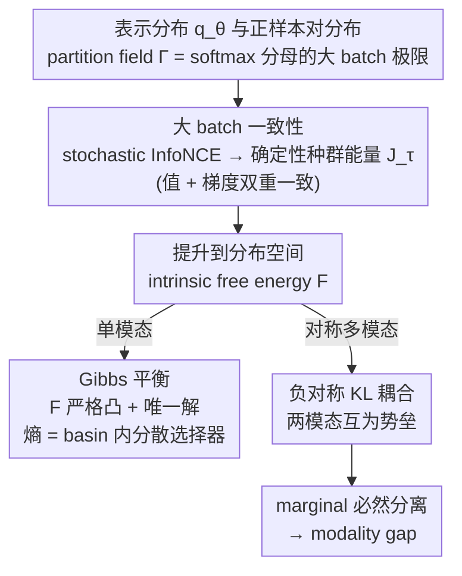

# The Geometric Mechanics of Contrastive Representation Learning: Alignment Potentials, Entropic Dispersion, and Cross-modal Divergence

**会议**: ICML 2026  
**arXiv**: [2601.19597](https://arxiv.org/abs/2601.19597)  
**代码**: 无  
**领域**: 表示学习理论 / 对比学习 / 多模态  
**关键词**: InfoNCE、CLIP、Modality Gap、population energy、Gibbs equilibrium

## 一句话总结
本文用测度论框架把 InfoNCE 损失提升到表示分布上的确定性"种群能量"，证明 unimodal 情形是凸的且收敛到唯一 Gibbs 平衡，而对称多模态情形会出现持续的负对称 KL 耦合，从几何上必然产生 modality gap。

## 研究背景与动机

**领域现状**：InfoNCE 是当前自监督与多模态对比学习的统一目标，从 SimCLR/MoCo 到 CLIP/SigLIP 都建立在其上。理论侧最经典的分析是 Wang & Isola (2020) 的 alignment-uniformity 分解，以及把最优 critic 描述为点态互信息的 density-ratio 视角。

**现有痛点**：(i) alignment-uniformity 解释只回答了渐近 trade-off，但没说 InfoNCE 自己倾向于什么"种群分布"；(ii) 多模态 InfoNCE 在 CLIP 等系统中明明做到强 pairwise 对齐，但两模态的 marginal 分布仍然分离（modality gap），现有理论给不出机制性解释；(iii) 已有 identifiability 结果只关心生成式假设下"可学到什么"，并不刻画训练目标本身的几何偏好。

**核心矛盾**：把 InfoNCE 仅看成"逐 pair 判别"会丢失关键信息 —— softmax 分母其实是当前表示分布的核平均，导致优化方向本质上取决于分布，而不是 pair。多模态情形下，这个"分布对自己施加的力"会与"对另一模态施加的力"耦合，pairwise 对齐再强也不能控制 marginal。

**本文目标**：(i) 把 stochastic InfoNCE 严格写成对表示分布的确定性 functional；(ii) 解释 unimodal 情形的几何（凸性、Gibbs 平衡、低温集中）；(iii) 推导多模态对称 InfoNCE 与 unimodal 不同的"交叉耦合"结构，给 modality gap 一个第一性原理的解释。

**切入角度**：把表示空间 $\mathcal{Z}$ 看成带体积测度 $\mu$ 的紧致流形，encoder 把数据分布 push-forward 到 $\mathcal{Z}$ 上，softmax 分母在 large-batch 极限下收敛到"种群 partition field"$\Gamma_{\theta,\tau}(\mathbf{z})$，这是一个分布相关的能量场。

**核心 idea**：InfoNCE 在大 batch 极限下等价于一个对表示分布的种群能量泛函；unimodal 该泛函严格凸 + 有唯一 Gibbs 解（即 entropy 在 alignment basin 内充当"分散选择器"），multimodal 该泛函含一个负对称 KL 耦合项，使两模态在锐化各自势能时互相成为"墙"，从而稳定地保持 modality gap。

## 方法详解

### 整体框架
分析流程：(i) 在紧致 $\mathcal{Z}$ 上定义 representation laws $q_\theta=(f_\theta)_\# p_x$ 与 positive-pair laws $\pi_{\theta\theta}$；(ii) 引入 partition field $\Gamma_{\theta,\tau}(\mathbf{z})=\int_\mathcal{Z}\kappa_\tau(\mathbf{z},\mathbf{w})\mathrm{d}q_\theta(\mathbf{w})$ 与 kernel-smoothed density $\tilde\rho_{\theta,\tau}=\Gamma_{\theta,\tau}/V_\kappa(\tau)$；(iii) 证明 stochastic InfoNCE 在 $N\to\infty$ 时 value- 与 gradient- consistent 地等于一个 parametric energy $\mathcal{J}_\tau(\theta)$；(iv) 把 $\mathcal{J}_\tau$ 提升到"intrinsic free energy"$\mathcal{F}_{\tau,U}$，并分析其凸性、最小化解、低温集中；(v) 同样的流程对 symmetric multimodal InfoNCE 重做一遍，得到包含负对称 KL 耦合的 $\mathcal{F}_{\tau,\mathbf{U}_{1,2}}^{\text{Sym}}$，分析其与 unimodal 的几何差异。整条推导在第 (iv) 步后分叉：单模态走向唯一 Gibbs 平衡，对称多模态因多出一个负对称 KL 耦合项而走向 modality gap——这个分叉正是全文的核心结构。

### 关键设计

**1. 从 stochastic loss 到 deterministic energy 的大 batch 一致性：让几何分析有数学地基，而不是直觉近似**

以前把 InfoNCE 拆成 alignment-uniformity 是手动近似，结论未必对得上真实的梯度下降。本文坚持「值和梯度都一致」。对单模态定义 $\mathcal{J}_\tau(\theta)=\frac{1}{\tau}\int_\mathcal{Z}U_\theta(\mathbf{z})\mathrm{d}q_\theta(\mathbf{z})-H_\times(q_\theta,\tilde\rho_{\theta,\tau})$，其中 alignment potential field $U_\theta(\mathbf{z})=-\int_\mathcal{Z}s(\mathbf{z},\mathbf{w})\mathrm{d}\nu_{\theta,\mathbf{z}}(\mathbf{w})$ 来自 positive-pair 的 disintegration。定理 3.1 在 encoder 与 critic 一致正则、kernel 体积常数、有限 batch 受控等条件下证明 $|\mathcal{L}_{\text{NCE}}(\theta)-\mathcal{J}_\tau(\theta)-\log(NV_\kappa(\tau))|\to0$ 且 $\|\nabla_\theta\mathcal{L}_{\text{NCE}}-\nabla_\theta\mathcal{J}_\tau\|\to0$。值和梯度双重一致意味着大 batch 下的 SGD 严格等价于种群能量下降，后面所有凸性、平衡分析才能直接对接实际训练，而不是停在直觉层面。

**2. intrinsic free energy 与 Gibbs 平衡：把 uniformity 重新理解成 basin 内的熵驱动分散**

parametric energy 还纠缠着参数化的隐式关系，作者进一步把它提升到分布空间，剥离参数后得到 $\mathcal{F}_{\tau,U}(\rho)=\frac{1}{\tau}\int_\mathcal{Z}U(\mathbf{z})\rho(\mathbf{z})\mathrm{d}\mu(\mathbf{z})-H(\rho)$，并证明它在 $\mathcal{P}_\mu(\mathcal{Z})$ 上严格凸、唯一最小解是 Gibbs 形式 $\rho^*(\mathbf{z})=\exp(-U(\mathbf{z})/\tau)/Z_\tau$。再用 sharp diagonal peak 假设证明它与 parametric energy 在低温下一致 $|\mathcal{J}_\tau(\theta)-\mathcal{F}_{\tau,U_\theta}(\rho_\theta)|\leq 2\varepsilon_{\text{kde}}^{(\theta)}(\tau)/\underline\rho_\theta$，并用低温集中命题说明 $\tau\to0^+$ 时 Gibbs 平衡集中到 $U$ 的近最小化区域。这一步在概念上升级了 Wang & Isola 的视角：alignment 决定收敛到「哪个 basin」，uniformity 不是与之对抗的全局力，而是 basin 内部由熵决定的分散度。

**3. multimodal 负对称 KL 耦合：从一个减号推出 modality gap 的必然性**

对称 InfoNCE 不是单模态的简单复制。作者定义 $\mathcal{J}_\tau^{\text{Sym}}(\theta,\phi)=\frac{1}{2}(\mathcal{J}_\tau^{x\to y}+\mathcal{J}_\tau^{y\to x})$，每个方向的能量都把自己的 cross-entropy 评估在「另一模态」的 smoothed density 上。提升到分布空间后得到 $\mathcal{F}_{\tau,\mathbf{U}_{1,2}}^{\text{Sym}}(\rho_1,\rho_2)=\frac{1}{2}(\mathcal{F}_{\tau,U_{1\to2}}(\rho_1)+\mathcal{F}_{\tau,U_{2\to1}}(\rho_2))-D_{\text{KL}}^{\text{Sym}}(\rho_1,\rho_2)$，关键全在最后那个减号：每个模态在锐化对自己势能的对齐时，又被推着去拉大与另一模态 marginal 的 KL，等于两模态互相把对方的密度场当成「势垒」。稳态下除非满足一个 knife-edge 兼容条件（两模态 conditional law 完全一致），否则 marginal 必然分离。于是 modality gap 不是优化没收敛，而是 InfoNCE 在异质 conditional 下的几何必然——这也给「靠更强 hard negative 或更大 batch 消 gap」画了天然上限。

### 损失函数 / 训练策略
本文是理论文章，没有训练新模型；实验部分用人工合成的两模态高斯混合做受控实验来可视化 modality gap 与一致性结论，并在预训练 OpenCLIP（CNN + ViT 骨干）上测量 marginal 间距离、检验"破坏 cross-modal 兼容性会系统增大 gap"的预测。

## 实验关键数据

### 主实验

| 实验 | 设置 | 关键观察 |
|------|------|----------|
| Unimodal 低温集中 | 合成数据 + 各 $\tau$ | $\tau\to0^+$ 时 Gibbs 测度在低势能区域质量趋于 1，与理论吻合 |
| Multimodal 边缘分离 | 合成异质模态 | 即使 pairwise alignment 完美，两模态 marginal 仍持续分离，gap 随兼容性失配单调增大 |
| OpenCLIP marginal gap | CNN / ViT 骨干 | 强 retrieval 性能与显著 modality gap 共存，弱化 cross-modal compatibility 系统性放大 gap |

### 消融实验

| 配置 | 现象 | 说明 |
|------|------|------|
| Sharp kernel + 低温 | $\mathcal{J}_\tau\approx\mathcal{F}_{\tau,U_\theta}$ | 验证 KDE bias 在 sharp regime 可控 |
| 单向 vs 对称 InfoNCE | 对称多了负 KL 耦合项 | 单向情形无 modality gap 必然性，对称版本才有 |
| 兼容性扰动 | gap 随扰动增大 | 验证"compatibility 决定 gap"这一预测 |

### 关键发现
- "uniformity"应被理解为 alignment basin 内的 entropy-driven 分散，而非与 alignment 全局对抗的力 —— 这直接修正了一个流传多年的解释。
- 多模态 modality gap 的本质是负对称 KL 耦合：两个模态在最小化各自势能的同时被迫互相推开 marginal，pairwise alignment 越强反而越固化 gap。
- exact marginal matching 需要一个 knife-edge compatibility condition（两模态 conditional law 完全一致），实际数据基本不会满足，因此 gap 是 generic 现象而非偶然失败。

## 亮点与洞察
- 把对比学习从"pointwise 判别"分析升级到"population geometry"分析是真正的视角升级，所有结论（Gibbs 平衡、负 KL 耦合）都不再依赖直觉而是测度论可证的。
- 用一个减号（负对称 KL）把 modality gap 一锤定音 —— 它把"为什么我们一直消不掉 gap"重新表述为"InfoNCE 的损失就长这样"。对工业界从业者来说，与其设计更精巧的 hard negative，不如直接添加对 marginal 的约束。
- intrinsic vs parametric 的两层分析 + KDE 误差控制是个干净的范式：先在分布空间证几何，再用 sharp kernel 把结论搬回参数空间，可以推广到任何带 softmax 分母的对比目标。

## 局限与展望
- 所有证明都依赖紧致流形 + 各向同性 kernel + sharp diagonal peak 等假设，温度极小、kernel 极尖时才严格成立；实际 CLIP 训练用的温度并不算极小。
- 实验只在合成数据 + 现成 OpenCLIP 上验证，没有从零训练一个用这套理论指导的 modify-loss 模型来证明 modality gap 真的可以系统性缩小。
- 多模态分析仅限对称两模态，三模态及以上的耦合结构是否仍由"两两 KL 减号"主导，论文没回答。
- 没有把这套几何与 zero-shot 性能、retrieval rank 等下游指标直接挂钩，理论与实际效果之间还有一段路。

## 相关工作与启发
- **vs Wang & Isola 2020 (alignment-uniformity)**：本文证明 uniformity 不是全局力而是 basin 内 entropy 选择，对原视角是细化而非推翻。
- **vs Liang et al. 2022 (modality gap)**：他们最早实证 modality gap 并归因于 cone effect 与 init，本文给出第一性原理几何解释。
- **vs identifiability 类工作 (Zimmermann 2021)**：那类工作回答"什么能学到"，本文回答"目标偏好什么几何"，是互补的视角。
- **vs Brumley / Park 2024 (LRH)**：CRH 与本文都在表示几何这条线上推进，CRH 关心 steering，本文关心训练目标的种群能量，思路上同源。

## 评分
- 新颖性: ⭐⭐⭐⭐⭐ "InfoNCE = 种群能量"+ "modality gap = 负对称 KL"两条结论在理论侧都是首次，对社区视角是结构性升级。
- 实验充分度: ⭐⭐⭐ 实验为理论服务、点到为止，没在大规模训练上系统验证理论可指导设计。
- 写作质量: ⭐⭐⭐⭐ 测度论符号严谨，作者花心思做了 unimodal-multimodal 的对偶呈现，但门槛较高。
- 价值: ⭐⭐⭐⭐⭐ 对未来对比学习与多模态对齐研究有方向性意义，明确告诉社区"靠 pairwise 调优消不掉 gap"。

<!-- RELATED:START -->

## 相关论文

- [\[AAAI 2026\] Cross-modal Prompting for Balanced Incomplete Multi-modal Emotion Recognition](../../AAAI2026/social_computing/cross-modal_prompting_for_balanced_incomplete_multi-modal_emotion_recognition.md)
- [\[ICML 2026\] Alignment Tampering: How Reinforcement Learning from Human Feedback Is Exploited to Optimize Misaligned Biases](alignment_tampering_how_reinforcement_learning_from_human_feedback_is_exploited_.md)
- [\[AAAI 2026\] Multi-modal Dynamic Proxy Learning for Personalized Multiple Clustering](../../AAAI2026/social_computing/multi-modal_dynamic_proxy_learning_for_personalized_multiple_clustering.md)
- [\[ICCV 2025\] Gradient Extrapolation for Debiased Representation Learning](../../ICCV2025/social_computing/gradient_extrapolation_for_debiased_representation_learning.md)
- [\[ICML 2026\] MIND: Multi-Rationale Integrated Discriminative Reasoning Framework for Multi-Modal Fake News](mind_multi-rationale_integrated_discriminative_reasoning_framework_for_multi-mod.md)

<!-- RELATED:END -->
