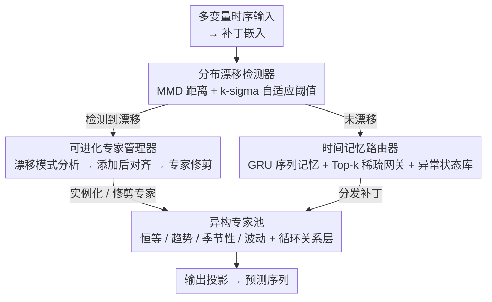

# Dynamic-TMoE: A Drift-Aware Dynamic Mixture of Experts Framework for Non-Stationary Time Series

**会议**: ICML 2026  
**arXiv**: [2605.20678](https://arxiv.org/abs/2605.20678)  
**代码**: 待确认  
**领域**: 时间序列 / 混合专家  
**关键词**: 时间序列预测, 动态专家, 分布漂移检测, 混合专家网络, 非平稳数据

## 一句话总结
通过 **MMD 检测分布漂移**并动态扩展异构专家池，结合**时间记忆路由器**保证选择一致性，Dynamic-TMoE 在九个时间序列基准上达到新的 SOTA——相比所有基线平均降低 MSE 10.4%、MAE 7.8%。

## 研究背景与动机

**领域现状**：时间序列预测是从能源管理到医疗监测等关键决策系统的基石。然而真实世界时间序列本质上非平稳，表现为持续的分布漂移和演化的时间依赖性。

**现有痛点**：现有方法主要分两类——一类是输入级标准化（RevIN、SAN、IN-Flow）通过移除-预测-恢复范式将非平稳输入映射到稳定分布，但往往丢弃对预测至关重要的非平稳信号；另一类是模型内适配（Non-stationary Transformer、Koopa、TimeStacker）通过重新设计注意力或利用物理 / 频谱动态捕捉演化特征，但单体架构缺乏模块性。最近的 MoE 方法（TFPS、Time-MoE）采用静态专家池和无记忆路由，无法适应突变的分布漂移。

**核心矛盾**：MoE 框架存在两个本质问题——（1）**时间刚性**：固定专家池无法容纳来自严重分布漂移的新模式，无记忆的网关忽视时间连续性导致选择不稳定；（2）**专门化不足**：同构专家缺乏功能多样性，无法解耦不同漂移分量（趋势 vs 季节性）。

**本文目标**：设计一个既能适应演化分布又能保持选择一致性的 MoE 框架。

**切入角度**：（1）分布漂移可通过 MMD 量化并触发专家池演化；（2）通过带历史记忆的 GRU 路由器维持时间连续性；（3）采用异构专家设计来专门化不同时间模式。

**核心 idea**：学习阶段动态扩展和修剪异构专家池（基于漂移检测），同时用支持异常状态库的时间记忆路由器保证上下文感知的稳定选择。

## 方法详解

### 整体框架
Dynamic-TMoE 针对的是现有 MoE 在非平稳时序上的两个软肋——固定专家池装不下新分布、无记忆路由忽视时间连续性，于是它把整套框架做成一个"感知-决策-适配"闭环。补丁嵌入后，分布漂移检测器先感知数据是否变了（感知），时间记忆路由器据此稳定地挑选专家（决策），可进化专家管理器在检测到漂移时扩展或修剪专家池（适配），底层是一个异构专家池：恒等、趋势、季节性、波动四类基础专家常驻，漂移专家按需实例化；补丁嵌入和输出投影是首尾脚手架。

### 关键设计

**1. MMD 漂移检测 + 自适应阈值：用核方法盯住分布变化，并让阈值跟着噪声水平动**

非平稳时序里分布说变就变，固定阈值的残差监控要么太迟钝、要么把噪声当漂移。Dynamic-TMoE 用 RBF 核算参考窗口和当前窗口的 MMD 距离 $\mathcal{D}_{\text{mmd}}^2 = \frac{1}{N_r^2}\sum_{i,j}k(x_i^{\text{ref}},x_j^{\text{ref}}) - \frac{2}{N_r N_c}\sum_{i,j}k(x_i^{\text{ref}},x_j) + \frac{1}{N_c^2}\sum_{i,j}k(x_i,x_j)$，比简单残差更能捕捉复杂分布偏移；阈值则用 k-sigma 规则动态设 $\epsilon = \mu_\mathcal{H} + \lambda\sigma_\mathcal{H}$，当 $\mathcal{D}_{\text{mmd}}^2 > \epsilon$ 才触发专家管理器。动态阈值让它在时变噪声下既不漏报突变、也不被噪声晃动，而泛化界进一步证明 MMD 增大会直接抬高目标预测风险的上界——检测信号和预测目标是对齐的。

**2. 时间记忆路由器 + 异常状态库：在演化的专家池上做上下文感知、且稳定的选择**

无记忆路由会让相邻补丁之间的专家选择来回跳，破坏时间连续性；而周期性重现的漂移每次都得冷启动重新适配。Dynamic-TMoE 用 GRU 维持隐状态 $\mathbf{h}_t = \text{GRU}(\phi(\mathbf{x}_{p,t}),\mathbf{h}_{t-1})$，投影成各专家 logits 后用 Top-k 稀疏网关激活前 $k$ 个专家，GRU 的序列记忆保证相邻选择平滑。异常状态库 $\mathcal{A}$ 则存下每次漂移时的隐状态，路由时按余弦相似度检索相关历史，用可学网关融合 $\tilde{\mathbf{h}}_t = \alpha\mathbf{h}_t + (1-\alpha)\mathbf{h}_{\text{ref}}$——这样当一个见过的漂移再次出现，模型能直接调出旧状态加速适配，避免从零摸索。

**3. 可进化专家管理器：检测到漂移后"对症"扩池、再悄悄瘦身**

漂移来了不能盲目加专家——加错类型没用、加太多还拖慢推理。可进化专家管理器把专家池当成一个有生命周期的动态系统（且这种结构演化只发生在训练阶段），靠三件事管理扩张与收缩。① 漂移模式分析器（Drift Pattern Profiler）先诊断"当前模型到底漏掉了哪种模式"：分析预测残差，算出趋势得分（残差线性回归的拟合优度 $R^2$）、季节性得分（主频段的频谱能量集中度）、波动得分（高频波动占比），据此实例化最匹配类型的新专家加入活跃专家集 $\mathcal{K}_t$——消融里这比随机选专家类型明显更好。② 添加后对齐（Post-Addition Alignment）解决新专家冷启动会扰动主干的问题：冻结已有专家和路由器主干，只在漂移数据（参考窗口 $\mathcal{W}^{\text{ref}}$ 与当前窗口 $\mathcal{W}^{\text{cur}}$ 拼接）上微调新专家和路由器输出头，让新专家先"稳进"偏移后的分布、再并入全局优化——消融显示它优于直接微调已有基础专家。③ 专家使用追踪器（Expert Usage Tracker）负责瘦身：跟踪每个专家在监控窗口内的平均路由权重，并加一个耐心约束——只有连续 $L$ 个窗口都低于阈值 $\tau$ 才修剪，避免被短期波动误删。三者合起来让专家池"该长则长、该短则短"，容量随分布变化自适应伸缩。

**4. 异构专家设计 + 循环关系层：用不同架构解耦时间成分，再显式建模变量间相关**

同构专家缺乏功能多样性，没法把趋势和季节性这类共存却异质的分量分开建模。Dynamic-TMoE 给每类成分配专属架构、各带不同归纳偏置：恒等专家 $E_{\text{id}} = \text{Linear}(\mathbf{X}_p)$ 保留原始信息、稳住梯度流；趋势专家 $E_{\text{trend}} = \text{MLP}(\text{AvgPool}(\mathbf{X}_p))$ 用平均池化当低通滤波抽全局趋势；季节性专家走频域 $\mathbf{Z} = \text{iFFT}(\text{MLP}(\text{FFT}(\mathbf{X}_p)))$ 再接 $\sin/\cos$ 周期激活显式建模周期；波动专家用因果卷积 + 门控线性单元捕捉局部高频波动。这套异构设计在消融里相对全同构提升约 2.5%。在专家之上还叠了一层循环关系层（Cyclic Relation Layer，借鉴 CycleNet）建模变量间相关：维护一个可学的周期相关原型 $\mathcal{R}_{\text{cycle}}$ 存历史依赖，再把当前相关与原型的残差经 MLP 修正后加回去 $\mathcal{R}_{\text{final}} = \mathcal{R}_{\text{cycle}}[t] + \text{MLP}(\mathcal{R}_{\text{cur}} - \mathcal{R}_{\text{cycle}}[t])$——稳定历史先验打底、残差项捕捉动态偏移，去掉它六个数据集普遍掉点（约 2.8%）。

## 实验关键数据

### 主实验

| 数据集 | 指标 | **Dynamic-TMoE** | TFPS | ST-MTM | RAFT | 提升 vs TFPS |
|--------|------|-------------|------|--------|------|------------|
| Weather | MSE | **0.240** | 0.241 | 0.262 | 0.271 | ↓0.4% |
| Exchange | MSE | **0.351** | 0.395 | 0.408 | 0.432 | ↓11.1% |
| ETTh1 | MSE | **0.429** | 0.448 | 0.432 | 0.432 | ↓4.2% |
| Electricity | MSE | **0.170** | 0.183 | 0.208 | 0.184 | ↓7.1% |
| ILI | MSE | **1.981** | 2.642 | 2.820 | 5.916 | ↓25.0% |

18 个评估指标中排名前 2 达 16 次（第 1 名 11 次，第 2 名 5 次）。

### 消融实验

| 配置 | 漂移感知 | 时间记忆 | 异常库 | ETTh1 MSE | Weather MSE |
|------|--------|--------|-------|-----------|-------------|
| ① 完整 | ✓ | GRU | ✓ | **0.429** | **0.240** |
| ② 无漂移 | ✗ | GRU | ✓ | 0.436 | 0.246 |
| ③ 线性路由 | ✓ | Linear | ✓ | 0.436 | 0.247 |
| ④ MLP 路由 | ✓ | MLP | ✓ | 0.438 | 0.245 |
| ⑤ 无异常库 | ✓ | GRU | ✗ | 0.438 | 0.246 |
| 异构 → 同构 | ✓ | GRU | ✓ | 0.440 | 0.246 |

### 关键发现
- 漂移感知和时间连续性都是处理非平稳性的必要条件；去掉任一都导致显著退化。
- GRU 路由相比静态路由提升 1.6%-2.1%——序列记忆对非平稳环境下的专家分配至关重要。
- 异构专家相比同构设计提升 2.5%——专家多样性有效解耦复杂分布。
- 关系层（循环相关建模）提升 2.8%。
- 异常状态库贡献相对较小（< 1%），但在周期性漂移数据上稳定性提升显著。

## 亮点与洞察
- **动态-异构-记忆的三位一体**：框架统一了三个维度——架构演化（动态专家）、功能多样性（异构设计）、时间一致性（记忆路由）；相比只关注其中某一维的现有工作，这种结合处理了非平稳预测的本质矛盾。
- **MMD 作为漂移信号的妙用**：相比人工设定固定阈值或简单的残差监控，核方法更能捕捉复杂分布变化；动态阈值（k-sigma）避免过度敏感。
- **冷启动对齐的工程智慧**：新专家添加后冻结现有参数、仅在漂移数据上微调，巧妙平衡新旧知识整合，避免灾难性遗忘。
- **频域处理季节性的经验设计**：FFT-MLP-iFFT 再加周期激活，是一个可复用的时间序列分解模式。

## 局限与展望
- 计算开销未充分讨论：MMD 计算、GRU 推理、漂移时新增专家的成本在大规模数据或长序列下的影响未给出具体数据。
- 超参数敏感性不完整：漂移阈值 $\lambda$、融合系数 $\alpha$ 等的敏感性分析仅在补充材料中。
- 泛化边界条件：什么样的漂移模式、多大的分布变化该框架仍然有效的理论刻画还不够清晰。
- 改进：在线学习范式；自适应超参；针对超长序列分析内存使用与索引效率。

## 相关工作与启发
- **vs RevIN / IN-Flow**：处理分布不变性但丢弃非平稳信号；Dynamic-TMoE 通过异构专家在模型内部保留并利用这些信号。
- **vs Non-stationary Transformer**（单体设计）：单体架构难以专门化多个共存模式；本文通过 MoE 分解复杂性。
- **vs TFPS / Time-MoE**（现有 MoE）：采用静态同构专家和无状态路由；Dynamic-TMoE 加入动态异构池和时间记忆。
- **vs Koopa / DERITS**（频谱方法）：全局频率处理；本文季节性专家在频域处理后回到时域细化，混合策略更灵活。

## 评分
- 新颖性: ⭐⭐⭐⭐⭐  把 MoE 框架从静态扩展到动态、从同构扩展到异构、从无状态路由扩展到时间记忆路由。
- 实验充分度: ⭐⭐⭐⭐⭐  9 个数据集 + 多基线对比 + 完整消融 + 多预测长度，证据充分。
- 写作质量: ⭐⭐⭐⭐  逻辑清晰，方法描述详细；图表丰富但部分细节放在附录。
- 价值: ⭐⭐⭐⭐⭐  解决了非平稳时间序列预测的核心问题——分布漂移与时间连续性，对工业级实际应用（金融、能源、医疗）有重要价值。

<!-- RELATED:START -->

## 相关论文

- [\[ICML 2026\] Parametric Prior Mapping Framework for Non-stationary Probabilistic Time Series Forecasting](parametric_prior_mapping_framework_for_non-stationary_probabilistic_time_series_.md)
- [\[AAAI 2026\] Task-Aware Retrieval Augmentation for Dynamic Recommendation](../../AAAI2026/time_series/task-aware_retrieval_augmentation_for_dynamic_recommendation.md)
- [\[ICML 2026\] Learning Long Range Spatio-Temporal Representations over Continuous Time Dynamic Graphs with State Space Models](learning_long_range_spatio-temporal_representations_over_continuous_time_dynamic.md)
- [\[AAAI 2026\] Towards Non-Stationary Time Series Forecasting with Temporal Stabilization and Frequency Differencing](../../AAAI2026/time_series/towards_non-stationary_time_series_forecasting_with_temporal_stabilization_and_f.md)
- [\[AAAI 2026\] M2FMoE: Multi-Resolution Multi-View Frequency Mixture-of-Experts for Extreme-Adaptive Time Series Forecasting](../../AAAI2026/time_series/m2fmoe_multi-resolution_multi-view_frequency_mixture-of-experts_for_extreme-adap.md)

<!-- RELATED:END -->
