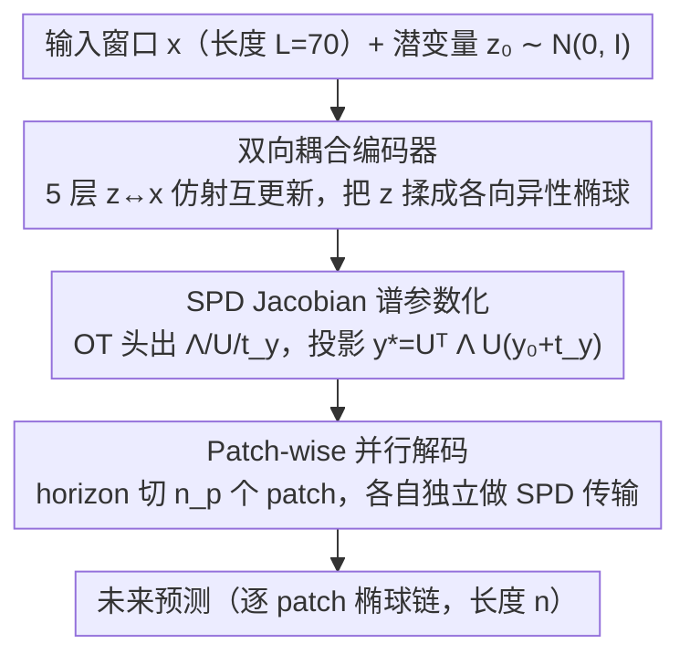

# Ellipsoidal Time Series Forecasting

**会议**: ICML 2026  
**arXiv**: [2505.17370](https://arxiv.org/abs/2505.17370)  
**代码**: 无  
**领域**: 时间序列预测 / 最优传输 / 动力系统  
**关键词**: 长期预测, SPD Jacobian, Brenier 定理, 椭球传输, 非平稳鲁棒性

## 一句话总结
Fern 把长期时间序列预测重新表述为「从固定高斯源到数据相关椭球的最优传输」，借助 Brenier 定理把搜索空间限制在 SPD（对称正半定）类 Jacobian 上，用 Householder 反射的低秩谱分解把代价从 $O(n^3)$ 压到 $O(Rn)$，并在非平稳冲击场景下相对 DLinear / Koopa 等基线取得最多 790× 的稳定性提升。

## 研究背景与动机

**领域现状**：长期时间序列预测（LTSF）社区已经形成 PatchTST、DLinear、Koopa、iTransformer 等一批强基线，主流做法要么用 channel-independent（CI）线性头直接拟合条件均值，要么用 channel-dependent（CD）Transformer 把多通道一起混。基准上看模型分数已经卷得很接近，CI / CD 之间也长期拉扯。

**现有痛点**：作者指出现有评测掩盖了模型在非平稳场景下的脆弱性——基准里大多是温和漂移的电力 / 交通 / 气象，一旦遇到 regime shift、混沌冲击或者真正的随机噪声，强基线会迅速崩溃，而 MSE 这种点度量根本看不出哪一段坏在哪里。同时，传统「直接建模 Jacobian」的路线在 $n$ 维 horizon 下要 $n^2$ 个分量，eigen-decomposition 还要 $O(n^3)$，根本跑不动。

**核心矛盾**：好的长期预测既需要保留**局部几何结构**（spectral 信息，能告诉你「这一步系统在哪个方向拉伸最厉害」），又需要在**计算预算**之内做到。直接搜任意 $n\times n$ 矩阵既贵又欠结构。

**本文目标**：(1) 找一个既数据相关又几何感知的预测器；(2) 把谱结构作为「内在参数」而不是「事后副产品」；(3) 设计能真正暴露模型在非平稳场景下脆弱性的评测协议。

**切入角度**：作者把预测视角从「$x \to y$ 的时间演化」转成「从固定高斯源 $\mathcal{N}(0, I)$ 到目标分布的传输」。一旦目标限制为高斯，根据 Brenier 定理这条最优传输唯一是仿射的（SPD 缩放 + 平移），那么 Jacobian 必然落在 SPD 锥里——搜索空间被天然约束。

**核心 idea**：与其学一个隐式非线性映射再去取它的 Jacobian，不如直接用 Householder 反射 + 对角谱参数化一个 SPD 矩阵 $A = U^\top \Lambda U$ 作为最优传输映射，让谱信息（特征值、特征向量）成为模型自带的可解释诊断量。

## 方法详解

### 整体框架
Fern 的 pipeline 是一个「双向耦合编码 + SPD 投影」的小模型：输入是长度 $L$（如 70）的单变量时间序列窗口 $x$，输出是长度 $n$（如 24）的未来 patch 预测，整个长 horizon 通过 patch 切分并行解码。中间状态包括一个低维高斯潜变量 $z \sim \mathcal{N}(\mu(x), \Sigma(x))$ 和一个固定噪声源 $y_0 \sim \mathcal{N}(0, I)$；最终通过仿射映射 $y^* = U^\top \Lambda U (y_0 + t_y)$ 把噪声「揉」成目标椭球。

架构遵循 channel-independent 原则：每个通道单独走，依靠 Takens 嵌入定理保证单通道 time-delay embedding 在拓扑上已经能重构整个吸引子，因此根本不需要显式 cross-channel 混合。整条数据流可以概括为「编码器把上下文压成各向异性高斯 → SPD 谱投影把固定噪声揉成目标椭球 → patch 切分并行解码」三步：

### 关键设计

**1. 双向耦合编码器：用潜变量把上下文压成各向异性椭球，避免梯度爆炸**

要把后面的 SPD 投影接上，得先有一个能概括窗口几何信息的低维高斯。如果直接用 $s(x) \odot x$ 这种公式去捏，训练会梯度爆炸。受 ANF 启发，Fern 引入潜变量 $z$ 和 5 层互相 affine 更新的耦合块：每层用一个 head 同时生成 4 个向量 $(s^i_x, t^i_x, s^i_z, t^i_z)$，交替迭代 $z^{i+1} = s^i_z \odot z^i + t^i_z$ 和 $x^{i+1} = s^i_x \odot x^i + t^i_x$，让初始各向同性的 $z \sim \mathcal{N}(0, I)$ 被逐步捏成各向异性的椭球。潜变量这条中间通道既稳定了训练，又让 Takens 嵌入承载的吸引子信息以「微分同胚」方式被压进低维高斯，正好衔接后面的 SPD 投影。

**2. SPD Jacobian 的谱参数化：直接把传输映射写成谱因子**

传统「直接建模 Jacobian」的路线在 $n$ 维 horizon 下要存 $n^2$ 个分量、特征分解还要 $O(n^3)$，根本跑不动。Fern 的破解点来自 Brenier 定理——既然目标被限制成高斯，高斯之间的 W2 最优传输必为仿射 SPD 映射，那 Jacobian 一定落在 SPD 锥里，于是不必再搜任意矩阵再去求特征分解，直接以谱因子作参数即可。具体把映射写成 $A = U^\top \Lambda U$，其中 $\Lambda$ 是对角的非负特征值向量、$U$ 是 $R$ 个 Householder 反射 $I - 2vv^\top$ 串成的正交矩阵。$\Lambda$ 的成本是 $O(n)$、$R$ 个反射向量的成本是 $O(Rn)$，整体 $O(Rn)$，$R$ 取 $n$ 给全容量、取小值给压缩容量。这一改不仅消掉了 $O(n^3)$ 的特征分解，还让特征值天然变成「跨 patch 可比的拉伸幅度信号」，可以直接拿来做局部稳定性诊断。

**3. Patch-wise 并行解码：把维数诅咒变成红利**

长 horizon 直接做一个 $n$ 维 SPD 搜索既贵又难并行。注意到 Brenier 定理对任何维度都成立，Fern 索性把 horizon $n$ 切成 $n_p$ 个 patch（如 14 个 24 维 patch），每个 patch 独立做一次 SPD 传输预测，单 patch 成本 $O(R \cdot p)$、总成本仍是 $O(R \cdot n)$。由于 patch 之间不依赖前一个的输出，可以完全并行——14 个独立的 24 维 SPD 搜索远比一个 336 维单体 SPD 搜索便宜，跨 patch 又共享同一主干，整条预测因此可解释为一串「逐 patch 椭球链」。

### 损失函数 / 训练策略
用最朴素的 Huber loss 监督点预测，**不对特征值做任何监督**。即使如此，作者在 Lorenz-63 实验中观察到模型学到的最大特征值会自发地在系统高速区（外环）变大、在 bottleneck 处变小——也就是说，谱结构是 MSE 训练自发涌现的诊断信号，而不是手工注入的先验。

## 实验关键数据

### 主实验

| 数据集类型 | 指标 | Fern | 最强基线 | 稳定性提升 |
|------------|------|------|----------|------------|
| 非平稳合成 shock | EPT（有效预测时长） | 显著领先 | DLinear / Koopa | **最高 790×** |
| Lorenz-63 单通道 | 吸引子重构 | 几何一致 | 主流 LTSF | 定性显著优 |
| 真实平稳基准 | MSE | 与 SOTA 相当 | PatchTST 等 | 持平 |

### 消融实验

| 配置 | 关键发现 | 说明 |
|------|---------|------|
| Full Fern | 椭球预测 + 谱诊断 | 完整模型 |
| w/o SPD 谱参数化（任意矩阵 Jacobian） | 成本 $O(n^3)$，不可扩展 | 验证 SPD 约束的必要性 |
| w/o 双向耦合编码（$s \odot x$ 直接做） | 梯度爆炸 | 验证 $z$ 隐变量的稳定作用 |
| 单 patch（不并行）vs patch-wise | patch-wise 大幅降本 | 14 个 24 维 patch 远比 336 维单体便宜 |

### 关键发现
- **谱结构涌现**：仅用 MSE 监督，模型的最大特征值会自发对齐 Lorenz-63 的速度场，证实「结构本身就是诊断量」这一论点比 CRPS 这类概率打分更直接。
- **CI 仍优于 CD**：作者用 Takens 定理和 Mori-Zwanzig 形式重新解释这一现象——单通道 TDE 已经在拓扑上覆盖全状态，所以盲目混 channel 反而会用噪声稀释解析流形。
- **基准盲点**：传统 LTSF 基准（电力 / 交通 / 气象）几乎全是温和漂移，没有真正的 regime shift，因此长期掩盖了 DLinear 这类线性强基线的脆弱性。本文新提出 EPT 指标专门测「模型在多长 horizon 内还能保持几何精度」。

## 亮点与洞察
- **把搜索空间几何约束化**：Brenier 定理给出「目标高斯 ⇒ 仿射 SPD 传输」的存在性结果，让作者得以从 $n^2$ 矩阵空间退到 SPD 锥再退到 $O(Rn)$ Householder 表示，每一步退缩都换来计算上的指数级红利。
- **谱因子作为可解释副产品**：直接参数化 $\Lambda, U$ 让特征值「跨 patch 可比」（因为共享同一个高斯源），这是任何「先学非线性再算 Jacobian」路线都做不到的。
- **重写 CI vs CD 的理论叙事**：把 dynamical systems theory（Takens / Mori-Zwanzig）拉进 LTSF 讨论，说明 CI 不是工程巧合而是定理后果，这一视角对整个时序社区都有启发。

## 局限与展望
- 作者明确把 Brenier 限制在高斯目标——非高斯尾部（重尾、双峰）就需要更一般的 OT 工具，目前 Fern 没有覆盖。
- 只关注单通道点预测，概率性评测（NLL / CRPS）和真正多变量情形被推到 future work；从论文叙事看 SPD 谱已经在内部模型协方差里，但实际拿出来做不确定性量化还需要额外校准。
- EPT 指标和合成 shock 基准目前只在论文里独立提出，是否能被社区接受还需要时间检验；现有 baseline 的对比也建立在作者自己设计的非平稳协议上。
- Householder 反射数 $R$ 是关键超参，论文给出 $R = 2$ 到 $R = n$ 的取舍但缺乏自动选择机制。

## 相关工作与启发
- **vs DLinear / PatchTST**：他们用线性头 / Transformer 直接拟合条件均值；Fern 显式建模 Jacobian 谱结构，在平稳基准上持平、在非平稳基准上碾压。
- **vs Koopa（Koopman 算子）**：Koopa 也想要线性化动力系统，但用全局算子；Fern 是局部 SPD 化、数据相关，应对 regime shift 更稳。
- **vs Neural ODE / Flow matching**：同样借 OT 思想，但 NeuralODE 类要解 ODE / SDE 才能拿到 Jacobian，Fern 直接闭式给出谱参数。
- **vs CRPS / NLL 类概率预测**：作者主张「结构 = 诊断」，把不确定性量化从概率打分转移到几何谱，可能启发新的诊断协议。

## 评分
- 新颖性: ⭐⭐⭐⭐⭐ Brenier 定理在 LTSF 的首次系统化使用，谱参数化路线在时序社区独树一帜。
- 实验充分度: ⭐⭐⭐⭐ 自建非平稳合成基准 + Lorenz-63 + 真实数据集三层验证，但缺概率指标。
- 写作质量: ⭐⭐⭐⭐ 理论推导清晰，把 dynamical systems 框架织入工程论文，可读性偏高。
- 价值: ⭐⭐⭐⭐⭐ 既给社区一个新基线，也重塑了 CI vs CD 的理论叙事，长期影响力可观。

<!-- RELATED:START -->

## 相关论文

- [\[NeurIPS 2025\] Fern: Chaining Spectral Pearls — Ellipsoidal Forecasting Beyond Trajectories for Time Series](../../NeurIPS2025/time_series/friren_beyond_trajectories_--_a_spectral_lens_on_time.md)
- [\[ICML 2026\] Time-series Forecasting Through the Lens of Dynamics](time-series_forecasting_through_the_lens_of_dynamics.md)
- [\[ICML 2026\] From Observations to States: Latent Time Series Forecasting](from_observations_to_states_latent_time_series_forecasting.md)
- [\[ICML 2026\] Nested Spatio-Temporal Time Series Forecasting](nested_spatio-temporal_time_series_forecasting.md)
- [\[ICML 2026\] It's TIME: Towards the Next Generation of Time Series Forecasting Benchmarks](its_time_towards_the_next_generation_of_time_series_forecasting_benchmarks.md)

<!-- RELATED:END -->
