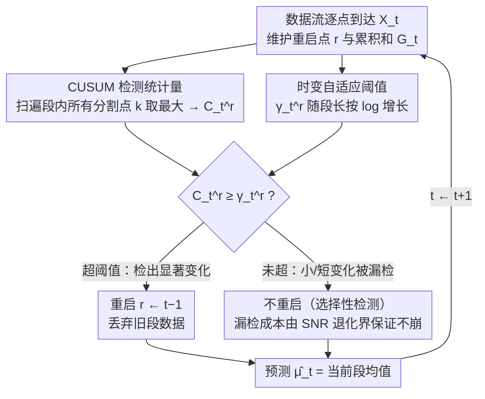

# The Cost of Learning Under Multiple Change Points

**会议**: ICML 2026  
**arXiv**: [2602.11406](https://arxiv.org/abs/2602.11406)  
**代码**: 待确认  
**领域**: 时间序列 / 在线学习理论  
**关键词**: 在线学习, 变点检测, 动态遗憾, 非平稳环境, 内生混淆

## 一句话总结
本文提出 Anytime Tracking CUSUM (ATC) 算法，通过时变自适应阈值 + 选择性检测原理，在**无任何可检测性假设**（最小间距 / 最小跳幅）下达到近似最小最优的动态遗憾 $O(\sigma^2 (S+1) \log T)$；并首次形式化量化了多变点场景中"漏检带来的内生混淆"的对数级退化界。

## 研究背景与动机

**领域现状**：在线学习中的非平稳环境问题被研究多年，单变点检测（CUSUM 等）的高置信度（δ-PAC）理论已经成熟。但实际应用通常面对**未知数量、未知位置**的多变点，且需要算法 anytime（无需预知地平线 $T$）。

**现有痛点**：现有方法多假设"可检测性"——要求变点间最小间距、最小跳幅。一旦这些假设不成立，会出现两个棘手现象：
- **内生混淆（endogenous confounding）**：某个变点漏检后，旧数据残留在参考统计量里，污染了后续变点的检测基准；学习器自身的失败恶化未来检测任务。
- **级联崩溃**：混淆逐步累积，后续变点检测功率持续下降，最终算法性能崩盘。这在非参数设置下尤其严重，因为参考分布必须从历史样本估计。

**核心矛盾**：如何**不依赖可检测性假设**，设计算法既能快速适应大幅变化、又能稳定应对小幅 / 短暂变化而不因频繁重启增大方差？

**本文目标**：建立多变点在线学习的学习论基础——给出动态遗憾的下界，并设计达到该下界的算法。

**切入角度**：作者放弃"高置信度检测"框架，从**回归遗憾**入手，用动态遗憾（预测值与时变真实均值的累积平方误差）作为统一度量，把检测延迟、虚警、内生混淆的代价全部编码进去。关键洞察：**不需要检测每个变点**——小 / 短变化漏检带来的遗憾成本可控；关键是用自适应阈值区分可检测和不可检测的变化。

**核心 idea**：时变自适应阈值 + 选择性检测原理 + 漏检 SNR 退化的对数上界，三者结合达到 $O(\sigma^2 (S+1) \log T)$ 的近似最小最优动态遗憾。

## 方法详解

### 整体框架
ATC 把经典 CUSUM 从"单变点检测"扩到"多变点在线追踪"，全程不需要预知地平线 $T$ 和变点数 $S$。每个时刻 $t$ 它只维护两样东西：最后一次重启时刻 $r$（初始 $r=1$）和累积和 $G_t = \sum_{i=1}^t X_i$（用来 $O(1)$ 算段均值）。每步走检测和预测两件事——检测时算 CUSUM 统计量 $C_t^r = \max_{r<k<t}\hat{D}_{k,t}^r$ 对比时变阈值 $\gamma_t^r$，超阈值就把 $r$ 重启到 $t-1$（丢弃旧段数据）；预测时直接输出最后完整段的均值 $\hat{\mu}_t = \frac{1}{t-r}\sum_{i=r}^{t-1}X_i$。整套流程是一个**逐点到达、检测—重启—预测交替**的在线回环：重启更新的 $r$ 会改变下一步的检测基准，构成方法的反馈闭环。

### 关键设计

**1. CUSUM 检测统计量：在当前段内扫遍所有可能的分割点，找最强的变点证据**

变点的位置事先未知，所以不能只盯某一个候选点，否则错过位置就漏检。ATC 在当前重启区间 $[r,t)$ 里扫所有分割点 $k$，算两段均值差的标准化统计量 $\hat{D}_{k,t}^r = \frac{1}{\sigma}\sqrt{\frac{(k-r)(t-k)}{t-r}}\left|\bar{X}_{r:k-1} - \bar{X}_{k:t-1}\right|$，类似 GLR 但不假设前后分布已知。在真实变点 $\tau_j$ 处它的信噪比是 $\text{SNR}_j^*(t) = \frac{(\tau_j - \tau_{j-1})(t-\tau_j)}{t-\tau_{j-1}}\frac{\Delta_j^2}{\sigma^2}$（$\Delta_j$ 是跳幅）。这个 SNR 随 $t$ 单调递增，意味着只要变化足够大，它就会在对数级延迟内被检出，而扫遍所有 $k$ 保证了位置未知也不会漏。

**2. 时变自适应阈值：用一条随段长增长的阈值线，自动平衡"稳"和"灵"**

固定阈值是个两难：调高了真变点反应慢，调低了虚警满天飞，而且还得预知 $T$。ATC 让阈值随时间走——$\gamma_t^r = \sqrt{6\log(t-r) + 2\log(1/\alpha_r) + 2\log(\pi^2/3)}$，其中 $\alpha_r = \frac{6\alpha}{\pi^2 r^2}$ 是按重启时刻递减分配的虚警预算，满足 $\sum_r \alpha_r \leq \alpha$，检测条件就是 $C_t^r \geq \gamma_t^r$。这里 $\log(t-r)$ 的增速不是随便选的：它恰好保证扫描统计量在当前段所有 $k$、所有 $t$ 上均匀集中（concentration），不会因为扫得多就虚警爆炸；而 $\alpha_r$ 的级数收敛保证 anytime 虚警总和有界，于是算法天然支持真正的在线操作，不依赖任何"可检测性"假设。

**3. 内生混淆量化（SNR 退化界）：证明"漏检会拖累后续检测，但拖不垮"**

多变点场景最阴险的陷阱是：某个变点漏检后，旧数据残留在参考统计量里污染后续检测基准，学习器自己的失败会恶化未来任务，理论上可能级联崩盘。ATC 把这件事量化死了：若第 $j$ 个变点漏检，参考均值变成混合 $\mu_{\text{pre}}^{\text{eff}}(r,j) = \frac{\sum_{\ell=i}^{j-1}n_\ell\mu_\ell}{\sum n_\ell}$，有效跳幅 $\Delta_j^{\text{eff}} = |\mu_{\text{pre}}^{\text{eff}} - \mu_j|$ 可能远小于真实 $\Delta_j$，对应 SNR 也下降。但 Proposition 3.1 给出退化只有**对数级**：$(\text{SNR}_j^*(t) - \text{SNR}_j^{\text{eff}}(t;r))_+ \leq C\log\frac{\tau_j - r + 1}{\alpha_r}$。这是全文理论的支点——它说明漏检只会延迟后续检出、不会让算法崩，于是"选择性检测"（不必抓住每个变点）才站得住脚。

### 训练策略 / 目标
最小化动态遗憾 $\mathcal{R}_T(\pi) = \mathbb{E}[\sum_{t=2}^T (\hat{\mu}_t - \mu_t)^2]$。无优化、无训练，纯在线追踪。

## 实验关键数据

### 主实验（理论 + 合成 + 真实数据）

| 环境 | 变点数 $S$ | 时间 $T$ | ATC 遗憾 | 理论上界 | 理论下界 | 备注 |
|------|----------|---------|---------|--------|--------|------|
| 合成（均值跳变） | 5 | 300+ | $O(\log T)$ | $O(\sigma^2 (S+1) \log T)$ | $\Omega(\sigma^2 (S+1) \log(T/(S+1)))$ | 5000 次 MC 重复 |
| NAB AWS CPU 数据 | 未知 | 4000+ | 最低遗憾 | 比基线低 ~40% | — | 显式重启优于滑窗 |

### 消融实验

| 配置 | 核心指标 | 说明 |
|------|---------|------|
| 完整 ATC（对数阈值） | 遗憾 + 虚警率平衡 | 默认配置 |
| 常数阈值 ATC | 遗憾 +30% | 固定阈值无法适应段长增长，漏检增多 |
| 计算高效变体（几何网格） | 遗憾几乎不变，计算 $O(\log(t-r))$ | 限制扫描候选点；渐近率保留 |

### 关键发现
- 图 4(c) 显示 5000 次 MC 中遗憾随 $\log T$ 线性增长，与 Theorem 4.1 一致；计算高效变体曲线与完整版本平行，仅相差常数。
- 第 5 个变点经历两次漏检后仍在 $t \approx 900$ 被成功检出，验证 SNR 退化界的"对数级、非崩溃"特性。
- NAB 数据上比滑窗 / 折扣基线在大跳变后立即适应，第 4000+ 步大跳跃处遗憾降低 40%。
- 对方差 $\sigma$ 误设敏感性：低估 $\sigma$ 增加虚警但不改变渐近率。

## 亮点与洞察
- **内生混淆的形式化**：第一次把多变点在线学习的隐藏陷阱写成 Proposition 3.1 的对数级显式界——所有基于重启的在线学习都该参考这套分析框架。
- **选择性检测原理**：核心哲学是"不必检测每个变化"——允许低于统计分辨率的变化漏检（成本可控），在完全通用设置下达近似最小最优。这反直觉但非常有力。
- **近似最小最优**：Theorem 4.1（上界）与 Theorem 4.2（下界）仅差 $\log(S+1)$ 因子，对 anytime 算法而言已是紧的特征化。
- **动态遗憾框架**：用平方损失追踪移动目标，可迁移到非平稳 RL、动态定价等问题。

## 局限与展望
- 完全在线下达到上界，但若提前知道 $T$ 和 $S$，是否能进一步改进到 $O(\sigma^2 S \log(T/S))$ 仍未解决。
- 算法假设子高斯代理 $\sigma$ 已知，实际需要在线估计。
- 多维扩展（$\mathbb{R}^d$）时阈值会多 $\sqrt{d}$ 因子，高维效率受限。
- 平方损失专属；$L_1$ 下界为 $\Omega(\sqrt{ST})$（线性增长），意味着算法设计需质变。

## 相关工作与启发
- **vs 经典 CUSUM（Page 1954; Lorden 1971）**：经典 CUSUM 针对单变点 + 已知前分布；本文推广到无可检测性假设的多变点，核心创新是处理内生混淆。
- **vs 滑窗 / 折扣（Garivier & Moulines 2011）**：被动方法靠遗忘旧数据适应，需手调参数；本文的显式重启自动化超参调优。
- **vs 多臂赌博机主动重启（Liu et al. 2018; Cao et al. 2019）**：先前工作都需要高置信度检测假设；本文在无此假设下提供遗憾界，可启发非平稳赌博机的新算法。
- **启发**：选择性检测 + 自适应阈值 + 漏检退化上界三件套对所有"基于重启的在线学习 / RL"都有方法论价值。

## 评分
- 新颖性: ⭐⭐⭐⭐⭐  首次严格形式化内生混淆 + 在完全通用设置下达近似最小最优；在线学习理论的显著突破。
- 实验充分度: ⭐⭐⭐⭐  合成数据清晰验证理论；NAB 上展现实际优势；消融到位；缺真实多变点数据集对比。
- 写作质量: ⭐⭐⭐⭐⭐  图 1 的内生混淆可视化直观有力；证明思路在主文完整；定义精确。
- 价值: ⭐⭐⭐⭐⭐  理论意义填补多变点非平稳学习空白；实际意义覆盖需求追踪 / 资源管理 / 在线压缩等；算法设计有通用参考价值。

<!-- RELATED:START -->

## 相关论文

- [\[NeurIPS 2025\] PlanU: Large Language Model Reasoning through Planning under Uncertainty](../../NeurIPS2025/time_series/planu_large_language_model_reasoning_through_planning_under_uncertainty.md)
- [\[NeurIPS 2025\] Frequency Matters: When Time Series Foundation Models Fail Under Spectral Shift](../../NeurIPS2025/time_series/frequency_matters_when_time_series_foundation_models_fail_under_spectral_shift.md)
- [\[ICML 2025\] TCP-Diffusion: A Multi-modal Diffusion Model for Global Tropical Cyclone Precipitation Forecasting with Change Awareness](../../ICML2025/time_series/tcp-diffusion_a_multi-modal_diffusion_model_for_global_tropical_cyclone_precipit.md)
- [\[ICML 2026\] Divide and Contrast: Learning Robust Temporal Features Without Augmentation](divide_and_contrast_learning_robust_temporal_features_without_augmentation.md)
- [\[ICML 2026\] Position: Current Benchmarking Hinders Real Progress in Deep Learning for Time Series](position_current_benchmarking_hinders_real_progress_in_deep_learning_for_time_se.md)

<!-- RELATED:END -->
