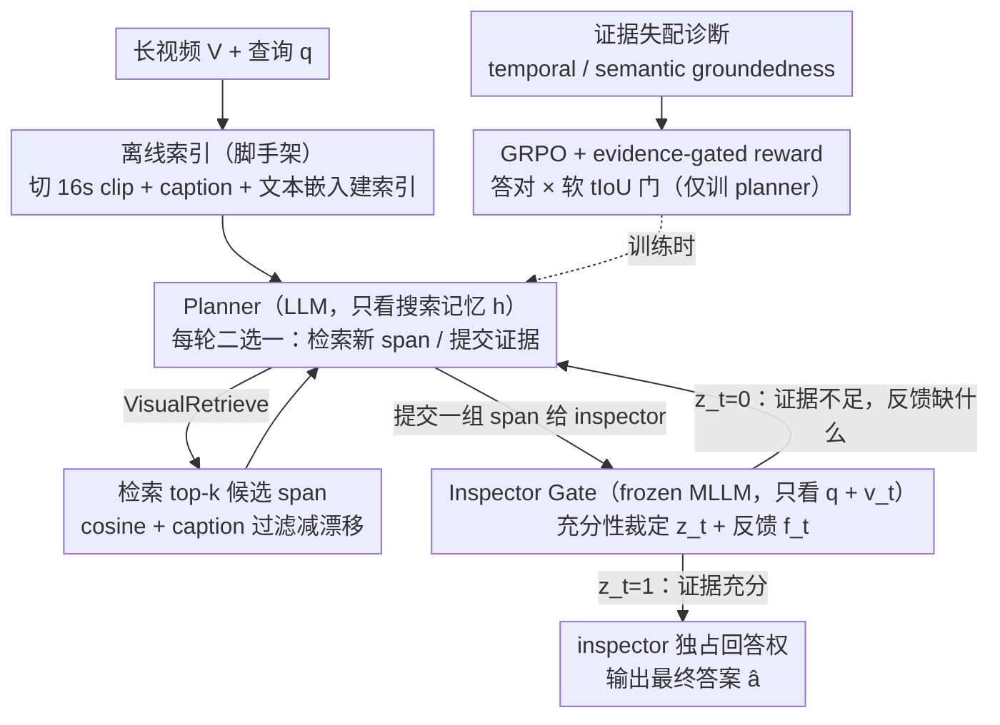

# VideoSEAL: Mitigating Evidence Misalignment in Agentic Long Video Understanding by Decoupling Answer Authority

**会议**: ICML 2026  
**arXiv**: [2605.12571](https://arxiv.org/abs/2605.12571)  
**代码**: <https://github.com/Echochef/VideoSEAL>  
**领域**: 视频理解 / Agentic RL / 长视频 QA  
**关键词**: 证据失配、planner-inspector 解耦、inspector gate、GRPO、temporal/semantic groundedness

## 一句话总结
VideoSEAL 发现现有 agentic 长视频 QA 系统存在「答对但没看到证据」的失配问题，并把根因归结为「coupled agent 把规划和回答权混在一起」，提出 planner-inspector 解耦框架：planner 负责长视距证据搜寻、inspector 持有独占回答权并在像素级证据充分时才放行，在 LVBench 上把准确率从 48.2% 拉到 55.1%（↑20.5%）且 LongVideoBench 从 52.2% 升至 62.0%。

## 研究背景与动机
**领域现状**：长视频 QA（LVU）比短视频难得多——证据稀疏、时间分散，绝大多数视频内容与问题无关。当前主流是 agentic 范式：用一个 monolithic planner 迭代地检索候选片段、调用工具检查视觉证据，多轮交互后输出答案。代表方法如 VideoAgent、DrVideo、Video-MTR、GenS、Conan 等。

**现有痛点**：作者用诊断实验发现一个隐蔽但普遍的失败模式——「evidence misalignment」：agent 的最终答案是正确的，但其 trace 并不提供充分证据支持。换句话说，agent 在「猜对」而不是「看到了所以答对」。这削弱了 agent 的可验证性与可解释性，也意味着所谓 SOTA 的准确率有部分是「靠先验拍脑袋」拿到的。

**核心矛盾**：用两个诊断指标揭示——(i) Reward Pressure（训练时）：outcome-only reward 只奖励答对，agent 通过参数化先验取捷径反而比认真找证据更高效；(ii) Prompt Pressure（推理时）：随着 trace 变长变噪，planner 在 shared context 里被迫做决策，从「寻找证据」滑向「拟合证据」，资本退而求其次回到通用 plausibility 模板。两者背后是同一个结构性病因：coupled agent 把「长视距规划」和「最终回答权」conflate 在一个共享上下文里。

**本文目标**：(i) 形式化「证据失配」并提供 temporal/semantic 两种 grounding 诊断指标；(ii) 通过架构解耦同时消除 reward 与 prompt 两类压力；(iii) 在四大长视频 benchmark 上同时改善准确率与 grounding。

**切入角度**：作者关键洞察是「回答权」是一种结构性资源，谁拥有它就会被两种压力塑形。如果把回答权从 planner 手里拿走，交给一个只看原始视觉证据（而非冗长 trace）的 inspector，让 inspector 在证据充分时才发声、否则要求 planner 继续找，就能从架构上同时打破两类失配。

**核心 idea**：把 monolithic agent 拆成「planner（负责工具调用/证据搜寻，只看结构化的搜索记忆）」+「inspector（frozen MLLM，只看当前提交的像素证据，独占终止权和回答权）」，并用 GRPO 仅训练 planner、inspector gate 作为可插拔模块。

## 方法详解
VideoSEAL 的方法部分由「诊断 → 架构 → 工具 → 训练」四块组成，逻辑链非常完整。

### 整体框架
输入：长视频 $\mathcal{V}$ 与查询 $q$。系统由两个角色构成：planner $P$（LLM）和 inspector $I$（frozen MLLM，通过 `VisualInspect` 工具接入）。每轮 $t$，planner 基于查询和搜索记忆 $h_{t-1}$ 产出 rationale-action 对 $(r_t,u_t)\sim P(\cdot\mid h_{t-1},q)$，环境返回观测 $o_t$，inspector 评估证据 $v_t=E(o_t)$：$(z_t,f_t)\sim I(\cdot\mid v_t,q)$，其中 $z_t\in\{0,1\}$ 是充分性裁定，$f_t$ 是反馈。仅当 $z_t=1$ 时 inspector 输出最终答案 $\hat a_t$，否则 planner 继续搜寻。这条 inspector gate 是整个架构的关键。

工具集三件：(i) Offline indexing 把视频切 16s clip，用 Qwen3-VL-8B 做 caption + text-embedding-3-large 做 dense embedding 建索引；(ii) `VisualRetrieve` 用 cosine 检索 top-$k$ 候选并用 DeepSeek-V3.2 做 caption 过滤减语义漂移；(iii) `VisualInspect(v_t,q)` 是 inspector 接口，返回 $(z_t,f_t)$ 与候选答案 $\hat a_t$。

### 关键设计

**1. 证据失配诊断（temporal + semantic groundedness）：把"答对"和"看到了"拆成两个指标分别审计**

现有评测只看答对率，根本暴露不了 agent 用先验"猜对"这种危险捷径。VideoSEAL 先定义结果正确性 $C\in\{0,1\}$ 和 trace 有据性 $G\in\{0,1\}$，专盯 $(C=1, G=0)$ 这个"答对却没据可查"的象限，再给出两个互补指标：时间有据性 $G_t=\mathbb{I}[\max_{\tau\in\mathcal{E}(\xi),\tau^*\in\mathcal{E}^*}\mathrm{tIoU}(\tau,\tau^*)\ge\gamma]$（$\gamma=0.05$）判断 agent 是否真的访问过相关时间区间，语义有据性 $G_s=1-J_{\text{judge}}(q,\xi,\hat a)$ 用 LLM judge 检查回答是否被 trace 里的工具输出逻辑支持，对应幻觉率 $H_t=\mathbb{P}(G_t=0\mid C=1)$、$H_s=\mathbb{P}(G_s=0\mid C=1)$。从"时间访问"和"语义支持"两个角度分别审计 trace，才让 reward/prompt pressure 这种结构性病因第一次被量化出来。

**2. Planner-Inspector 解耦 + Inspector Gate：把"回答权"从 planner 手里夺走，交给只看像素证据的 inspector**

诊断指出两类压力同源：prompt pressure 来自"长 trace 逼 planner 强行决策"、reward pressure 来自"outcome reward 让 planner 学会用先验抄近路"，根子都是"planner 既规划又回答"的角色混合。VideoSEAL 因此把 agent 拆成两个角色：planner 是 LLM-only 策略，只维护紧凑的搜索记忆（提交过的 span + inspector 反馈），每轮二选一——检索新 span 或把一组 span 提交给 inspector；inspector 是 frozen MLLM，每次调用只看 $(q, v_t)$、完全不看 planner 的中间推理或完整历史，输出充分性裁定 $z_t$ 和反馈 $f_t$，只有 $z_t=1$ 时才放行最终答案 $\hat a_t$，否则 planner 拿 $f_t$（如"证据里缺 X"）继续找。解耦后 planner 没有回答权、无法用先验回避找证据，inspector 不看 trace、无法被冗长上下文同化，两条捷径从架构层同时被关死；而 inspector 是冻结可插拔的，推理时换更强 MLLM 也无需重训 planner。

**3. GRPO + Evidence-Gated Reward：只训 planner，并用软门控把奖励对齐到"访问对了地方"**

光解耦还不够堵住 reward pressure——即便 inspector 把关，planner 仍可能学到"随便找点东西就提交、让 inspector 自己看着办"的偷懒策略。训练时只对 planner 跑 GRPO、inspector 全程冻结，奖励给两种：baseline 的 outcome-only $R_{\text{ans}}(\xi)=\mathbb{I}[\hat a=a^*]$，以及证据门控 $R_{\text{evd}}(\xi)=R_{\text{ans}}(\xi)\cdot g_{\text{evd}}(\xi)$，其中软门 $g_{\text{evd}}(\xi)=\min\{1, \tfrac{1}{\gamma}\max_{\tau\in\mathcal{E}(\xi),\tau^*\in\mathcal{E}^*}\mathrm{tIoU}(\tau,\tau^*)\}$ 让"访问得越对齐奖励越高"，$\gamma$ 取训练集 max-tIoU 均值做归一化。之所以用软门，是因为真实 tIoU 平均才约 0.05，硬门太稀疏给不出可用梯度，软门才把"为了让 inspector 开 gate，我得真找到关键证据"这条信号稳定地喂给 planner；冻结 inspector 则保证训练不污染验证模块、让 gate 在策略漂移时仍可信。

### 损失函数 / 训练策略
GRPO 目标只作用于 planner $P$，inspector $I$ 全程冻结。Reward 在有 ground-truth 时间区间的数据集（如 CG-Bench）上使用 $R_{\text{evd}}$，无标注时回退到 $R_{\text{ans}}$。每个候选 inspection 窗口最多 64 帧（参见主表的 Frames 列），可调节搜索预算 $K$ 在精度/成本间权衡。

## 实验关键数据

### 主实验
四个 LVU benchmark（MLVU、VideoMME w/o sub、LongVideoBench、LVBench）上，与同 backbone（Qwen3-8B planner + Qwen2.5-VL-7B inspector，64 帧/inspection）的 coupled 基线对比：

| 框架 | 答案权 | MLVU | VideoMME | LongVideoBench | LVBench |
|------|--------|------|----------|----------------|---------|
| Qwen2.5-VL-Instruct（单 MLLM, 64f） | Model | 63.9 | 58.4 | 55.3 | 34.6 |
| VideoAgent (coupled, GPT-4o) | LLM | 55.8 | 59.4 | 50.3 | 42.3 |
| Video-MTR (coupled, MLLM) | MLLM | 58.4 | 62.7 | 57.3 | 42.0 |
| Coupled baseline (本文同 backbone) | LLM | 64.6 | 59.9 | 52.2 | 48.2 |
| **VideoSEAL (decoupled)** | **MLLM (inspector)** | **68.2** (↑4.3) | **62.9** (↑4.5) | **62.0** (↑6.7) | **55.1** (↑20.5) |

所有 backbone 一致情况下，仅切换为 decoupled 架构就在所有四个 benchmark 上带来 4–10+ 个点的提升，LVBench 上更是从 48.2 跳到 55.1（相对 ↑20.5%）。

### 消融实验

| 配置 | 关键指标 | 说明 |
|------|---------|------|
| Full VideoSEAL | 最优 | Planner-Inspector 解耦 + GRPO + 软 evidence gate |
| w/o Inspector Gate (coupled) | 显著掉点 | 回到 monolithic 范式，prompt + reward pressure 都回来 |
| Outcome-only reward (无 evidence gate) | 准确率小幅掉 + grounding 明显下降 | 验证 reward pressure 的存在 |
| 增大搜索预算 $K$ | 准确率单调提升 | 解耦后 scaling 可持续，coupled 基线则会 plateau |
| Inspector 7B → 72B | 准确率显著跳升 | 模块化可插拔，无需重训 planner |

LVBench grounding 评测（Table 2）显示，VideoSEAL 不仅在 $R@\{0.05,0.10,0.20\}$ 上超过 LongVT，还把 temporal 幻觉 $H_t$ 显著降下，semantic groundedness $G_s$ 上升、$H_s$ 下降，验证「答案变好的同时 trace 也真的更有据可查」。

### 关键发现
- coupled agent 越训越答对，但 grounding 增长几乎停滞，outcome-grounding gap 持续扩大（图 1）。这是 reward pressure 的直接证据：模型在「学答对」而不是「学找证据」。
- 推理时随着 trace 变长，$G_t$ 早早 saturate 但 $G_s$ 单调下降、$H_s$ 单调上升（图 2）。说明 agent 越后期越倾向用「might suggest」之类的 hedge 模板拍脑袋（图 3 示例），即 prompt pressure 实在存在。
- 解耦后 search budget 越大模型越受益（图 6a），而 coupled 基线被 context saturation 拖累平台；inspector 从 7B 换 72B 直接拉准确率（图 6b），证明 inspector 可作为 verification 模块独立 scale。
- 即使在 evidence-gated reward 上 hard gate 太稀疏（$\gamma\approx 0.05$），软 gate $\min\{1,\mathrm{tIoU}/\gamma\}$ 提供了足够稳定的训练信号，是工程上让 grounding-aware RL 跑通的关键 trick。

## 亮点与洞察
- 把「回答权」当成一种可被架构操控的资源是这篇文章最深的洞见。无论是 prompt pressure（推理）还是 reward pressure（训练），都源自「同一个模型既要找证据又要给答案」。把回答权剥离出去交给一个只看证据的模块，相当于在 agent 里设了一道「事实核查官」，从架构层制度化「无证据不开口」。这条原则可推广到任何 agent 系统：RAG、code agent、tool-use agent 都可以引入「inspector gate」做最终裁定。
- temporal groundedness + semantic groundedness 双指标提供了「准确率不能说明一切」的可操作工具。把答案对错和证据支持度分开看，让评测从「输赢」回到「为何赢」，这种 grounding-aware 评测论文以后可以成为 agentic system 的标配。
- frozen inspector 让验证模块可独立 scale 而无需重训 planner，是 modular agent design 的典范。这意味着随着更强 MLLM 的出现，整个系统能以零训练成本升级 verification 能力，工程价值非常大。
- 用软 evidence gate $\min\{1,\mathrm{tIoU}/\gamma\}$ 解决稀疏奖励问题，是一类「当 hard signal 太稀疏时用归一化软 surrogate」的通用 trick，可借鉴到任何对齐稀疏 ground-truth 的 RL 任务。

## 局限与展望
- 解耦增加了一次 inspector 调用的开销，单次决策延迟和总 token 消耗都比 coupled 高，作者未给出端到端的延迟/成本对比。
- inspector 完全 frozen 意味着它只能在分布内做判断，对于 inspector 本身就答错的 case（如视觉细节超出其能力），planner 无论怎么找证据都救不回来；evidence-gated reward 也救不了 verifier 自己的错。
- evidence-gated reward 依赖 ground-truth 时间区间标注（CG-Bench 等），对大量无 grounding 标注的 LVU 数据集不可用，软 gate 也只能依赖 outcome-only reward 退化。
- LLM judge 计算 semantic groundedness 本身可能引入偏差或 jailbreak 风险，作者未深入讨论这一评测工具的可靠性。
- 实验主要在多选 QA 形式的 benchmark 上，对开放式生成回答（如 long-form summarization、video captioning）的有效性仍待验证；这些任务里「证据支持度」如何定义并不显然。

## 相关工作与启发
- **vs VideoAgent / DrVideo（coupled）**：他们用单个 planner 在共享 context 里串行规划 + 回答，难免被 prompt/reward pressure 同时压制；VideoSEAL 通过架构解耦从源头消除这两类压力。
- **vs Video-MTR / LongVT（RL trained, coupled）**：同样用 RL 学多轮交互，但 planner 与 answerer 角色未分离，outcome-only reward 直接强化「找到答案最便宜的路径」，结果学到先验取捷径；VideoSEAL 把训练目标限制在 planner 的搜寻行为，并用 evidence gate 把方向矫正回「找到证据」。
- **vs GenS / FrameThinker / Conan（coupled MLLM）**：这些都把 inspection 与 answering 放在同一个 MLLM 里，inspector 不独立、回答权不解耦；VideoSEAL 把 inspector 拎出来变成可插拔模块。
- **vs RAG 中的 self-RAG / verifier 思路**：本质类似，但把「检索-推理-验证」三步在视频时序场景里架构化，并把 verifier 升格为「具有否决权的 inspector」，并通过 grounding 指标量化效果。
- **启发**：(i) 任何 agent 系统都应认真审视「回答权」归属，错误归属会引入 reward/prompt 双重失配；(ii) 评测 agent 不能只看输赢，必须看「证据-结论一致性」；(iii) modular frozen verifier 是让 agent 在推理时持续 scale 的低成本路径。

## 评分
- 新颖性: ⭐⭐⭐⭐ 「证据失配」的形式化 + planner-inspector 解耦设计 + inspector gate 是 LVU agent 领域第一次系统化处理该问题，且 reward/prompt pressure 的双向诊断框架非常有启发性。
- 实验充分度: ⭐⭐⭐⭐⭐ 四大 LVU benchmark + 同 backbone coupled/decoupled 直接对比 + grounding 评测 + search 预算与 inspector backbone 双 scaling 实验，论证链完整。
- 写作质量: ⭐⭐⭐⭐⭐ Section 3 的诊断 → 病因归因 → 结构性 remedy 的叙事极其清晰，把「为什么解耦」推理得环环相扣，是 agentic system 论文的范本。
- 价值: ⭐⭐⭐⭐⭐ 解耦回答权的范式可直接迁移到任何 agentic 系统（RAG、code、tool-use agent），且 frozen inspector 的可插拔升级路径在工程上有强落地价值。

<!-- RELATED:START -->

## 相关论文

- [\[ICML 2026\] VideoTemp-o3: Harmonizing Temporal Grounding and Video Understanding in Agentic Thinking](videotemp-o3_harmonizing_temporal_grounding_and_video_understanding_in_agentic_t.md)
- [\[CVPR 2026\] VideoARM: Agentic Reasoning over Hierarchical Memory for Long-Form Video Understanding](../../CVPR2026/video_understanding/videoarm_agentic_reasoning_over_hierarchical_memory_for_long-form_video_understa.md)
- [\[CVPR 2026\] StreamReady: Learning What to Answer and When in Long Streaming Videos](../../CVPR2026/video_understanding/streamready_learning_what_to_answer_and_when_in_long_streaming_videos.md)
- [\[ICML 2026\] Video-MTR: Reinforced Multi-Turn Reasoning for Long Video Understanding](video-mtr_reinforced_multi-turn_reasoning_for_long_video_understanding.md)
- [\[ICML 2026\] Foresee-to-Ground: From Predictive Temporal Perception to Evidence-Driven Reasoning](foresee-to-ground_from_predictive_temporal_perception_to_evidence-driven_reasoni.md)

<!-- RELATED:END -->
