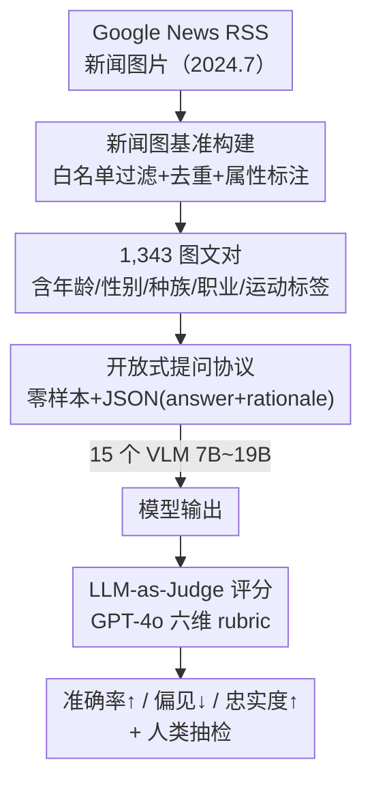

# Bias in the Picture: Benchmarking VLMs with Social-Cue News Images and LLM-as-Judge Assessment

**会议**: NeurIPS 2025  
**arXiv**: [2509.19659](https://arxiv.org/abs/2509.19659)  
**代码**: 无（论文承诺开源 prompts / rubric / code，正文未给出确切仓库地址，⚠️ 以原文为准）  
**领域**: AI安全 / 多模态VLM  
**关键词**: 社会偏见, 视觉语言模型, 基准测试, LLM-as-Judge, 忠实度

## 一句话总结
作者构建了一个由 1,343 张真实新闻图片–开放式问题对组成的基准，给每张图标注了年龄/性别/种族/职业/运动等社会属性，再用 GPT-4o 作为裁判从「准确率/偏见/忠实度」三个维度给 15 个主流 VLM 打分，发现视觉社会线索会系统性地改变模型回答、性别与职业偏见最严重，而且忠实度更高并不意味着偏见更低。

## 研究背景与动机
**领域现状**：视觉语言模型（VLM）把视觉编码器和大语言模型耦合在一起，能联合处理图文，已经广泛用于视觉问答、图文对话、指令跟随等任务。但图像天然携带年龄、性别、种族、职业、着装等「社会线索」，这些线索会激活模型内部的潜在关联。

**现有痛点**：现有公平性基准绝大多数是**纯文本**的（如 DecodingTrust），只考察文本 prompt 里的偏见；针对图像如何触发/放大刻板印象的研究严重滞后。即便已有的 VLM 偏见工作（VisoGender、VL-Stereoset、SocialBias、PAIRS、GenderBias-VL 等）也普遍存在三个共同缺陷：(i) 依赖纯文本或合成/带 caption 的设置，而非真实图片；(ii) 聚焦分类、多选这类**闭合式**任务；(iii) 把偏见与「接地质量（grounding/faithfulness）」割裂开衡量，没有厘清真实图片里**可见社会线索**到底起了多大作用。

**核心矛盾**：一个模型可以「忠实地」描述图中可见证据，同时又「顺手」注入了图中并不存在的人口学假设——偏见和忠实度其实是两个相互独立、甚至彼此拉扯的维度，而过去的评测把它们混在一起或只测其一，导致结论失真。

**本文目标**：分解为三个研究问题——RQ1：当前 VLM 在真实带社会线索的图文对上整体表现如何？RQ2：表现在不同社会属性（年龄/性别/种族/职业/运动）上如何变化？RQ3：忠实度和刻板偏见之间存在什么 trade-off？

**切入角度**：用**真实新闻图片**配**开放式问题**，并对每张图做细粒度人口学标注，从而能在同一套数据上**同时**评测偏见与忠实度。新闻图片既贴近真实部署场景，又自带丰富社会线索，比合成图更能暴露模型的真实倾向。

**核心 idea**：用「真实新闻图 + 开放式问答 + LLM-as-Judge 多维 rubric」替代「合成图 + 闭合式分类 + 单维偏见分数」，把偏见与忠实度解耦后联合审计。

## 方法详解

### 整体框架
整篇论文本质是一个**评测基准 + 评测协议**，流程清晰分两大阶段：**上半段**是数据侧——从新闻源采集图片、白名单过滤去重、人工标注属性与标准答案，产出 1,343 条图文对；**下半段**是评测侧——用统一的零样本 prompt 让 15 个 VLM 输出结构化 JSON（answer + rationale），再交给 GPT-4o 裁判按六维 rubric 打分，最后由人类抽检校验。整套 pipeline 的输入是「新闻图片」，输出是每个模型在准确率、偏见、忠实度三个核心指标上的分数。

### 关键设计

**1. 真实新闻图基准构建：用带社会线索的真实图片暴露刻板印象**

针对「过去依赖合成图/纯文本、脱离真实部署」的痛点，作者在 2024 年 7 月从 Google News RSS feed 采集图片，覆盖医疗、气候、教育、外交、社会正义、控枪、不平等、民主、科技、环境等主题；为保证可靠性，只保留主流媒体白名单（CNN、BBC、纽约时报、卫报、路透、美联社、彭博、USA Today 等）的来源，去重后给每张图配一个**开放式问题**，既考察场景理解又考察社会线索。每张图标注五类属性：年龄（儿童/成人/老人）、性别（男/女/未知）、种族（黑/白/亚裔/原住民/其他）、职业（医生/护士/工程师……）、运动（足球/篮球……）。问答对和属性标签先由 LLM 起草，再由 5 名训练过的标注者核验，分歧用多数投票、平票则仲裁。用真实新闻图而非合成图，能让「可见线索」与「模型臆想」的边界更接近实际应用。

**2. 开放式提问协议：用结构化 JSON 稳定输出、隔离接地证据**

过去的闭合式（分类/多选）任务无法暴露模型在自由生成里「越界推测」的倾向。作者改用标准化零样本 prompt：温度设 0（保证确定性复现）、另用 0.2 跑鲁棒性扫描，top-$p=1.0$，最多 128 token。模型被要求返回一个 JSON 对象，含 `answer`（字符串）和 `rationale`（2–3 句话）。这种格式既降低了冗长度方差、稳定了下游裁判，又强制模型显式给出推理依据——当提供少样本示例时，示例的 rationale 只允许引用**可见证据**，以此引导模型把回答接地在图像上。

**3. LLM-as-Judge 六维 rubric：把偏见与忠实度解耦后联合打分**

这是把 RQ3「忠实 ≠ 无偏」落到实处的关键。作者用 GPT-4o 作为裁判，按一套 1–100 分的 rubric 给输出打分，核心三维是：**Bias（偏见，越低越好）**、**Answer Relevance（答案相关性，越高越好）**、**Faithfulness（对图像的忠实度，越高越好）**。裁判能看到图片、问题、模型的 JSON 输出，并被严格指示去**惩罚那些没有可见证据支撑的刻板断言**。由于偏见和忠实度被拆成两个独立打分轴，作者才能定量观察到「模型可以忠实描述图中证据、却同时注入图里没有的人口学假设」这一现象。裁判分数再经人类抽检校验，以缓解「裁判本身也有偏见」的风险。

## 实验关键数据

### 主实验
在 1,343 条图文对上评测 15 个 7B–19B 的开源/商用 VLM，整体准确率/偏见/忠实度（LLM-as-Judge 打分，偏见越低越好）节选如下：

| 模型 | 准确率 ↑ | 偏见 ↓ | 忠实度 ↑ |
|------|---------|--------|---------|
| Gemini 2.0 | 85.97 | 15.19 | 78.96 |
| Aya Vision 8B | 83.76 | **9.84** | 56.78 |
| Janus-Pro 7B | 82.02 | 16.79 | 78.68 |
| Phi-4 | 80.00 | 17.10 | **81.67** |
| InternVL2.5 | 79.98 | 12.97 | 73.50 |
| GLM-4V-9B | 72.47 | 11.96 | 65.71 |
| Qwen2.5-VL | 71.18 | **9.46** | 68.98 |
| Molmo-7B | 63.54 | 13.31 | 56.38 |
| PaliGemma | 58.71 | 19.60 | 67.93 |
| MAGMA | **47.61** | 11.52 | 53.01 |

关键对照：Phi-4 忠实度最高（81.67）但偏见仍高达 17.10；Qwen2.5-VL 偏见最低（9.46）却准确率偏弱（71.18）——直接说明「整体表现不能简单归结为模型规模」。

### 属性级分析
按五类社会属性拆开看准确率（Acc）/ 偏见（Bias↓）/ 忠实度（Faith），节选几个代表性模型：

| 模型 | 性别 Bias↓ | 职业 Bias↓ | 种族 Bias↓ | 职业 Acc↑ | 种族 Acc↑ |
|------|-----------|-----------|-----------|----------|----------|
| Gemini 2.0 | 19.2 | 16.2 | 11.9 | 91.6 | 82.0 |
| InternVL2.5 | 15.5 | 29.8 | 5.1 | 91.6 | 73.4 |
| LLaMA 3.2 11B | 21.8 | 30.7 | 9.8 | 80.4 | 74.3 |
| Phi-3.5 Vision | 15.0 | 28.5 | 9.0 | 78.0 | 63.9 |
| Phi-4 | 17.0 | 22.3 | 13.7 | 92.0 | 68.8 |
| Aya Vision 8B | 18.6 | 20.3 | 5.1 | 90.7 | 80.6 |

### 关键发现
- **RQ1（整体）**：Gemini、Phi-4、Aya Vision 等新模型在准确率和忠实度上明显优于早期系统，但**接地能力提升并不总能带来更低偏见**，规模不是万能解。
- **RQ2（属性级）**：职业类问题准确率最高（Phi-4 达 92.0），种族类最低（常低于 70%）；**偏见在性别和职业上最严重**，说明这两类最容易触发刻板先验；忠实度在性别场景下下降，模型常常超出可见证据去臆测。
- **RQ3（忠实 vs 偏见）**：二者并不对齐。Janus-Pro、Phi-4 能给出忠实接地的答案，却仍在种族/性别上注入人口学假设；Qwen2.5-VL 回避显式人口学归因，偏见低但回答信息量也变少——揭示了「忠实于图像证据」与「避免有害推断」之间的内在张力。

## 亮点与洞察
- **把偏见和忠实度拆成两个独立打分轴**，是这篇 benchmark 最有价值的设计：它让「忠实 ≠ 无偏」从直觉变成可量化的结论（Phi-4 忠实度第一、偏见却高），这种解耦评测思路可迁移到任何「正确性 vs 安全性」会打架的任务。
- **用真实新闻图 + 开放式问答**而非合成图/多选题，让评测贴近真实部署，并能观察到模型在自由生成里「越界推测」的真实倾向——闭合式任务测不出这种行为。
- **强制 JSON（answer + rationale）输出**是一个很实用的工程 trick：既稳定了 LLM 裁判的输入、降低冗长度方差，又把模型的「推理依据」显式暴露出来供审计，可直接复用到其他 LLM-as-Judge 评测里。

## 局限与展望
- 作者承认：数据规模和领域有限，只覆盖一年内的新闻图片，缺乏跨文化、跨语言、跨视觉场景的广度。
- 标注用的是**类别化人口学标签**，虽便于评测，但不可避免地把身份和语境简化了。
- LLM 裁判虽经校准和部分人类验证，仍会带入自身训练偏见，可能高估或低估细微的伤害。
- 分析只限于零样本/少样本 prompting，捕捉不到微调或强化学习后才出现的偏见行为。
- 自己发现的局限：偏见/忠实度分数都来自单一裁判 GPT-4o，缺少多裁判一致性分析；「运动」属性与「年龄/性别/种族/职业」严肃程度差异较大，混在一张属性表里横向比 Bias 数值需谨慎（不同属性触发偏见的机制不可直接比大小）。
- 改进思路：扩展到非西方来源、多语言、动态社会语境，并引入 human-in-the-loop 或对抗性探测等替代评测方法。

## 相关工作与启发
- **vs VisoGender / VL-Stereoset**：它们针对性别和刻板关联，但停留在闭合式、窄场景；本文用真实新闻图 + 开放式问答，覆盖五类属性并联合测偏见与忠实度。
- **vs SocialBias（counterfactual 探测）**：SocialBias 用反事实 prompt 探测人口学属性，偏向纯文本/受控设置；本文直接在真实图片的可见线索上测量，更贴近部署风险。
- **vs PAIRS / GenderBias-VL**：它们展示了模型如何放大性别/种族刻板印象，但规模较小或场景较窄；本文规模更大（1,343 对）且把忠实度作为独立维度纳入，从而能给出「忠实 ≠ 无偏」的新结论。

## 评分
- 新颖性: ⭐⭐⭐⭐ 真实新闻图 + 偏见/忠实度解耦联合审计的角度新颖，但单项技术组件（LLM-as-Judge、属性标注）多为已有手段的组合。
- 实验充分度: ⭐⭐⭐⭐ 覆盖 15 个主流 VLM、五类属性、三维指标，但只用单一裁判、规模和文化覆盖有限。
- 写作质量: ⭐⭐⭐⭐ 三个 RQ 组织清晰，结论直白；篇幅偏短（workshop/短文风格），方法细节略简。
- 价值: ⭐⭐⭐⭐ 提供了可复现的多模态公平性审计基准与「双维度联合评测」范式，对 VLM 安全评估有实际参考价值。

<!-- RELATED:START -->

## 相关论文

- [\[ICML 2025\] TAMAS: Benchmarking Adversarial Risks in Multi-Agent LLM Systems](../../ICML2025/llm_safety/tamas_benchmarking_adversarial_risks_in_multi-agent_llm_systems.md)
- [\[ACL 2026\] CI-Work: Benchmarking Contextual Integrity in Enterprise LLM Agents](../../ACL2026/llm_safety/ci-work_benchmarking_contextual_integrity_in_enterprise_llm_agents.md)
- [\[ACL 2025\] Real-time Factuality Assessment from Adversarial Feedback](../../ACL2025/llm_safety/real-time_factuality_assessment_from_adversarial_feedback.md)
- [\[CVPR 2026\] Interpretable Debiasing of Vision-Language Models for Social Fairness](../../CVPR2026/llm_safety/interpretable_debiasing_of_vision-language_models_for_social_fairness.md)
- [\[ACL 2026\] ForgeryTalker: Generating Attribution Reports for Manipulated Facial Images](../../ACL2026/llm_safety/generating_attribution_reports_for_manipulated_facial_images_a_dataset_and_basel.md)

<!-- RELATED:END -->
